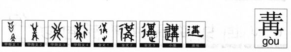

# 讲与媾

前几天**某人**跟我说，生活大爆炸里面的sheldon很喜欢用交媾（腹黑的字幕君）这个词表达爱爱，偶然发现讲话的讲（**講**）和交媾的**媾**的繁体字为什么这么像，有什么共同点？

想到这两个字的意思，不免望文生义了下，难道是前者指文爱，后者指体爱。（邪恶）（这个是错的，看下面吧）

然后仔细考证了一下：

**1,要说讲（講）和媾先要说冓这个字**

冓在甲骨文里面是两个鱼相对的形状。

《说文解字》里面说：交積材也。象對交之形。凡冓之屬皆从冓。古候切。（交积：汇聚，聚集。材：木架。古候切的意思是冓读音为gou4）

可以看出冓的古意就是相遇，对顶的意思。

**2,然后再看讲（講）**

《说文》里面的意思是：和解也。从言冓聲。古項切（说明读音是jiang4，粤语里面读作gong2）。

再看讲（講）的部首言。“直言（诚挚地和直率地说）曰言，論難（争论焦点问题）曰語。”（《说文》）

“紛糾者解釋之是曰講”（《说文》）

可见讲（講）的本意是双方之间有了矛盾，纠纷然后相遇在一起诚挚直率说话，即和解。

这就不难理解为什么讲（講）会有一个冓在里面了（不仅读音，而且本意）。

**3,最后我们在来看看交媾的媾字**

“重也。从女冓聲。《易》曰：‘匪寇，媾。’古候切（看来和冓读音一样）”（《说文》）媾即交互为婚姻,亲上结亲的意思。

“女”指“新娘”。“女”和“冓”联合起来表示“和新娘子当面对拜（结为夫妻）”。

本义：男女对拜（相互低头鞠躬）以结亲。

转义：夫妻面对面XXOO。

18禁：人类的性交体位有两种，一种是面对面式样，另一种是男面对女背式样。在西方部分传教士看来，“面对背”式样的体位被认为是不文明的方式，是动物式的性交。而“面对面”方式是文明人的性交方式，被称为“missionaryposition（使命姿势）”)

**说到这我说个好玩的：**

“屯如如，乘马班如。匪寇，婚媾。”（《周易》）这句话的意思就是：一个成年男子，骑着高头大马，打扮得漂漂亮亮，前往女方家中，将看中的漂亮女人抢回来结婚。大伙儿都惊动了，出来看的时候，才知道是男方过来抢婚。不过这属于假劫真婚。

当时的抢劫婚已经司空见惯。这一习俗演进到后世，女方为了防备抢亲的出现，则有了出嫁时候坐轿，蒙上红盖头的措施，这些都是为了不让来抢亲的人轻易看到新娘子的容颜。而男欢女爱的新房，居然被称为“洞房”，更显示出迎亲的男方不敢让女方待在家里，而是躲在山洞过夜的情形。

**结论：**

冓：鱼儿相对游来。

讲（講）：双方之间有了矛盾，纠纷然后相遇在一起诚挚直率说话，即和解。

媾：结亲------>嘿咻（有木有很像鱼儿游来游去，，，）

2012-08-04
