# 自动浇花装置


**基本原理**

自动浇花装置实现的原理非常简单，一句话表述就是：当由土壤中的湿度传感器检测的湿度值低到某个阈值时，开启经由Arduino指挥下的继电器模块，打开控制水流的电磁阀，达到自动浇花的目的。虽然有些拗口，不过流程很简单吧（除此之外还有个TF卡的存储记录模块，用于记录一些数据，当然这不是必须的）。

那么先来看看控制线路的样子吧：

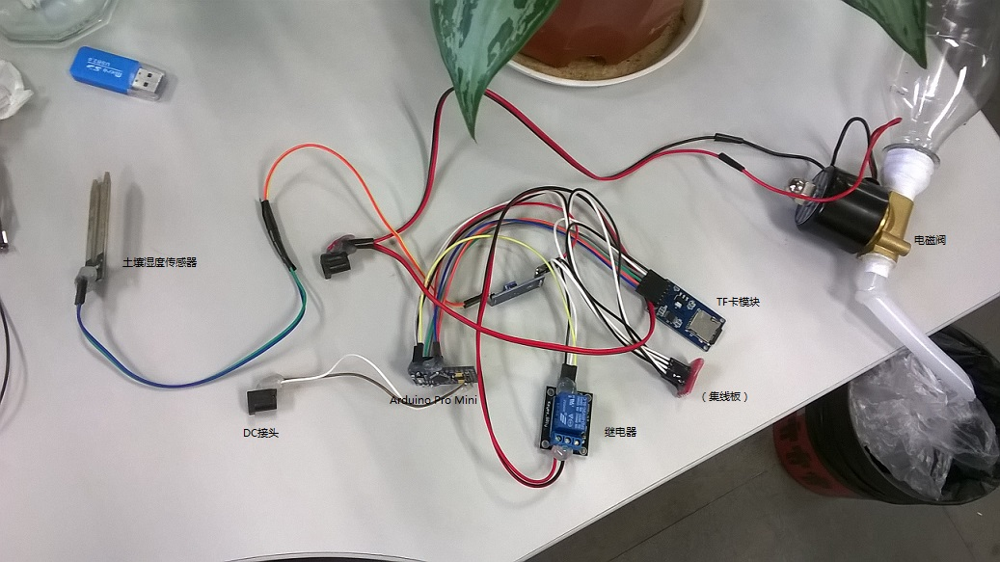

看起来眼花缭乱的话，当然没有电路图来的清楚：

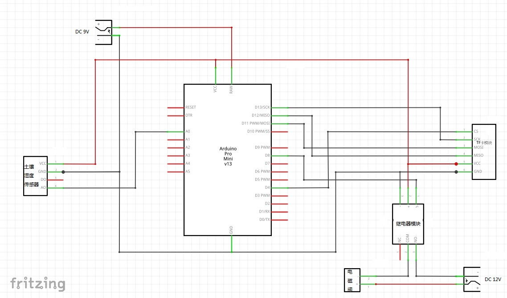

**详细的说明一下**

**1 控制部分**

主控部分的话，我选择的是Arduino Pro Mini，处理器是ATMEGA328P工作在5V 16MHz，样子就像这样：

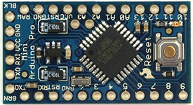

如果你要查看它的电路图：[http://arduino.cc/en/uploads/Main/Arduino-Pro-Mini-schematic.pdf](https://givedrug.github.io/self-wiki/!个人文章/Joker大人/2014/http://arduino.cc/en/uploads/Main/Arduino-Pro-Mini-schematic.pdf)

推荐本入门书籍：《Arduino程序设计基础》陈吕洲 北京航空航天大学出版社 (2014-01)

**2 监测部分**

监测部分即土壤湿度传感器，它被我安插在了花盆的中部。它通过一对镀镍的感应板来实时的监测两板之间的电位变化，而电位的变化又与土壤中的含水率（即湿度）存在相关关系，这正是湿度传感器的工作原理。

大概就是这个样子：

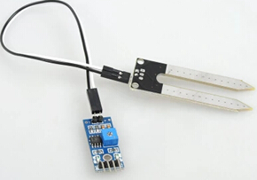

**3 出水部分**

控制水瓶中的水流出的部分主要由继电器和电磁阀组成。

**继电器**

我选用的继电器是一路继电器：

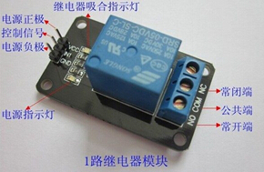

因为我们希望平常的时候继电器处于打开状态而非闭合状态，所以连接电磁阀只用到了常开端和公共端。

**电磁阀**

2W025-08电磁阀的一些参数：

**材质**：黄铜（这里要说明一下选择铜质的原因，因为我浇花的水并不是纯净水，我一般会加入一些营养液，而营养液里面貌似含有硫酸铜，如果选择铁质的话，可能不多久就要反应掉了）

**口径**：2分(1/4"，DN8)流量口径：2.5mm。（开始买了个 6分口径的，当时考虑到口径和普通的可乐瓶相近，可真正调试的时候发现，流量太大，那出水速度，简直一个本流入海）

**型式**：常闭式

**压力类型**：零压型0-0.8MPA（这个也要说明下，最初我还买过一个所谓的“无压型”电磁阀，可惜的是无压型并不是真正的零压力下开启，压力范围是0.01MPA-0.4MPA，也就是说，要正常工作，至少需要1m的水柱高度，真是失误啊）

**电压**：DC 12V（所以专门配了一个变压器，至于为什么没有选择AC220V，我总觉得那样的不太安全- -）

主要就是这些，样子长这样：

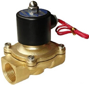

**连接**

因为电磁阀的口径远小于水瓶的口径，直接插进去是不要想了，所以真正连接的时候，用了一个小接头


先用它和瓶口固定（用了我两卷生料带）：

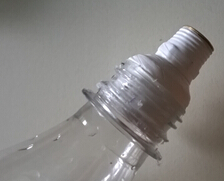

然后用热熔胶和尼龙管粘了一个出水嘴：

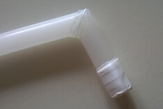

组合起来是这个样子：

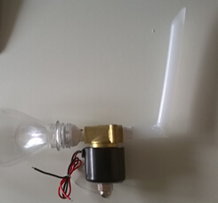

**4 固定部分**

用于给水瓶固定的结构，虽然在整个装置中并不起关键作用，可却是最难搞而且最贵的部分，因为要将一瓶水固定到工作间的小隔板上，为此我想了各种解决方法呢。最终它由三部分组成：PVC管、自行车水壶架、卡槽。

卡槽是这个死样子：

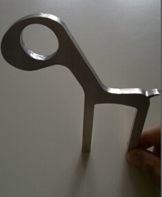

这个是我专门定做的铝合金CNC加工件。这个是它的CAD设计图

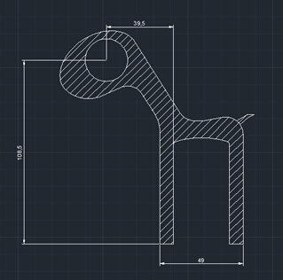

最初的时候它是这个样子的：

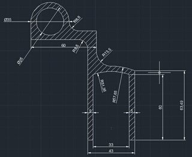

后来我发现它可以做成一个小动物的形状，于是当我看到一张小鹿时，我觉得它可以变成那样：


当然……它可能比小鹿长得更抽象一点。

忽略掉这些细节……

支架最后成型：

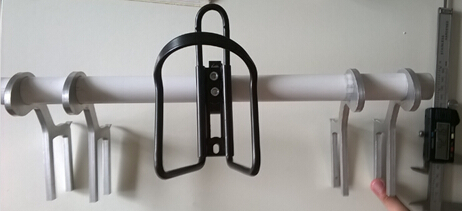

（当然硬件部分还应该包括TF存储部分，不过它并不是重点，也不是必须的，所以这里就不说它了，你可以在任何一本全面的Arduino教程中看到关于TF卡存储模块的使用细节。而且在代码中可以看到相关操作的内容）

最后在放两张实际工作的图片：（印着小花的盒子里面装着那些杂乱的线路）

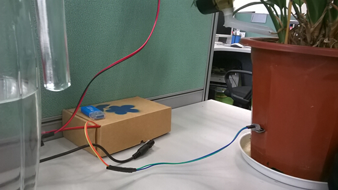


**程序**

程序代码也非常简单：每隔一分钟记录一次土壤湿度值，当超过阈值（选定的是150）的次数超过100次（如果湿度变化是线性的话，这个时间大概是100分钟）时，开启水阀8秒钟（这个时间大概可以浇水80~100ml）。

之所以选择100次，而不是1次，是为了避免当外界短时间的干扰使得湿度值超过阈值时的浇水行为，比如将传感器拿出来又放回去，这时候虽然“湿度值”达到了放水的限值，可它并不是真的需要浇水了，我们就是要避免这种或者类似的（也有可能在拔插电源的瞬间发生湿度值的异常）情况。

下面是程序源码（包括TF记录的内容）：

```c
#include <SD.h>

 File myFile;
 int shidu;
 int jidianqi = 8;
 int count = 0;

 void setup(){
    // 初始化串口通信
    Serial.begin(9600);
    Serial.print("Initializing SD card...");
    pinMode(jidianqi,OUTPUT);
    pinMode(53, OUTPUT);// Arduino上的SS引脚(UNO的10号引脚， Mega的53号引脚)
   
    if (!SD.begin(4)) {
    Serial.println("initialization failed!");
    return;
    }
    
    Serial.println("initialization done.");
    
    if (SD.exists("arduino.txt")) {
    Serial.println("arduino.txt exists.");
    } else {
    Serial.println("arduino.txt doesn't exist.");
    }
    
    // 打开一个新文件，并立即关闭。
    // 如果指定文件不存在，将用该名称创建一个文件
    Serial.println("Creating arduino.txt...");
    SD.open("arduino.txt",FILE_WRITE);
    
    myFile.close();
    
    // 检查文件是否存在
    if (SD.exists("arduino.txt")) {
    Serial.println("arduino.txt exists.");
    } else {
    Serial.println("arduino.txt doesn't exist.");
    }
 }

 void loop(){
    File my;
    my = SD.open("arduino.txt",FILE_WRITE);

    if (my) {
    shidu = analogRead(A0);
    Serial.println("writting");
    Serial.println(shidu);
    my.println(shidu );
    if(shidu > 150){
      count++;
    }
    if(count > 100){
      count = 0;
      my.println("watering");
      digitalWrite(jidianqi,HIGH); //继电器导通；
      delay(8000);
      digitalWrite(jidianqi,LOW); //继电器开关断开；
      delay(1000);
    }
   }

    my.close();
    delay(60000);
}
```

最后再放一张实测的湿度变化图：

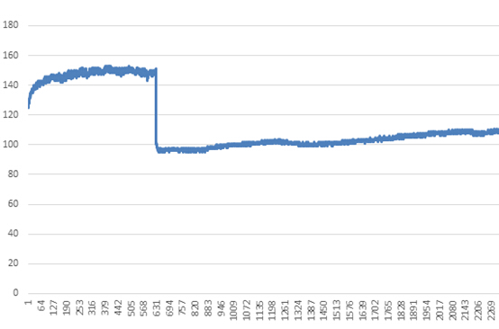

（横坐标表示时间，纵坐标表示湿度值，中间的骤降是因为浇水的缘故）

**辅助工具**

除了上面的主要部件，可能（有些是必须的）你还需要下面东西的辅助：

生料带（密封作用）、热熔胶、热熔胶枪、挫、砂纸、内六角、千分尺、电烙铁、焊丝、万能板、导线（杜邦线）、松香、剪刀、钳子

**再说几句**

**关于小花**

我桌上的那盆小花，是银皇后，很便宜的一种植物，连盆带花一共花了10块钱，记得买它的时候跑了很远的一个花卉市场，转遍了好几个大棚才找到。至于买它的原因嘛——给大家推荐个电影《这个杀手不太冷》！

**关于Arduino**

这应该是学习arduino以来做的第一个像样的东西吧，从构思到测试再到成型花了近半个月时间，原理可能只要花一个小时就能了解了，可真正做出来成品，遇到的困难那就太多了，不管怎么说，很开心，寒暑假也不用记挂着了，麻麻再也不用担心我忘了浇花！

2014-09-24
