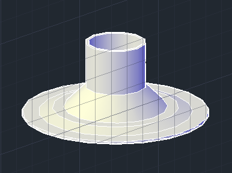

# 自制吸尘器

我说在我的梦想中有一台吸尘器

功率又大又响亮，吸尘肯定棒

整个城市找遍所有的街，都没有……

**吸尘器是如何工作的**

吸尘器的工作原理很简单，高速旋转的吸风电机，抽离密闭桶体内的空气，从而产生负压区，在大气压作用下，空气进入进气口平衡压差，空气流动过程中，会夹裹灰尘一同进入，从而达到吸尘效果。

**开始动手**

首先我们来清点一下都需要些什么东西：集尘桶、高速吸风电机、一段比较长的吸尘器软管（最好有个吸尘嘴）。先想到这么多，马上备货。

先是密封的集尘桶，恰好我手边就有一个足够大的保鲜盒：

接着是吸风电机，如果有不用的电吹风，应该那个电机也可以使用，功率足够了。千万注意不是轴流风机，那个转速慢的感人……

参数：

功率：1200W

电压：220V

频率：50HZ 

绕组材质：转子与定子绕组为全铜线

下面是吸尘用的软管，虽说是软管，但也不要太软，不然被负压压扁可就什么垃圾都进不来了。

我用的就是这种螺纹软管，话说洗衣机那个出水管一般就可以的。剪下来的时候千万别让妈妈发现。

好了，现在开始动工：

遇到的第一个问题是如何连接电机和集尘桶。我想了很多方案，开始想着将他俩固结在一起，考虑到电机工作起来震动惊人，固结有开裂风险。于是决定使用柔性连接，通过一根软管连通起来。

好了，先来处理一下电机，总得把电源线接上（1200W需要一根粗壮些的电线）：

然后放在泡沫盒子里面，固定起来，泡沫可以有效的吸震，缺点当然就是不太结实。（其实是找不到别的东西固定电机）

修剪出一个凹槽，把电源线拉出来：

然后用胶带封牢：

电机就先告一段落，下面处理集尘桶，首先是进气口和排气口的安装，在盖子上挖出两个洞，插入，热熔胶封口，如图：

为了不让集尘桶中的垃圾进入排气口，我在排气口的位置加了一个过滤盒，过滤盒上安装有防尘罩。因为没有现成的防尘罩可供使用，索性用3D打印机打了一个，任性！

客官看图：

打印好的防尘罩和修剪好的过滤盒：

依然是神一般的热熔胶粘合过滤盒（过滤盒的底部剪的有点过多了……）：

晾干之后侧面图：

粘牢防尘罩：

最终效果：

好了，下面就是如何连接排气管和电机吸风口的问题了，最初想了很久，效果都不理想，最后决定先在吸风口上加装一个连接器，最后完美的解决了问题：

连接器的3D模型（仔细的测量了吸风口的形状，精确地画出模型）：

打印出来的效果：

完美的结合：

到这里吸尘器已经基本完工了，但如果还有个吸尘器嘴的话，那吸尘效率决定提升一个档，可哪去找吸尘器嘴呢？猜对了！画一个，打出来。

打印好的吸尘器嘴：

连接之后的效果：

嗯嗯，现在吸尘器已经可以使用了，不过你也觉得电机转速如果可以调节的话，那不就太好了吗？是的，加一个调速器。不不不，这个打印机打不出来的……

2000W的可控硅调速器：

如果想了解可控硅调速原理的可以查看这个链接：[http://pan.baidu.com/s/1kT5lOv9](https://givedrug.github.io/self-wiki/!个人文章/Joker大人/2015/http://pan.baidu.com/s/1kT5lOv9)

注意最好给调速器包装一下，以免漏电。

现在已经完全没有问题了吧。等等，我可不打算抱着这玩意除尘……这时我恰好遇到了一个小推车：

然后完工啦！

顺便加了一个面板开关- -

**请不要问我为什么这么丑**

最后上一个效果图，大吸力，妥妥的！

我们不生产灰尘，我们只是灰尘的搬运工

——于一个下了三天雨的

冻死人的

南京的

晚上

2015-04-07
