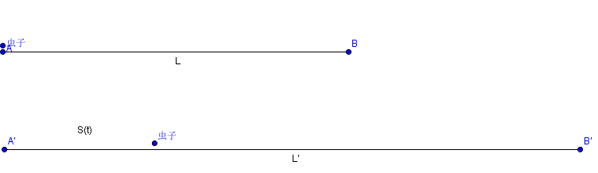

# 虫子爬绳

有一根神奇的绳子，初始时长度L=1000m，它可以无限的伸长（均匀的伸长），伸长的速度v=1000m/s，非常快；又正好有这么一只傻虫子，腿脚也不怎么灵便，爬起来的速度只有u=1cm/s，但它非要从绳子的一端爬到绳子的另一端，反正我是劝不住，但它坚信自己能爬过去，那么问题来了，它能爬过去吗？

直观上感觉的话，似乎这只虫子永远也爬不到头，绳子伸长的速度是虫子速度的十万倍啊，但转机就在绳子伸长的方式是均匀的，这就是说，傻虫子每爬一段距离后，考虑还没爬的那部分绳子，这一段的伸长速度在慢慢减少，但究竟能不能减少到零呢？好像心里也没谱，所以还是动笔算一算：

设虫子从A向B端爬行，与A端的距离记作S(t)，显然S是时间t的函数。

S(t)的增加来自两个方面，一方面是虫子的速度u，另一方面是绳子的伸长，而且影响S(t)增加的并不是全部的绳子，只是绳子的一部分。t时刻时绳子总长为L’=L+vt，因此有t时刻S(t)的增加速度为：

$$S’(t)=U+s(t)*v/(L+vt)$$

于是解此微分方程。

稍作变化有：

$$U+s*v/(L+vt)= dS/dt=d(S*v)/d(L+vt)$$

即为一阶非齐次线性微分方程，解得：

$$S(t)=(Lu/v)(ln(1+vt/L)(1+vt/L))$$

当虫子爬到B端时，即S(t)=L’=L+vt,代入上式：

$$L+vt=(Lu/v)(ln(1+vt/L)(1+vt/L))$$

$$T=(L/v)(e^(v/u)-1)$$

将$L=1000m$，$v=1000m/s$，$u=1cm/s$ 代入上式得到：

$$t=e^{100000}-1(秒)=2.8*10^{43429}(秒)=8.9*10^{43421}(年)$$

这个时间简直久到无法想象，有多久呢，看下面这句话。

对于宇宙热寂说，宇宙寿终正寝（熵达到最大）的时间大概在10^1000年之后。

傻虫子要多准备点炫迈了。

2015-06-24
