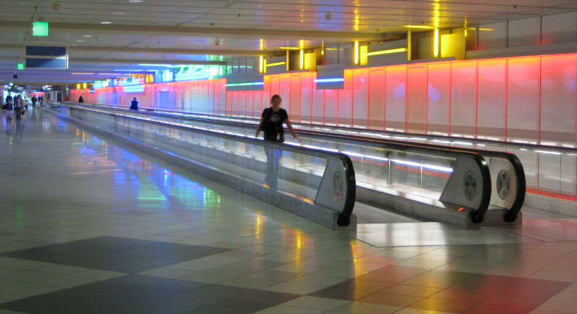
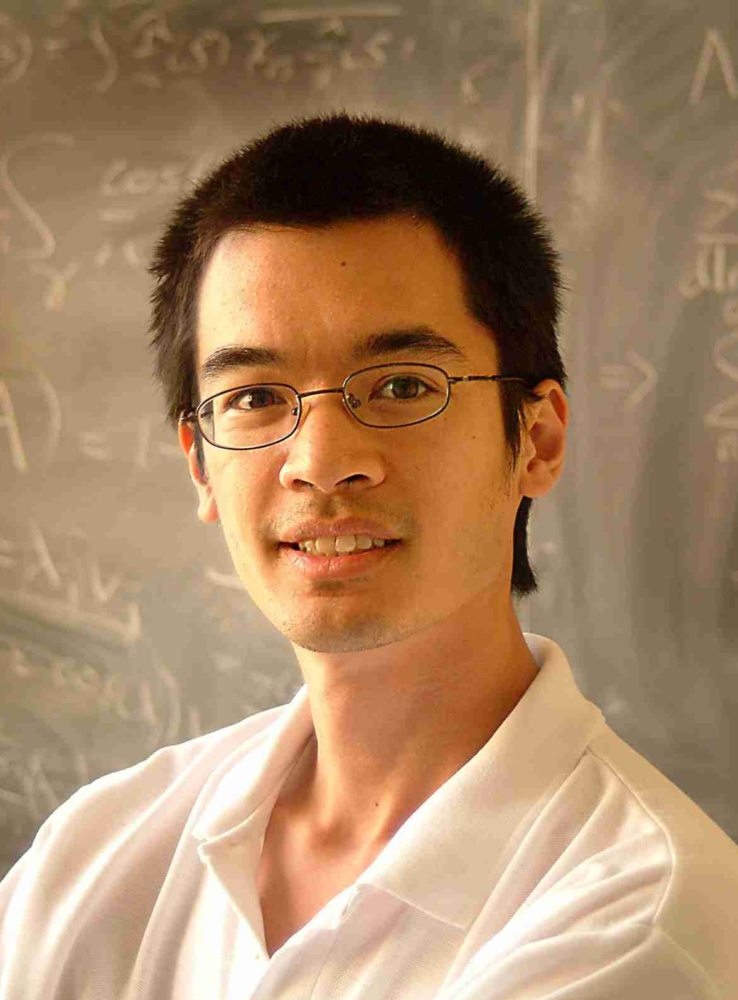

# 陶哲轩跑步机问题

如果看到这个题目，以为我要跟你科普一些飞机马上就要起飞，而你还在去往登机口路上飞奔时候的注意事项，那我只好满怀“歉意”的说一句：Bazinga！

哈哈，虽然没有温馨小贴士，但我下面要给大家分享的这个有趣的题目，说不定在你哪天赶飞机的时候，真的争取到几分钟时间呢！

我们知道，机场通道里面通常会设置几段水平扶梯，供需要休息或者赶时间的人使用，那么问题来了，如果正在赶路的你发现需要停下来系一下鞋带，是在平地上系还是在扶梯上系比较节省时间呢？又或者是你刚好有跑一小段路的力气，是在平地上跑还是在扶梯上跑能让你更快到达登机口呢？

**问题描述**

这个有趣的问题的提出者，正是大名鼎鼎的陶哲轩（Terence Tao），是他在一次乘坐国际航班前突然想到的。随后他便将这个问题放在了他的博客上（[链接](https://givedrug.github.io/self-wiki/!个人文章/Joker大人/2015/https://terrytao.wordpress.com/2008/12/09/an-airport-inspired-puzzle/)），引发了大量的回复讨论，我们先看下这个问题的具体描述：

你要从机场通道的一端到另一端（为了简化问题，假设通道是一条直线），通道由一段平地和一段自动扶梯组成，假设你走路为匀速运动，且速度为$v$，而自动扶梯以匀速$u$运行，这就是说当你站在自动扶梯上的时候，你前进的速度为$v+u$。为了能够以最短的时间通过通道，请回答下面三个问题：

1，如果你需要停下来一小段时间，比如系鞋带，那么应该在平地上还是在扶梯上停留呢？假设花费的时间相同。

2，如果你刚好有一股能量支持你跑起来，把速度提高到$v’$，那么你应该在平地上还是扶梯上奔跑呢？假设拥有的能量相同。

\*3，如果考虑到狭义相对论，那上面两个问题的答案又是什么？

差点不会走路了

**问题解答**

**问题1**：设系鞋带的时间为$t$，那么有在平地上系鞋带花费的总时间$T1$为：

$$T_{1} = t + \frac{a}{v} + \frac{b}{u+v}$$

而在扶梯上系鞋带花费的总时间$T2$为：

$$T_{2} = \frac{a}{v} + t + \frac{b-ut}{u+v}$$

显然$T1>T2$，所以应选择在扶梯上系鞋带。

**问题2**：因为能量是恒定的，假设跑步时发力均匀，由$E=FS$可以推得，无论在平地还是扶梯，这些能量提速，所持续的距离是相等的（当然在扶梯上时，是相对于扶梯而言的距离），我们假设这段距离为$s$，那么在平地上跑步话费的总时间$T1$为：

$$T_{1} = \frac{s}{v'} + \frac{a-s}{v} + \frac{b}{u+v}$$

而在扶梯上跑步花费的总时间$T2$为：

$$T_{2} = \frac{a}{v} + \frac{s}{v'} + \frac{b - s - \frac{s}{v'}u }{u+v}$$

于是有：

$$∆T = T_{2} - T_{1} = \frac{s}{v} - \frac{s - \frac{s}{v'}u }{u+v}$$

显然$∆T>0$，所以应选择在平地上奔跑。

**问题3**：在陶哲轩本人的回复中，对Q3进行了解释：只有在速度接近光速时，才会发生明显的差异，并给出了计算公式，结论仍然是Q1，Q2中的策略不变。有兴趣的可以在他博客中查看具体步骤，当然前提是，要翻墙！

**一个直观的解释**

在本题的所有评论中，[**Harald Hanche-Olsen**](https://givedrug.github.io/self-wiki/!个人文章/Joker大人/2015/http://www.math.ntnu.no/~hanche/)给出了一个直观的解答，不需要任何计算就可以得到前两个问题的答案，让我们来看一下：

**问题1**：假设你和你的孪生兄弟一起通过通道（这里将扶梯和平地的顺序交换一下）。你踏上扶梯之后马上蹲下来系鞋带，而你的兄弟是在走上扶梯之前停下来系鞋带，完成之后马上踏上扶梯。显然你处于领先位置，并将提前进入平地步行，而你的兄弟在相同的步行速度下，无论如何也追不上你了。

**问题2**：同样假设你和你的笨蛋孪生兄弟一起过通道（不再交换顺序）。你一开始就奔跑，直到能量耗光，这时相对于你走路的兄弟，你将领先$s$米的距离。显然你将提前进入扶梯，这时他还在用步行，在他进入扶梯前的一段时间里，你们之间的距离将会继续拉大（大于$s$米）。然后他也坐上扶梯，并且开始奔跑，但直到他耗光所有能量，也只能和你缩短恰好$s$米的距离，终究还是抓不上你。

所以综上，系鞋带要在扶梯上，奔跑则要选在平地上。Harald的解释生动形象，又很容易理解，完全用想象就得到了问题的答案，简直兵不血刃啊！

如果你想快速的掌握这个结论，那么只需要记住一句话就可以了：**速度越均匀，时间越短。**

**偶像陶哲轩**

偶像的照片永远都是笑着的

9岁上大学，13岁拿国际数学奥林匹克竞赛金牌（迄今最年轻的金牌获奖者），24岁成为正教授，31岁拿菲尔兹奖（数学领域最负盛名的奖项）。

更是一个人同时做着八个数学方向，从调和分析到偏微分方程；从解析数论（这是陈景润的方向）到算术数论；无一不是数学发展中的热点。此外，他还从事工科方面的研究：照相机的压缩传感原理（调和分析在实际中的应用）。最近他又开始对几何感兴趣，不久前刚刚发表了一篇黎曼几何的论文。

反正我一直都是跪着介绍的，谁也别拉我起来。

**参考**

1 Tao博客中的题目原文[https://terrytao.wordpress.com/2008/12/09/an-airport-inspired-puzzle/](https://givedrug.github.io/self-wiki/!个人文章/Joker大人/2015/https://terrytao.wordpress.com/2008/12/09/an-airport-inspired-puzzle/)

2 陶哲轩的数学题 [http://bbs.emath.ac.cn/forum.php?mod=viewthread&tid=1081&highlight=%CC%D5%D5%DC%D0%F9](https://givedrug.github.io/self-wiki/!个人文章/Joker大人/2015/http://bbs.emath.ac.cn/forum.php?mod=viewthread&tid=1081&highlight=%CC%D5%D5%DC%D0%F9)

3 陶哲轩的数学题——结论与结束[http://xbeta.info/puzzle-terrence-tao.htm](https://givedrug.github.io/self-wiki/!个人文章/Joker大人/2015/http://xbeta.info/puzzle-terrence-tao.htm)

2015-06-06
