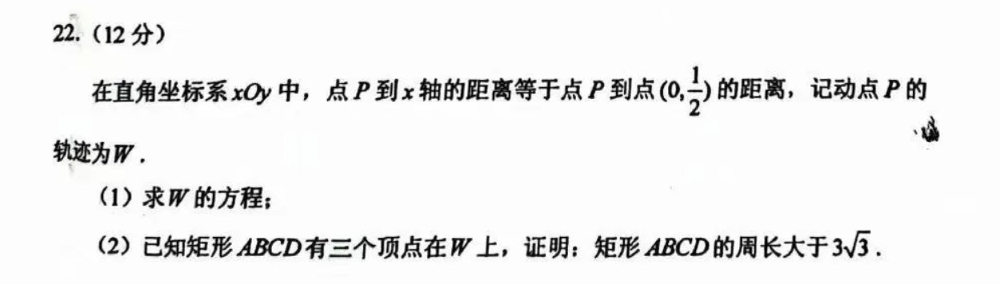

# 2023年全国新高考Ⅰ卷

**试题：（圆锥曲线）**

**解答：**

（1）设$W$的方程为$y=f(x)$，则有：
$$\sqrt{(y-\frac{1}{2})^{2} +x^{2} }=y$$
得到：
$$y=x^{2}+\frac{1}{4} $$
（2）因矩形周长与$W$的平移位置无关，则考虑曲线$w$方程$y=x^{2}$结果一致。
因此，设$A$点坐标为$(a,a^{2})$，计算与$w$上另一点$(b,b^{2})$的连线长度为：
$$l=\sqrt{(b^{2}-a^{2})^{2}+(b-a)^{2}}=\left|b-a\right|\sqrt{(b+a)^{2}+1}$$
又因为其两点斜率为
$$k=\frac{b^{2}-a^{2}}{b-a}=a+b$$
故其连线长度可写为：$l=\left|b-a\right|\sqrt{k^{2}+1}$

设$AB$所在直线的斜率是$k$，$AB$所在直线方程为：
$$y-a^{2}=k(x-a) $$
与$y=x^{2}$联立，得到$B$点$x$坐标为$k-a$，带入上述弦长公式

故$\left|AB\right|$为：$\left|k-2a\right|\sqrt{k^{2}+1}$

由$AB$与$AD$垂直，有$AD$所在直线的斜率为$-\frac{1}{k}$，同理得到$D$点$x$坐标为$-\frac{1}{k}-a$

故$\left|AD\right|$为：$\left|\frac{1}{k}+2a\right|\sqrt{\frac{1}{k^{2}}+1}$

故矩形$ABCD$周长为$2(\left|AB\right|+\left|AD\right|)$，即：
$$C(k,a)=2(\left|k-2a\right|\sqrt{k^{2}+1}+\left|\frac{1}{k}+2a\right|\sqrt{\frac{1}{k^{2}}+1})$$
$$=2\sqrt{k^{2}+1}(\left|k-2a\right|+\frac{1}{k^{2}}\left|1+2ak\right|)$$
因为$w$关于$y$轴对称（$a$必有对称点$-a$），以及$AB$与$AD$垂直（斜率正负相反），可知$a$，$k$的符号可任意组合，不妨设$a\le0$，$k>0$（$k$不可为0），分如下情况讨论：

**情况1**：$1+2ak\ge0$，即$0\ge a\ge -\frac{1}{2k}$
此时周长（周长为正数）为：
$$C(k,a)=2\sqrt{k^{2}+1}(k+\frac{1}{k^{2}}+2a(\frac{1}{k}-1))$$
1）当$\frac{1}{k}-1\ge 0$，即$0< k\le 1$时
$$min(C(k,a))=C(k,a)|_{a=-\frac{1}{2k}}=2\sqrt{k^{2}+1}(k+\frac{1}{k})=C_{0}(k)$$
$$min(C_{0}(k))=C_{0}(k)|_{k=\frac{\sqrt{2}}{2}}=3\sqrt{3}$$
2）当$\frac{1}{k}-1\le 0$，即$k\ge 1$时
$$min(C(k,a))=C(k,a)|_{a=0}=2\sqrt{k^{2}+1}(k+\frac{1}{k^{2}})=C_{1}(k)$$
$$min(C_{1}(k))=C_{1}(k)|_{k=1}=4\sqrt{2}$$
**情况2**：$1+2ak\le 0$，即$a\le -\frac{1}{2k}$
此时周长（周长为正数）为：
$$C(k,a)=2\sqrt{k^{2}+1}(k-\frac{1}{k^{2}}-2a(\frac{1}{k}+1))$$
$$min(C(k,a))=C(k,a)|_{a=-\frac{1}{2k}}=2\sqrt{k^{2}+1}(k+\frac{1}{k})=C_{2}(k)$$
$C_{2}(k)$与$C_{0}(k)$最值相等，皆为$a=-\frac{\sqrt{2}}{2}$，$k=\frac{\sqrt{2}}{2}$时取得。

综上可得：
$$min(C(k,a))=min(min(C_{0}(k)),min(C_{1}(k)),min(C_{2}(k)))=3\sqrt{3}$$
注意到，当$a=-\frac{\sqrt{2}}{2}$，$k=\frac{\sqrt{2}}{2}$时，矩形退化为两条重合的线段，故矩形$ABCD$周长大于$3\sqrt{3}$，证毕。
