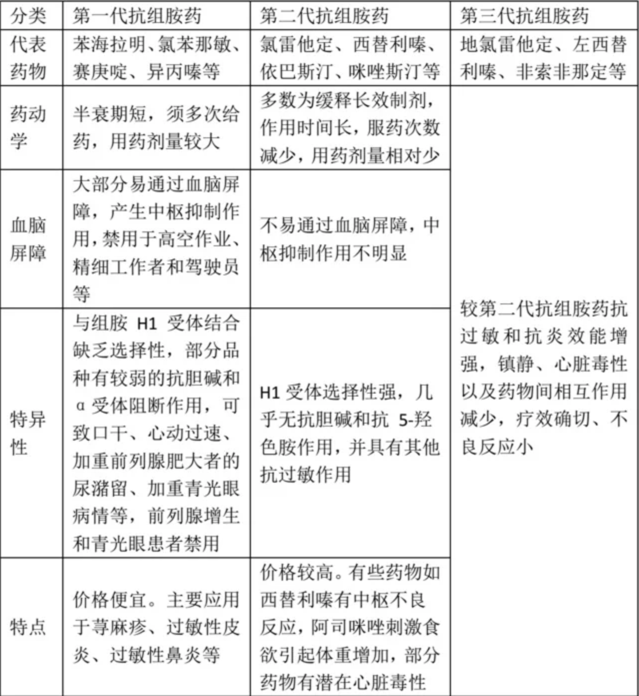

# 抗组胺药

组胺（英语：Histamine），是一种有机含氮的环状化合物。

组胺参与局部免疫反应和炎症反应，并作为瘙痒介体中心，具有调节肠道生理功能的作用。它还是一种神经递质。组胺由嗜碱性球和附近结缔组织肥大细胞产生。它也可以增加微血管对白血球和某些蛋白质的通透性，允许白血球从微血管进入感染组织并吞噬其中的病原体。组织胺广泛存在于动植物组织中，可以人工合成。

组胺与H1和H2组胺受体发生作用，组胺作用于H1受体，引起肠管、支气管等器官的平滑肌收缩，还可引起毛细血管扩张，导致血管通透性增加，产生局部红肿、痒感；组胺作用于H2受体，引起胃酸增加，而胃酸分泌过多与消化性溃疡的形成有密切关系。组胺是一个亲水性的血管活性（Vasoactive）胺。作为身体内的一种化学传导物质，它可以影响许多细胞的反应，包括过敏、发炎反应等，也可以影响脑部神经传导，造成嗜睡等症状发生。

组胺是导致花粉过敏的重要介质。从基本免疫反应来看，花粉过敏属于抗体IgE介导的炎性反应。当机体接触过敏原后会产生一种IgE抗体，它吸附在组织肥大细胞、嗜碱性粒细胞表面，使机体处于致敏状态。当人体再次接触相同过敏原时，这些过敏原就会和IgE抗体结合，引起上述两种细胞脱颗粒并释放其中的介质。组胺作为其中介质之一可使小血管扩张、血管通透性增加、外分泌活动加强，是患者鼻黏膜水肿、鼻呼吸阻力增加、分泌物增多的重要物质基础。

抗组胺药（英语：Antihistamine）是指组胺受体的拮抗剂，这类药物可作用于体内的组胺受体，减少组胺的效应，从而减轻身体对过敏原的过敏反应，或减少胃酸的分泌。

根据药物作用的受体不同，可分为四类：

H1抗组胺：抑制H1受体的活性，H1受体主要存在于肥大细胞、平滑肌、内皮细胞和脑部下丘脑的结节乳突神经核等处，H1抗组胺可用于治疗与组胺有关的过敏反应。

H2抗组胺：抑制H2受体的活性，H2受体主要存在胃黏膜的胃壁细胞，H2抗组胺能减少胃酸的分泌，可用于治疗消化性溃疡及胃食管反流病。

H1及H2抗组胺是目前临床较常使用的二类抗组胺药物，而H3及H4抗组胺则还在实验阶段。

抗组胺药物主要分为三代：

