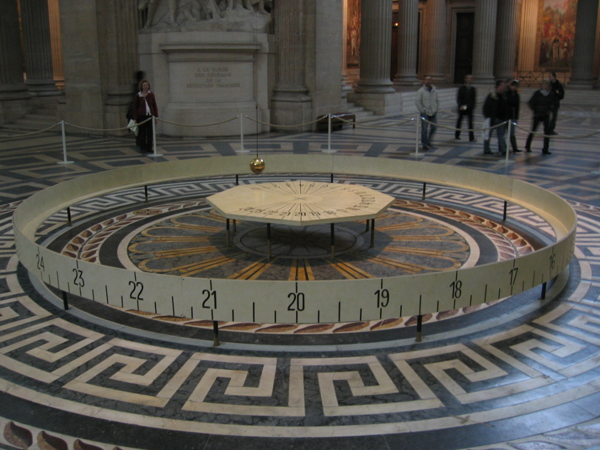

# 傅科摆

傅科摆（英语：Foucault pendulum、Foucault's pendulum），是依据法国物理学家莱昂·傅科命名的，用以证明地球自转的一种简单设备。虽然人们长久以来都知道地球在自转，但傅科摆第一次以简单的实验予以证明。

这个实验的装置包括一个高大的、在任意垂直平面上振荡的单摆。单摆摆动的方向会因为地球本身的周日转动而改变。这是因为单摆的摆动平面，像陀螺仪一样，当地球转动时仍会在空间中保持固定的方向。傅科摆于1851年2月首度次在巴黎天文台的子午仪室公开展示。几个星期之后，傅科制做了他最著名的单摆，他在巴黎先贤祠的拱顶下以67米长的钢索悬挂着一颗28千克重的铅锤。这个单摆的摆动平面以每小时顺时针方向11°，以31.7小时环绕一圈。

无论是在南极或北极，当单摆下面的地球以一个恒星日旋转了一周，摆的振荡平面相对于恒星是固定不变的。所以相对于地球，在南极或北极的摆的振荡平面以一天的时间，分别以顺时针或逆时针方向旋转了一周。当傅科摆被悬挂在赤道上，摆的振荡平面相对于地球是固定不变的，也就是说观察不到傅科摆现象。在其它的纬度上，这个摆的摆动平面相对于地球逐渐旋转，但比极地要慢；角速度，$\displaystyle \omega$ (每恒星日以顺时针方向旋转的角度)，是正比于纬度 $\displaystyle \varphi$ 的正弦值：

$\displaystyle \omega =360^{\circ }\sin \varphi \ /$日

此处，在赤道以北和以南的纬度分别以正值和负值来显示。例如，在南纬30°的傅科摆，会以2天的周期逆时针旋转360°。
