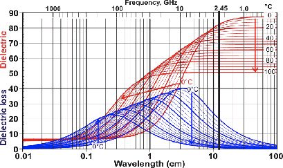

# 微波炉为什么可以加热？

一般的解释是，2.4GHz的微波与食物中的水的固有频率差不多，于是产生共振，其实这种解释是不正确的，因为水分子的共振频率在THz量级上。

介电常数和介电损耗随温度变化曲线，2.4 GHz 在这里面一点都不特殊（甚至是耗损并不大的一个区域）。

图中蓝色曲线为介电损耗曲线，**介电损耗**衡量了电磁场在物质中传播的能量损耗，这损耗的能量不会凭空消失，就是变成了物质的内能。这一部分内容如果从粗略的经典力学的图像来理解的话，就是一个电偶极子跟着外部的交变电场在来回地转。

之所以选择2.4GHz大概是因为如下几个原因：

1、**我们选取吸收频率的时候其实恰恰要避开最强的吸收位置**。因为要考虑电磁波的**穿透深度**，假如我们选择的是 10 GHz 作为微波炉的工作频率，那么我们很可能并不能有效加热食物。因为所有的电磁波能量都被表面的水给吸收了，而内部的食物还是处于冷冰冰的状态。

2、2.4 GHz 的 ISM 频段无须申请许可证。这个频率是公开频段，不管是民间还是政府都可以使用。而在 ISM 频段 2.4 GHz ~ 2.5 GHz 这个波段信道有限，可是却要传递这么多东西，难免拥堵，这个信道设计之初（1947 年确定标准）其实是给当时还是 baby 状态的微波加热应用留的，没想到后来还承担了通信的用途，承担了太多他不该承担的责任。

总结一下：

微波炉之所以能够加热是因为作为极性分子的水，在变化的电磁场中发生震荡，但并不是因为发生共振，也不工作在震荡最剧烈的频率。
