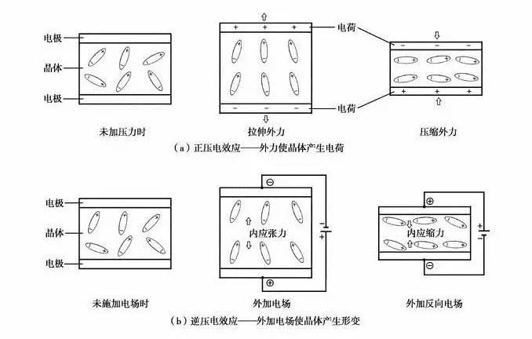

# 电子打火机原理

这种打火机中装有一块**压电陶瓷**。使用时只需按压点火开关，冲击压电陶瓷元件就会在两点火极之间产生火花引燃丁烷气。

左手拇指快速按压弹簧冲击块，右手食指接近导线就会感觉到“电麻手”的刺激。有时你还可看到“放电火花”。实验证明，物体间形成电火花时，在它的两极一定有电压，当足够高的电压才能使气体分子发生电离形成电流，正负电荷中和放出能量，即电能转化成热能、光能。由上可知，压电陶瓷在械机冲击力作用下能产生较高电压（3000V以上）。

**压电效应**

某些电介质在沿一定方向上受到外力的作用而变形时，其内部会产生极化现象，同时在它的两个相对表面上出现正负相反的电荷。当外力去掉后，它又会恢复到不带电的状态，这种现象称为正压电效应。当作用力的方向改变时，电荷的极性也随之改变。相反，当在电介质的极化方向上施加电场，这些电介质也会发生变形，电场去掉后，电介质的变形随之消失，这种现象称为逆压电效应。依据电介质压电效应研制的一类传感器称为压电传感器。

