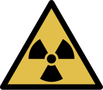
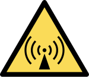

# 电离辐射与非电离辐射

辐射可分为电离辐射和非电离辐射，电离辐射可以从原子或分子里面电离过程（Ionization）中作用出至少一个电子。反之，非电离辐射则不行。

从波长小于 150 纳米开始的电磁波，也就是频率超过 1.9E15 赫兹的电磁波，可以使物质电离，也就是说小波长，也就是高频率的一部分紫外线，X 射线以及伽玛射线属于电离辐射。

（电离辐射标志）

**电离辐射**：α射线（α粒子）、β射线（β粒子）、中子等高能粒子流与γ射线、X射线等高能电磁波，而被称为宇宙射线的高能粒子射线则两者皆有。电磁波（光子）的电离能力，随着电磁波谱变化，电磁波谱中的γ射线、X射线几乎可以电离任何原子或分子。电磁波的频率愈高，能量愈强，电离能力愈强。在电磁波谱上，远紫外线，电离能力较强；

（非电离辐射标志）

**非电离辐射**：与X射线相比之下波长较长的电磁波，由于其能量低，不能引起物质的电离，故称为非电离辐射。如近紫外线与可见光、红外线、微波和无线电波等电离能力较弱的电磁波。
