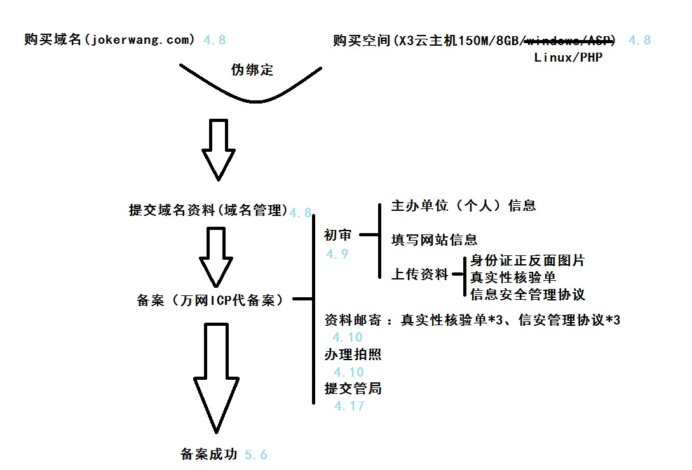
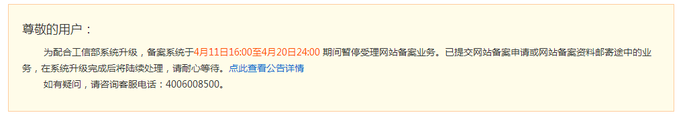

5月份自己的网站备案成功后，就一直想写点什么帮助一下想自己建站的同学or好青年，一直到今天才开始动笔（拖延症你给我死开），好了，直奔主题了，希望能尽可能的详尽，少走弯路，少走弯路。

**STEP 1：域名**

首先是申请一个属于自己的域名，关于域名我们主要关心两件事情：收费还是免费、顶级域名选取。

收费还是免费：

免费的顶级域名也不是没有的，大名鼎鼎的.tk域名就是其中之一，tk是位于南太平洋的新西兰海外领地Tokelau（历史上亦称联合群岛或托克劳群岛）的地区顶级域名。可以免费申请，特殊域名需要收费（免费的要90天内30人访问，但少于4个字母，特殊含义等需要收费）。来自欧洲荷兰的Dot TK是老牌TK顶级免费域名服务商。可能是由于政府财政问题吧，连国家域名都是连同别国运维的。

免费的二级域名，国内比较知名的二级域名服务商有：花生壳；国外的当属棒子国的.co.cc域名了。主要是因为CO.CC官方有自己的DNS解析服务，且支持中文域名注册及其它语种域名注册。老毛子的net.ru/org.ru/pp.ru曾经免费提供过，不过最终还是走上收费。

收费的域名注册商那就太多了，万网、新网、商务中国、网域科技、35互联、godaddy等等。注册流程大概和注册qq是差不多的，按部就班很容易就下来了。

顶级域名的选择：

常见的顶级域名.com、.net、.org、.cn如果是个人网站，可以使用.name、.me、.cc

一般来说现在一个.com的域名大概在50元/年以上，上不封顶（几百万几千万的域名买卖不时发生）一个.me的域名大概在两三百/年，.cc的则要四五百/年。价钱总在浮动，仅供参考。

至于为自己的网站选取一个什么样的二级域名，那就是自己发挥的时候啦。容易让别人和自己记住，我觉得是个重要的前提。

关于收费还是免费的选择，我个人还是倾向于收费域名，首先收费域名的选取范围更大，知名网站的顶级域名基本都是收费的；然后售后服务可能更好些，毕竟拿钱办事；免费域名有收回风险；推广可能遇到阻力，据说百度对tk域名的收录是有限制的。（当然如果你爱折腾，不怕麻烦，可以忽略我的建议。）

最后，并不是注册完域名就万事大吉了，还要选择DNS服务提供商，知名的DNSPOD是个不错的选择，重点是免费。当然如果你的主机空间商可以提供给你DNS解析服务，也是很不错的。

**STEP 2：虚拟主机（空间）**

紧接着第二个问题就是虚拟主机（空间）的选择。空间商的选取我觉得是比域名重要的多的事情，网站的数据全都存放在虚拟空间里，如果发生什么意外，可能损失是无法挽回的。所以选择空间商务必正规。（免费的空间商也有不少，选择的时候一定要考虑周全）

一些知名的空间商：万网、新网、新网互联、Godaddy等等。

空间的大小：个人网站的话几百兆足矣。

空间性能：流量上限、带宽上限、并发连接数、域名绑定数量、机房线路、组件支持、应用支持情况等等，确实都需要考虑，但个人网站的话基本都是够用的。

PHP还是ASP.NET：关于空间系统的选择有不少的讨论，windows—ASP；linux—PHP

孰优孰劣还看自身情况吧。（因为我的博客系统选择的是WordPress所以空间系统选择了linux—PHP）

这里有一点需要说明，如果你选择的是过年的空间商，那接下来的事情就是备案，国外的空间商就可以直接跳过第三步了。

**STEP 3：备案**

备案是最没有什么好说的，但等待时间最久的一步

没什么技术问题，无非是繁琐，等待。

前前后后花了一个月左右吧，中间还赶上工信部的系统升级，审核中断了几天。

**STEP 4：上传网站代码**

到这里我们就要正式布置自己的网站啦。如果你要自己设计自己的网站，那当然最好不过。

如果技术不够，或者时间太紧，还有很多很好的免费建站程序可供选择：

**博客网站：**

WordPress：是一种使用PHP语言开发的博客平台，用户可以在支持PHP和MySQL数据库的服务器上架设属于自己的网站。也可以把 WordPress当作一个内容管理系统（CMS）来使用。WordPress是一个免费的开源项目，在GNU通用公共许可证下授权发布。目前最新版本为2014 年8月16日WordPress 4.0 版。

Z-Blog：是由RainbowSoft Studio开发的一款小巧而强大的基于Asp平台的Blog程序，其创始人为朱煊(网名：zx.asd)。

Emlog：是 "Every Memory Log" 的简称，意即：点滴记忆。它是一款基于PHP语言和MySQL数据库的开源、免费、功能强大的个人或多人联合撰写的博客系统(blog)。

还有Sablog-X、Bo-Blog、F2Blog等等。

**门户网站：**

织梦(DedeCms)： 以简单、实用、开源而闻名，是国内最知名的PHP开源网站管理系统，也是使用用户最多的PHP类CMS系统。

PHPCMS：由国内80后知名创业者钟胜辉（网名：淡淡风）于2005年创办，是国内知名的站长建站工具。

思拓合众（CmsTop）：是国内领先的内容管理系统软件与服务提供商。

**论坛网站：**

Discuz!：国内最大的社区软件及服务提供商。

PHPWind：（简称：PW）是一个基于PHP和MySQL的论坛程序，是国内很受欢迎的通用型论坛程序。

由于我的网站定位于博客网站，所以选择了WordPress作为博客系统。

关于WordPress的使用教程不胜枚举。推荐paran的[WordPress初级教程](http://paranimage.com/wordpress/tutorials/)

**STEP 5：网站分析工具**

如果你想实时的了解网站的情况，比如：访问量、地域分布、访问某些页面的数量等等这些信息的话，那么一个好用的网站分析工具将绑上大忙。

百度分析：可以提供实时的数据报表，支持百度热力图，百度收录查询，推广评估，并且界面简洁易用，百度统计凭借搜索引擎提供商的独特优势，服务稳定性自然不用多说。

Google Analytics：在免费工具中提供了可以和收费工具媲美的功能，功能相当完备强大，尤其高级细分，定制性比较强大，所以在这块大多时候是需要专业的团队来配合完成，谷歌分析中国唯一合作伙伴truemetrics（触脉）比较专业些，而弱点在于，现在大陆访问的Google服务器主要在香港，服务稳定性有时候会受到影响。

CNZZ：国内草根站长的热爱，分析工具简单易用，报告简洁，部署简易。

说了这么多，蠢蠢欲动的同学们，出击吧

**话外：**

花生壳+ Serv-U：记得大一的时候，有天闲来无事逛学校的贴吧，注意到有个人发布资源（一些java小程序，推房子之类的）的时候，用的是自己架设的ftp，想着自己也搞一个玩玩，这样无论到什么地方，都可以随时随地的下载自己的资料了（那个时候自己还没有网盘的概念，百度网盘直到2012年才推出），当时还真弄成了，只是没什么好上传的东西，直接用U盘倒方便的多，可就是那个时候，对ftp服务器，网站什么的开始感兴趣的。

为什么自己建站：一直想有个界面干净，可以高度定制的个人博客。新浪博客，百度空间，163博客，点点我都用过，要么界面太乱，广告扔的满屏幕，或者功能单一，访客杂乱。最后选定了blogbus，觉得各方面还都不错，可真正用了一阵，发现上传文章的时候，卡的不是一般的疼。随后果断放弃。

再后来，看到了matrix67的关于搭建个人网站的文章，预估了一下复杂度，觉得搞起来问题不大。从四月份就开始着手操练起来了。

自己的网站显然就不用顾虑那么许多了，烦人的广告可以没有，敏感词什么的也都是浮云（水表已拆），最重要的是格（bi1）调（ge2）一下子就提升了好几个档，感觉食堂的大妈打菜都比以前多了！

**链接**

参考了这些：

1. [http://www.cnblogs.com/winroot/archive/2012/02/07/2341807.html](http://www.cnblogs.com/winroot/archive/2012/02/07/2341807.html)“云时代”solo模式的网站创建

2. [http://blog.csdn.net/lyonte/article/details/6449181](http://blog.csdn.net/lyonte/article/details/6449181)如何搭建个人网站

3. [http://www.im286.com/thread-10049121-1-1.html](http://www.im286.com/thread-10049121-1-1.html)

4. matrix67的[如何架设你自己的个人网站](file:///G:/000个人网站/建站时用到的资料/Matrix67%20My%20Blog%20 "Permanent Link to 如何架设你自己的个人网站")，可惜改版之后找不到链接了。

如果你致力于免费网站：

1. [http://jingyan.baidu.com/article/e5c39bf57b11a739d76033e5.html](http://jingyan.baidu.com/article/e5c39bf57b11a739d76033e5.html)

2. [http://www.ruanyifeng.com/blog/2012/08/blogging_with_jekyll.html](http://www.ruanyifeng.com/blog/2012/08/blogging_with_jekyll.html)

3. [http://jingyan.baidu.com/article/c35dbcb03acd1d8916fcbc3a.html](http://jingyan.baidu.com/article/c35dbcb03acd1d8916fcbc3a.html)

2014-09-09
