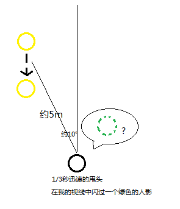

想起之前，有次吃完饭，出食堂的时候，“嗖”的一下，有个人影晃了过去，倒不是因为对方走的太快，而是当我意识到我认识那个人的时候，我很快把头甩过去（可能只有三分之一秒的反应时间），也没来的急打声招呼。只觉得是一个绿色的人影一闪而过（脑补了一下绿灯侠- -）。

事后我在qq上聊及此事，时间地点都对，只是衣服的颜色并非我看到的绿色，而是黄颜色。

图1：证明这都是真事儿

难道是我瞬间患上了色盲症？还是我真的认错了人？还是我也醉了？感觉都不太可能呀。

———————————————这是分割线—————————————————

说不定真的有什么可以解释为什么“看错”颜色（准确的说谁都没有看错）——比如——多普勒效应。

多普勒效应大家都学过，就不多说了，回忆一下事情的经过：

图2：事情就像这样

假设当时的黄颜色光的频率为520THz，而我看的绿颜色光的频率为530THz，那么根据光的多普勒效应公式（狭义相对论下推导）：

$$f'=f \frac{\sqrt{1-\frac{u^{2}}{c^{2}}}}{1+\frac{u\cos \theta}{c}}$$

其中：

$f'$：视光波频率530THz

$f$：原光波频率520THz

$u$：相对速度

$c$：光速299792458m/s

$\theta$：观察者与被观察者的连线与相对运动方向的夹角170°(相向运动)

带入之后解得：

$$u=5799615m/s$$

则1/3秒时间内，我的眼睛焦点扫过的距离约为1933205m

原来，我迅速的抬头之后，望向了远方……

———————————————这是分割线—————————————————

其实颜色改变，原来是发生了所谓的“蓝移”，至于最后具体的数值，可以忽略（因为最后的结果对数据的改变十分敏感，而数据的获取基本上都是我估计的）感受其中的乐趣就足够了。

而且只要速度可以足够快（约为光速的六分之一时），甚至可以把红色看做绿色，这样闯红灯的话，声称是由于多普勒效应，不知道警察叔叔会不会买账。

至于光的多普勒效应的公式，要用到洛伦兹变换和一些简单的狭义相对论的知识，推导过程满大街都能找到（比如《费恩曼物理学讲义（卷一）》）。

谦虚的我当然要加上这一句：希望大家批评指正。

2014-09-22
