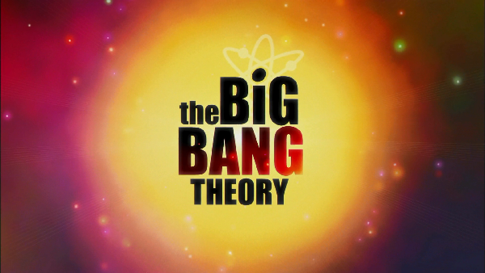

我最喜欢的《生活大爆炸》是由Chuck Lorre和Bill Prady创作的情景喜剧，讲述了四个高智商宅男与一位美女邻居之间发生的故事。

该剧自07年开播以来便获奖无数，IMDB评分更是高达8.5分。

目前最新的第八季已经完结，但之前早已被其出品公司CBS续签到了第十季（2017）。

历经八季的大爆炸发生了太多变化，但片头的主题曲却一如既往的保持了下来，这便是由裸体淑女合唱团（Barenaked Ladies）演绎的《万物史》（The History of Everything）。

从宇宙大爆炸、星系形成、生物演化、人类历史变迁，一直到现今的信息社会，在轻快的曲风下，这些令人目不暇接的背景图切换，有力的诠释了“爆炸”两字！

那么我就逐帧给大家展示一下，里面都包含了哪些东西吧。

**大爆炸宇宙论：** 宇宙是由一个致密炽热的奇点于137亿年前一次大爆炸后膨胀形成的。1927年，比利时天主教神父勒梅特（Georges Lemaître）首次提出了宇宙大爆炸假说。1929年，美国天文学家哈勃根据假说提出星系的红移量与星系间的距离成正比的哈勃定律，并推导出星系都在互相远离的宇宙膨胀说。

大爆炸开始时：约150亿年前，极小体积，极高密度，极高温度，称为奇点。

大爆炸后10-43秒：约10³²度，宇宙从量子涨落背景出现。

大爆炸后10-35秒：约1027度，引力分离，夸克、玻色子、轻子形成。

大爆炸后10-10秒：约1015度，质子和中子形成。

大爆炸后0.01秒：约1000亿度，光子、电子、中微子为主，质子中子仅占10亿分之一，热平衡态，体系急剧膨胀，温度和密度不断下降。

大爆炸后0.1秒后：约300亿度，中子质子比从1.0下降到0.61。

大爆炸后1秒后：约100亿度，中微子向外逃逸，正负电子湮没反应出现，核力尚不足束缚中子和质子。

大爆炸后13.8秒后：约30亿度，氢、氦类稳定原子核（化学元素）形成。

大爆炸后35分钟后：约3亿度，原初核反应过程停止，尚不能形成中性原子。

大爆炸后30万年后：约3000度，化学结合作用使中性原子形成，宇宙主要成分为气态物质，并逐步在自引力作用下凝聚成密度较高的气体云块，直至恒星和恒星系统。

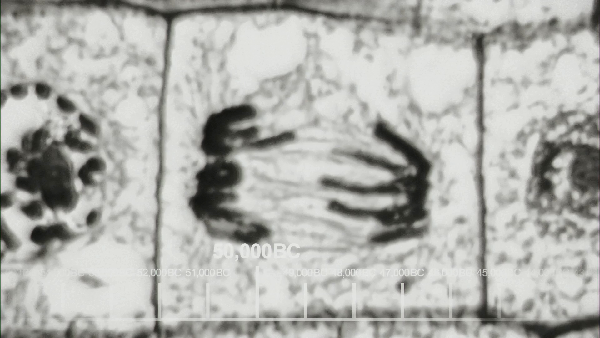

**有丝分裂：** 由E. Strasburger于1880年首次发现于植物，W. Fleming于1882年首次发现于动物。特点是有纺锤体染色体出现，子染色体被平均分配到子细胞，这种分裂方式普遍见于高等动植物。

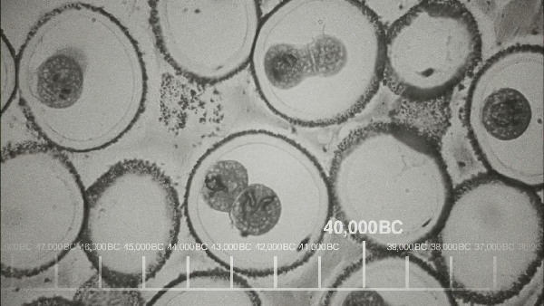

**马蛔虫的有丝分裂：** 马蛔虫受精卵细胞，染色体数目少、结构简单、分裂期各个时期特点非常典型，是观察有丝分裂极好的材料。

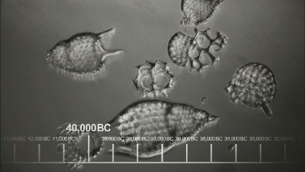

**水生原生生物：** 动物界中最低等的一类真核单细胞动物，而很多科学家认为生命正是从海洋起源的。图为放射虫。

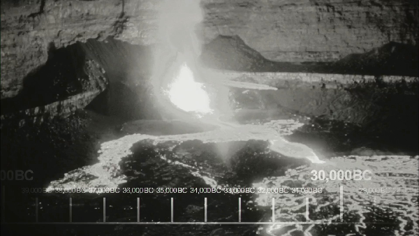

**火山爆发：** 很多科学家认为火山爆发对原始大气的形成与生命的诞生起到了重要作用。气体由火山释出，可能包含了氨、甲烷、水蒸气、二氧化碳、氮气与其他含量较少的气体。火山、闪电与紫外线幅射释出的高能会使得简单化合物如甲烷与氨通过化学反应组合成较为复杂的分子，众多的有机化合物组成了生命的基础。图为夏威夷基拉韦厄火山喷发。

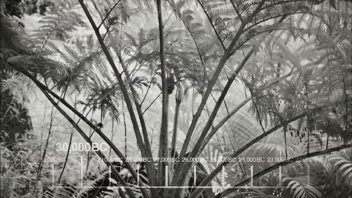

**桫椤：** 别名蛇木，有“蕨类植物之王”赞誉。桫椤是能长成大树的蕨类植物，又称“树蕨”。桫椤的茎直立，中空，似笔筒，叶螺旋状排列于茎顶端。是已经发现唯一的木本蕨类植物，极其珍贵，堪称国宝，被众多国家列为一级保护的濒危植物,有“活化石”之称。

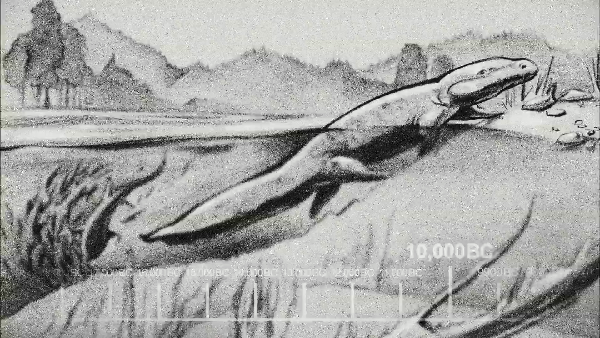

**两栖动物：** 两栖动物是最早长出肺的生物。在三亿九千万年前的泥盆纪开始，某些具有肺样结构的古总鳍鱼曾尝试登陆。到了石炭纪它们爬上陆地。从此它们是往后七千五百万年陆地上最繁荣的脊椎动物。

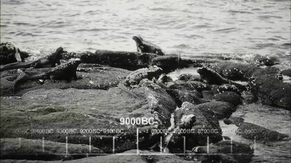

**爬行动物：** 是一类脊椎动物，包括了龟、蛇、蜥蜴、鳄及已绝灭的恐龙与似哺乳爬行动物等等。图中的海鬣蜥是一种外貌像史前动物的爬行动物，古怪的样子令人生畏。有人把它们称作“龙”，其实并不是龙，而是海鬣蜥。海鬣蜥是世界上唯一能适应海洋生活的鬣蜥。它们和鱼类一样，能在海里自由自在地游弋。它们喝海水，吃海藻及其它水生植物。

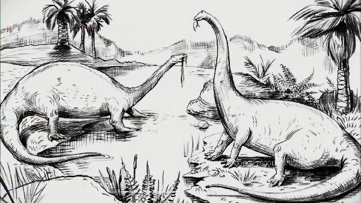

**梁龙：** 生活于侏罗纪末的北美洲西部，时代可追溯至1亿5000万至1亿4700万年前。个体最长可超过30米，体重约10吨左右。鼻孔位于眼睛之上。它们的脖子无法抬高，推测是用来扩大原地进食面积的。属草食性动物。

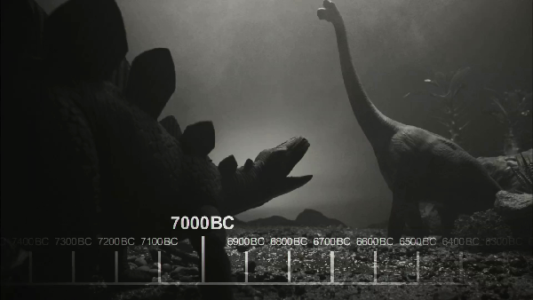

**剑龙与腕龙：** 剑龙生活在侏罗纪晚期，大约是1亿5500万年前到1亿5000万年前左右，食草性动物，它的背上有一排巨大的骨质板，以及带有四根尖刺的危险尾巴来防御掠食者的攻击，头尾长大约是9米，高度则大约4米，重达4 吨；腕龙同样生活在侏罗纪晚期，体长25米，高15米，重达30吨，巨大草食性恐龙，名字的原意为「有武装的蜥蜴」。

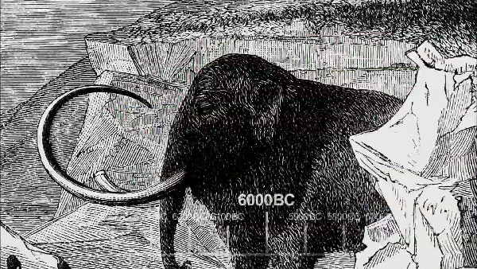

**猛犸：** 又称长毛象，古哺乳动物，是长鼻目象科中特化的一类象，属于猛犸象属（学名：Mammuthus），大小近似现代的象，周身覆盖有棕色长毛，门齿向上弯曲。猛犸象源于非洲，早更新世时分布于欧洲、亚洲、北美洲的北部地区，尤其是冻原地带，体毛长，有一层厚脂肪可隔寒，夏季以草类和豆类为食，冬季以灌木、树皮为食，以群居为主。存活于四百八十万年到四千年前的上新世时期。最后一批西伯利亚猛犸象大约于公元前2000年灭绝，那时正好是埃及建立金字塔时代。

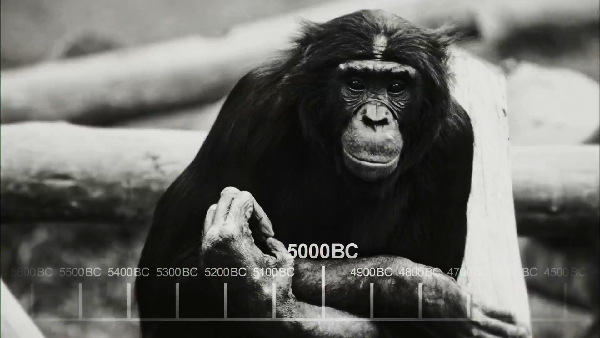

**黑猩猩：** 根据黑猩猩基因组计划的研究结果，黑猩猩和倭黑猩猩与人类具有较高的基因相似度，与人类有最近的共同祖先，按进化论按序可以算是人类最近的“姊妹”，黑猩猩跟人类基因组的相似度高达99%，大约在600万年前“分家”。黑猩猩的生活范围在非洲西部及中部，英文名Chimpanzee在非洲土语中意指“小精灵”，属于哺乳纲灵长目，平日成群地生活，每个群体就像一个部落。

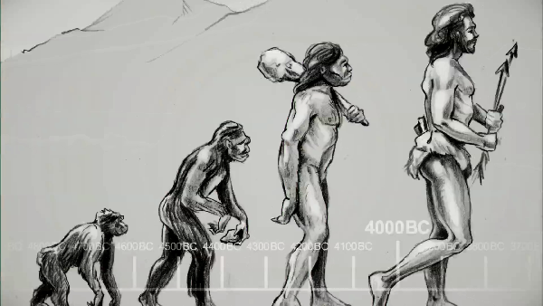

**人类：** 人类进化起源于森林古猿，从灵长类经过漫长的进化过程一步一步发展而来。经历了 猿人类、原始人类、智人类、现代类四个阶段。

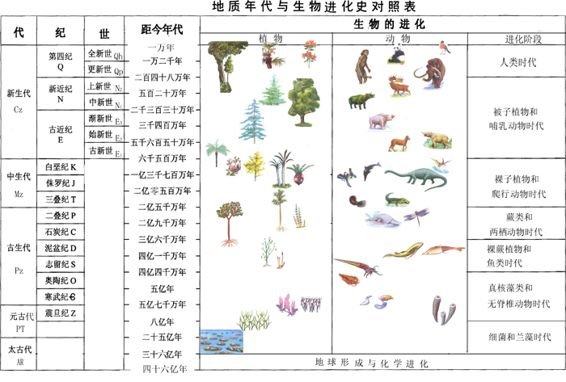

**附图：地质年代与生物进化史**

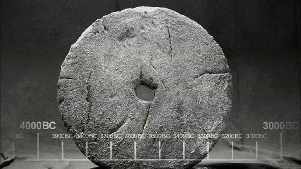

**石器时代：** 是考古学对早期人类历史分期的第一个时代，即从出现人类到青铜器的出现，大约始于距今二三百万年，止于距今6000至4000年左右。这一时代是人类从猿人经过漫长的历史、逐步进化为现代人的时期，人们以石头作为工具使用的时代，这时因为科技不发达，人们只可以石头制造简单的工具。图为石轮。

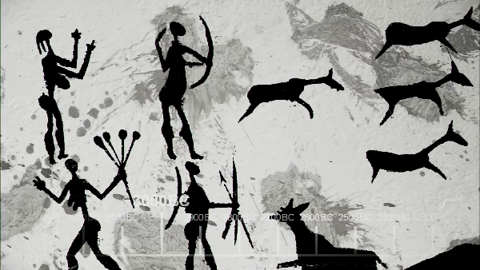

**非洲的古代岩石壁画：** 指约始于公元前9000年的非洲岩画艺术，撒哈拉沙漠和利比亚地区，都发现大量原始猎人刻画的牛、长颈鹿、河马、大象，单峰驼等动物。还有描绘类人类的日常生活、舞蹈、狩猎、战争和举行原始宗教仪式的风俗画等。图中或为非洲san文化岩石壁画。

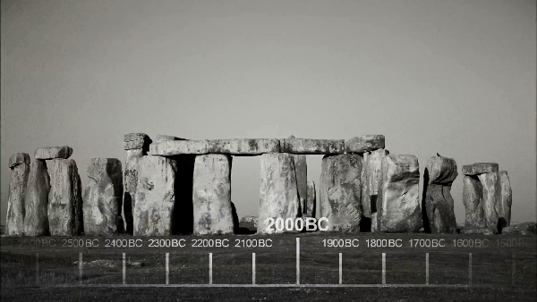

**巨石阵：** 英国最著名的史前建筑遗迹，它的建造起因和方法至今在考古界仍是个不解之谜。巨石阵也叫做圆形石林，位于英国埃姆斯伯里。那里的几十块巨石围成一个大圆圈，其中一些石块足有六米之高。据估计，圆形石林已经在这个一马平川的平原上矗立了几千年。1986年，“巨石阵、埃夫伯里和相关遗址”被列为世界文化遗产。整个巨石阵的结构是由环状列石及环状沟所组成，环状沟的直径将近100米，再距离巨石阵入口处外侧约30米的地方，有一块被称为“席尔”的石头单独立在地上，如果从环状沟向这块石头望去，刚好是夏至当天太阳升起的位置，因此部分的学者认为古代民族用巨石阵来记录太阳的运行。2008年的考古研究从该处挖掘出远至公元前3000年的古代骨灰，考古学家猜测该处最初可能为古时墓地。

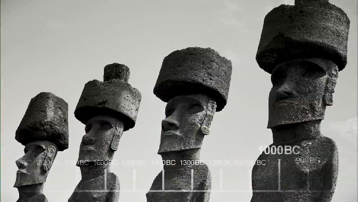

**复活节岛人像：** 复活节岛（Easter Island），太平洋东南部岛屿。最具神秘色彩的是岛上的历史古迹，被称为"露天博物馆"。全岛发现1000多尊巨大的半身人面石像，其中600尊整齐地排列在海边的石岛上。石像大小不等，高6-23米，重约30-90吨，它们形象诙谐，面对大海，若有所思。据考察测定大约雕凿在公元1100-1680年间。这些巨大石像使人惊叹，这些雕像代表什么？是谁雕刻的？怎样雕刻的？怎样雕刻、运输、排列的？以上这些问题众说纷纭，莫衷一是，在岛上上万件古文物 中，有25块上面刻着由人、兽、鱼、鸟等图形符号的木板，大的长2米，岛民称为之为"会说话的木板"，至今无人能读懂它们。对于这些神秘古物，岛民也不知其来历。

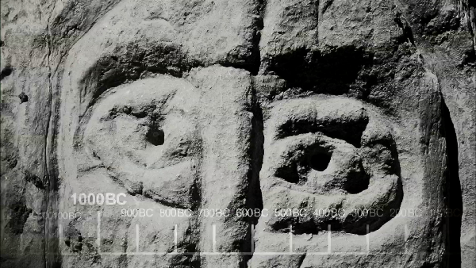

**人面雕刻：** 石质雕刻起源很早。早在原始社会，人们在利用石块制作石器、进行生产生活的同时，也产生了对石的巫术审美。他们把石块雕制成为肖人形或人面形，除普通石质，还是用珍贵的翠玉。图中或为玛雅人面雕刻。

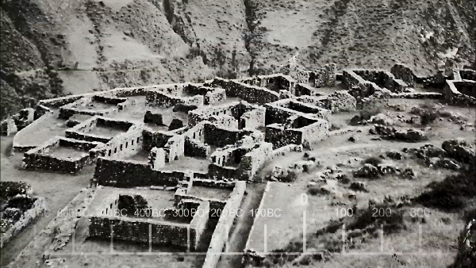

**Q'allaqasa 遗址：** 秘鲁库斯科市的皮克萨（Pisac）遗址是最漂亮最壮观的印加遗址之一，图中的"Q'Allaqasa"的军事区便位于其中。印加帝国（克丘亚语：Tawantinsuyu）是11世纪至16世纪时位于南美洲的古老帝国，亦是前哥伦布时期美洲最大的帝国，印加帝国的政治、军事和文化中心位于今日秘鲁的库斯科。

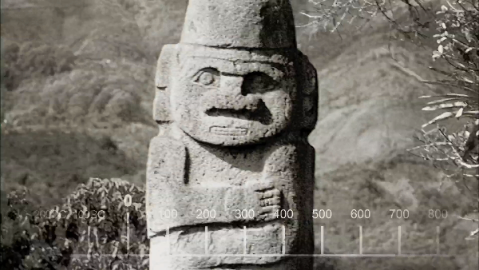

**圣奥古斯丁考古公园：** 位于哥伦比亚南部海拔1800多米的安第斯山区。这里气侯温暖，降水丰富，印第安人的一支在这里孕育发展出了相当独特的圣奥古斯丁文化。圣奥古斯丁文化在公元8世纪达到鼎盛，后来同其他美洲文明一样，迅速地衰败消失了。1995年联合国教科文组织将圣奥古斯丁考古公园作为文化遗产，列入《世界遗产名录》。图为公园中的人像。

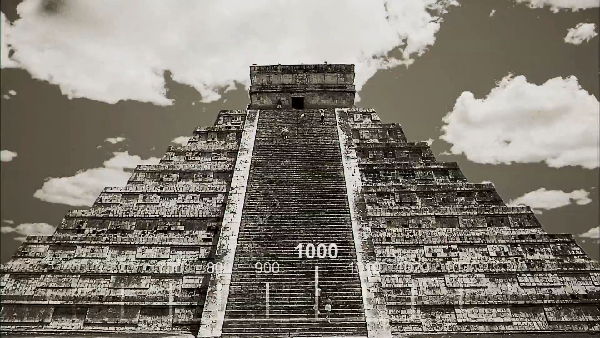

**墨西哥玛雅金字塔：** 又称羽蛇神金字塔、卡斯蒂略金字塔或墨西哥金字塔。位于犹加敦半岛玛雅遗迹奇琴伊察的中心，建造于11至13世纪之间，为祭祀羽蛇神的神庙。金字塔的四面楼梯都是91阶，但若金字塔顶端的神庙如果也算成一阶的话，卡斯蒂略金字塔总共有365阶，每一阶就代表哈布历（Haab'，玛雅历的其中一种）的每一天。

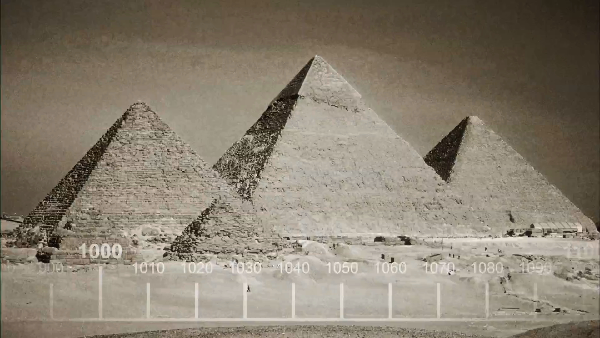

**埃及金字塔：** 相传是古埃及法老（国王）的陵墓，但是考古学家从没有在金字塔中找到过法老的木乃伊。金字塔主要流行于埃及古王国时期。陵墓基座为正方形，四面则是四个相等的三角形（即方锥体），侧影类似汉字的“金”字，故汉语称为金字塔。金字塔是古代世界七大奇迹之一。埃及金字塔是至今最大的建筑群之一，成为了古埃及文明最有影响力和持久的象征之一，这些金字塔大部分建造于埃及古王国和中王国时期。

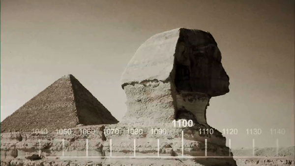

**狮身人面像：** 或称人面狮身像，是一座位在卡夫拉金字塔旁的雕像，外型是一个狮子的身躯和人的头。狮身人面像长约73.5米（241英尺），宽约6米（20英尺）和高约20.22米（66.34英尺）。狮身人面像是现今已知最古老的纪念雕像，一般相信是在法老哈夫拉统治期间内建成（约公元前2558年至2532年）。由于狮身人面像无论是年代、外型，甚至是建造者是谁都充满争议，所以这些问题被世人称作“狮身人面像之谜”，但与希腊神话中的斯芬克斯之谜仍有些许不同。狮身人面像鼻子和胡须已经脱落，有一种说法是当年拿破仑炮轰所致，但真实性有待考证。

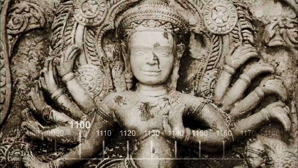

**提毗：** 梵语即为“女神”之意，象征了神圣的女性面，印度教的性力派认为提毗与提婆——男神是相互不可或缺的对存在。婆罗门教奉行一元论，认为提毗是所有女神的原型，因为以这样的哲学见解，所有的印度女神都只是提毗不同的外观而已。图中神像为Durga或Mahakali。

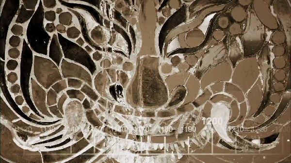

**双龙寺神龙：** 泰国清迈双龙寺是一座由白象选址、皇室建造，充满传奇色彩的庙宇，传说有位锡兰高僧带了几颗佛舍利到泰国，高僧们为了怕让人抢走，便决定将舍利放在白象上，由白象选择一处可以建寺供奉舍利的福地，白象随意游荡，便在双龙寺的现址趴下，人们就建了舍利塔，又由于山路两旁有两只金龙守护，所以便叫做“双龙寺”。

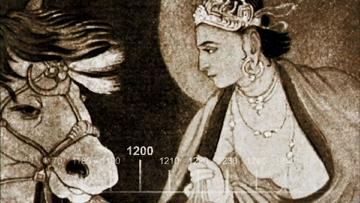

**释迦牟尼出行：** 即悉达多·乔达摩太子，古印度著名思想家，佛教创始人，出生于今尼泊尔南部。他在外出巡游时，恰遇老人、病人、死者和修行者，深感人间生老病死的苦恼人称四门之游，经常在阎浮树下沉思，但是不得离苦之道，于是在29岁时的某个月夜乘马出家修道。图为其出行图。

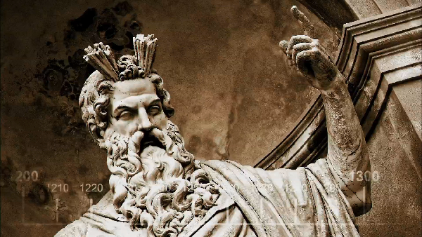

**摩西：** 是公元前13世纪时犹太人的民族领袖。史学界认为他是犹太教的创始者。在犹太教、基督教、伊斯兰教和巴哈伊信仰等宗教里都被认为是极为重要的先知。按照以色列人的传承，摩西五经便是由其所著。出埃及记中记载，摩西受上帝之命，率领被奴役的希伯来人逃离古埃及，前往一块富饶之地:迦南地。经历40多年的艰难跋涉，他在就要到达目的地的时候去世了。在摩西的带领下，希伯来人摆脱了被奴役的悲惨生活，学会遵守十诫，并成为历史上首个尊奉单一神宗教的民族。

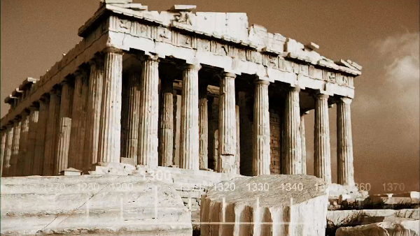

**帕特农神庙：** 是古希腊雅典娜女神的神庙，兴建于公元前5世纪的雅典卫城。它是现存至今最重要的古典希腊时代建筑物，一般被认为是多立克柱式发展的顶端；雕像装饰是古希腊艺术的顶点，此外还被尊为古希腊与雅典民主制度的象征，是举世闻名的文化遗产之一。

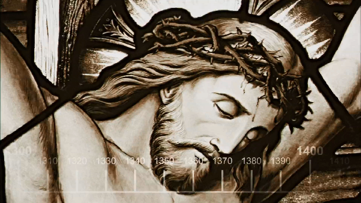

**耶稣：** 基督教的中心人物，是基督教的开创者。又称基督（希伯来语为弥赛亚），耶稣是神的儿子。耶稣两千多年前出生于以色列的伯利恒，三十岁左右开始传天国的福音，在总督本丢彼拉多执政时受难被钉死在十字架上，正如圣经所说，基督为我们的罪死了，而且埋葬了；又如圣经所说，第三天复活了，并且向众门徒显现，复活后第四十天升上高天，现如今坐在神的右边，将来他必要再来，建立荣耀的国度。

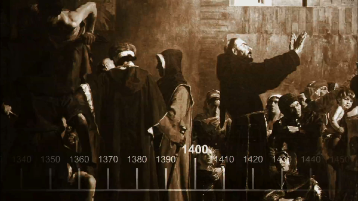

**西班牙宗教裁判所：** 是于1478年由西班牙Isabella女王成立的异端裁判所。用以维护天主教的正统性，直至19世纪初始取消。最新数据显示，从1483年至1820年，共有12万5千人被裁定成异端，被火刑处死的人数有大约1200至2000人。图为J.-P. Laurens创作的画作La Délivrance des Emmurés de Carcassonne。

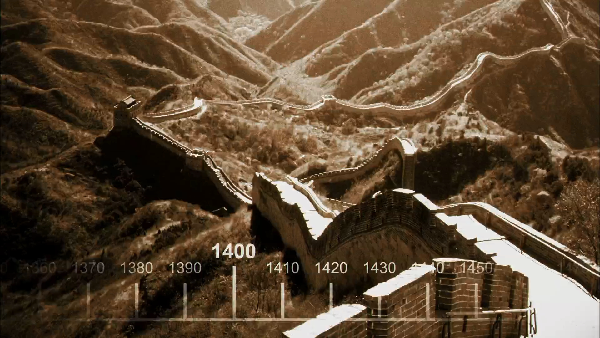

**长城：** 是古代中国为抵御不同时期塞北游牧部落联盟的侵袭，修筑规模浩大的军事工程的统称。长城东西绵延上万华里，因此又称作万里长城。现存的长城遗迹主要为始建于14世纪的明长城，西起嘉峪关，东至虎山长城，长城遗址跨越北京、天津、青海、山西、内蒙等15个省市自治区，总计有43721处长城遗产。长城同时也是自人类文明以来最巨大的单一建筑物，以及修缮时间持续最久的建筑物。2012年6月5日，国家文物局宣布，历经近5年的调查和认定，中国历代长城总长度为24496.18千米。

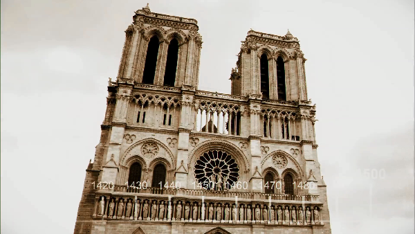

**巴黎圣母院：** 巴黎圣母院大教堂（Cathédrale Notre Dame de Paris）是一座位于法国巴黎市中心、西堤岛上的教堂建筑，也是天主教巴黎总教区的主教座堂。圣母院约建造于1163年到1250年间，属哥特式建筑形式，是法兰西岛地区的哥特式教堂群里面，非常具有关键代表意义的一座。圣母院的法文原名“Notre Dame”原意“我们的女士”，这位女士不是指别人，正是意指耶稣的母亲圣母玛丽亚。

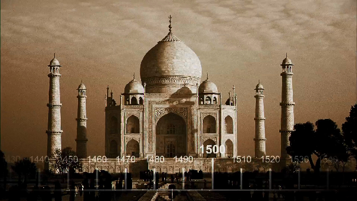

**泰姬陵：** 是位于印度北方邦阿格拉的一座用白色大理石建造的陵墓，是印度知名度最高的古迹之一。它是莫卧儿王朝第5代皇帝沙贾汗为了纪念他的第三任妻子已故皇后姬蔓·芭奴而兴建的陵墓，竣工于1654年。泰姬陵被广泛认为是“印度穆斯林艺术的珍宝和世界遗产中被广泛赞美的杰作之一”。

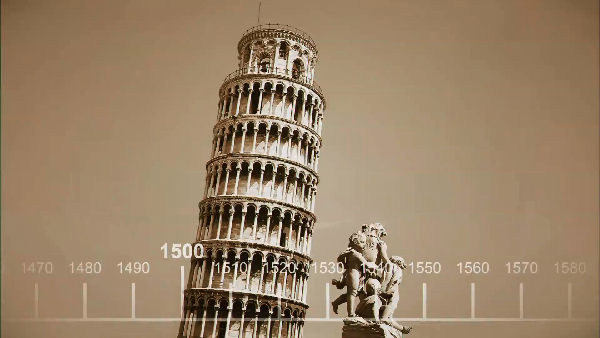

**比萨斜塔：** 位于意大利托斯卡纳省比萨城北面的奇迹广场上，广场的大片草坪上散布着一组宗教建筑，它们是大教堂、洗礼堂、钟楼（即比萨斜塔）和墓园，它们的外墙面均为乳白色大理石砌成，各自相对独立但又形成统一罗马式建筑风格。传说1590年，出生在比萨城的意大利物理学家伽利略，曾在比萨斜塔上做自由落体实验。

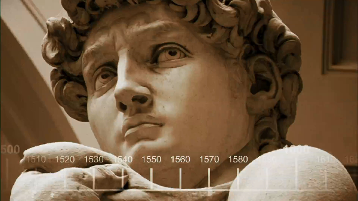

**大卫：** 创作于16世纪初，像高2.5米，连基座高5.5米，用整块大理石雕刻而成，重量高达5.5吨。它是文艺复兴雕塑巨匠米开朗基罗的代表作，被视为西方美术史上最优秀的男性人体雕像之一。大卫是以色列联合王国的第二任国王。大卫的意思是“被爱的”。

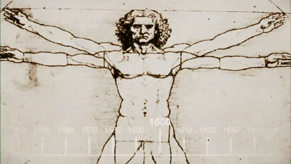

**维特鲁威人：** 是达·芬奇在1487年前后创作的世界著名素描。根据约1500年前维特鲁威在《建筑十书》中的描述，达芬奇努力绘出了完美比例的人体。这幅由钢笔和墨水绘制的手稿，描绘了一个男人在同一位置上的“十”字型和“火”字型的姿态，并同时被分别嵌入到一个矩形和一个圆形当中。这幅画有时也被称作卡侬比例或男子比例。维特鲁威人现被收藏于意大利威尼斯的学院美术馆中。

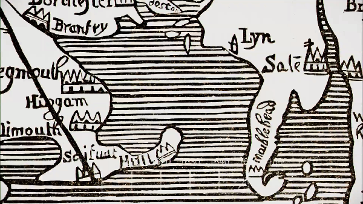

**马萨诸塞湾：** 英国在17世纪定居在北美马萨诸塞湾东海岸的殖民地，被划分至新英格兰并且包含当时重要城市塞勒姆和波士顿。是英国在北美洲大西洋沿岸建立的十三殖民地之一。

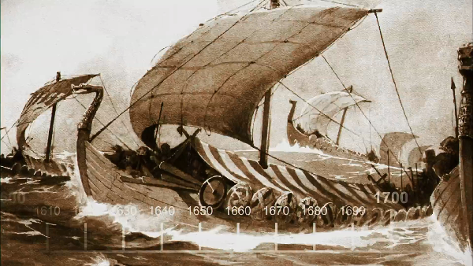

**维京龙头海盗船：** 维京Viking，意是“来自峡湾的人”。维京人泛指生活于公元800年——1066年之间所有的斯堪的纳维亚人。他们从事广泛的海外贸易和殖民扩张，海盗时代初期，维京人对英格兰海岸及欧洲大陆的修道院、教堂和其他一些易于攻击之地发起猛烈进攻，他们因此被描绘成杀人如麻的掠夺者，但实际上他们既是开拓者又是侵略者，既是伟大的探险家又是无恶不作的强盗，既是勤劳的商人又是冷酷的征服者。维京战船统称维京龙头战舰。 维京人的海船一般长70－100英尺，制作精良，可说是一件艺术品，是维京造船师精湛技艺的完美体现。

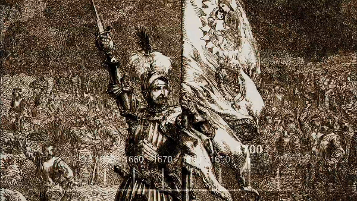

**巴尔波亚：** 文艺复兴时期欧洲探险家。他来自偏远的西班牙西部地区，为埃斯特雷马杜拉的许多征服者之一。在从伊斯帕尼奥拉岛因破产逃出来后，他又对巴拿马地峡进行了探险，并率领一队欧洲人首次看见了太平洋，他在巴拿马建立了今被称为安提瓜的殖民地，成为了新殖民地的首任总督，后被其继任者逮捕处死。

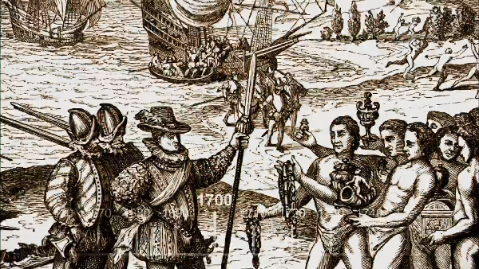

**哥伦布：** 探险家、殖民者、航海家，出生于中世纪的热那亚共和国（今意大利西北部）。在西班牙的天主教君主的赞助下，他在1492年到1502年间四次横渡大西洋，并且成功到达美洲。他使得普通欧洲人也知道了美洲。他的这些航行，以及在伊斯帕尼奥拉岛建立永久居民点的努力，拉开西班牙殖民美洲的序幕，同时也是欧洲殖民后来所谓“新大陆”的先驱。

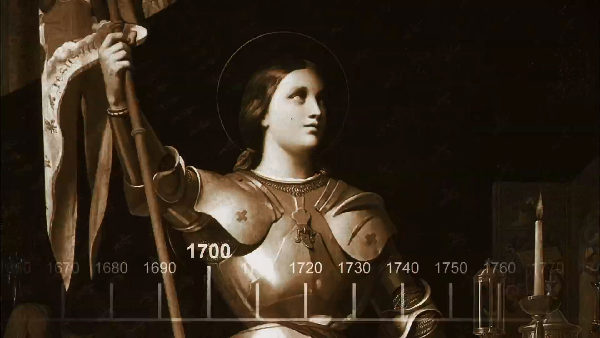

**圣女贞德：** 被法国人视为民族英雄。在英法百年战争（1337年－1453年）中她带领法国军队对抗英军的入侵，最后被捕并被处决。贞德原本是一位法国农村少女，她声称在十六岁时的一日，在村后的大树下遇见天使，从而得到“上帝的启示”，要求她带兵收复当时由英格兰人占领的法国失地。后来她几番转折，得到兵权，于1429年解奥尔良之围，成为了闻名法国的女英雄，后带兵多次打败英格兰的侵略者。500年后被梵蒂冈封圣。

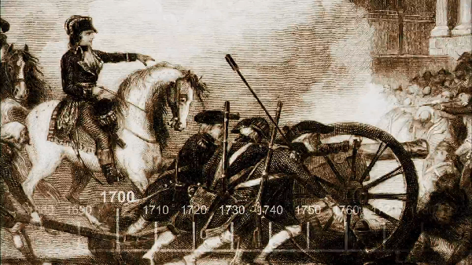

**拿破仑：** 出生于科西嘉岛，十九世纪著名军事家、政治家，法兰西第一帝国的缔造者。在其统治下的法兰西帝国一度达到鼎盛，使其成为欧洲霸主，成为跟凯撒大帝、亚历山大大帝齐名的拿破仑大帝。与反法联军的最后一战滑铁卢战役最终战败，结束了拿破仑帝国，其本人被放逐，自此退出历史舞台。

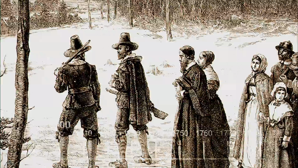

**朝圣者去教堂：** George Henry Boughton于1867年创作的绘画Pilgrims Going to Church，描绘了17世纪新英格兰的清教徒在一个下雪的冬季，虔诚的前往教堂的场景。

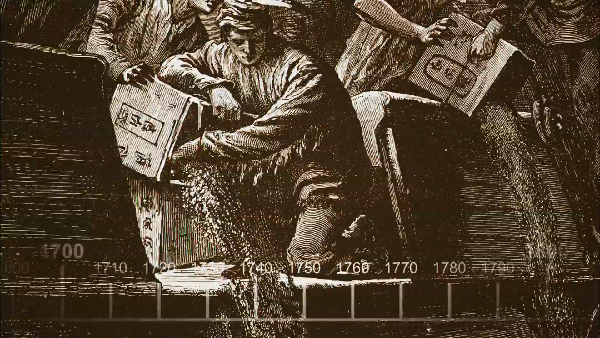

**波士顿倾茶事件：** 发生在1773年12月16日的政治示威，因北美人民不满英国殖民者的统治，当地居民塞缪尔·亚当斯率领60名自由之子化妆成印第安人潜入商船，把船上价值约1.5万英镑的342箱（约为18,000磅）茶叶全部倒入大海，来对抗英国国会，最终引起著名的美国独立战争。

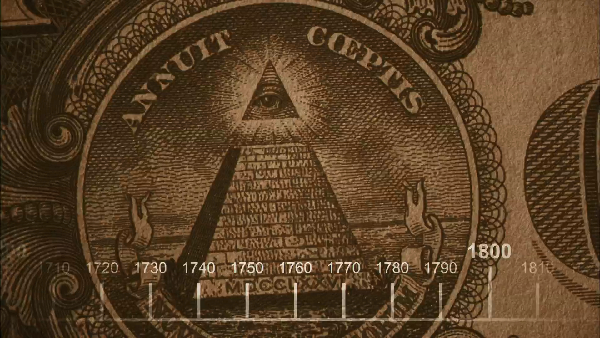

**上帝之眼：** 代表着“上帝”监视人类的法眼，常见的形式为一颗被三角形及万丈光芒所环绕的眼睛，以出现在美国国徽及一美元纸币的背面而广为人知。上帝之眼通常会与共济会关联。眼睛的图案最早是在1797年作为共济会标准意象的一部分出现的。这个图案代表上帝的全视之眼，警示着共济会的所思所行都被上帝观察着。

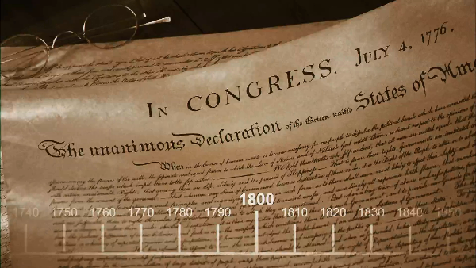

**独立宣言：** 为北美洲十三个英属殖民地宣告自大不列颠王国独立，并宣明此举正当性的文告。1776年7月4日，本宣言由第二次大陆会议于费城批准，当日之后成为美国独立纪念日。原件由大陆会议出席代表共同签署，并永久展示于美国华盛顿特区的美国国家档案馆。此宣言为美国最重要的立国文书之一。

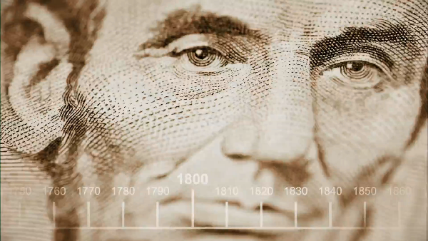

**林肯：** 第十六任美国总统，1861年3月就任，直至1865年4月遇刺身亡。林肯领导美国经历了其历史上最为惨烈的战争和最为严重的道德、宪政和政治危机——南北战争。由此他维护了联邦的完整，废除了奴隶制，增强了联邦政府的权力，并推动了经济的现代化。林肯的头像出现在两种面值的美国货币上——1美分硬币和5美元纸币。

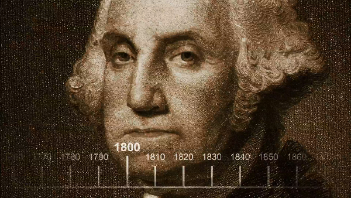

**华盛顿：** 美国国父，1775年至1783年美国独立战争时殖民地军的总司令，1789年成为美国第一任总统（其同时也成为全世界第一位以“总统”为称号的国家元首），在接连两次选举中都获得了全体选举团无异议支持，一直担任总统直到1797年。他也是一名共济会成员。1美元纸币和25美分硬币上印有他的肖像。

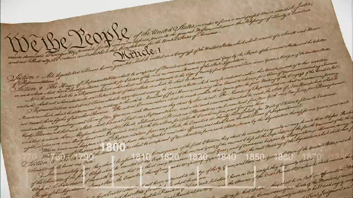

**美国宪法：** 是美国的根本大法，奠定美国政治制度的法律基础。1789年，美国宪法正式生效。美国宪法是世界上首部成文宪法，该宪法为日后许多国家成文宪法的制定提供了成功的典范。 美国宪法的序言只有一句话：我们合众国人民，为建立更完善的联邦，树立正义，保障国内安宁，提供共同防务，促进公共福利，并使我们自己和后代得享自由的幸福，特为美利坚合众国制定本宪法。

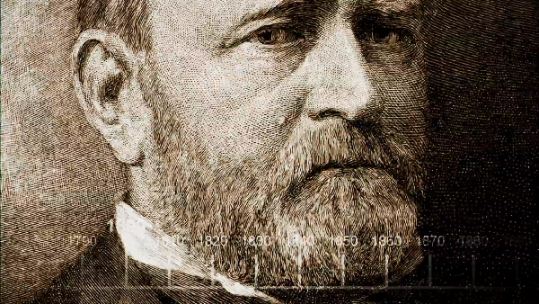

**格兰特：** 美国军事家、陆军上将、第18任美国总统，他是美国历史上第一位从西点军校毕业的总统。在美国南北战争后期任联邦军总司令，屡建奇功。但能征惯战并不等于善于理政，格兰特的平平政绩与他的赫赫战功成为明显对照。

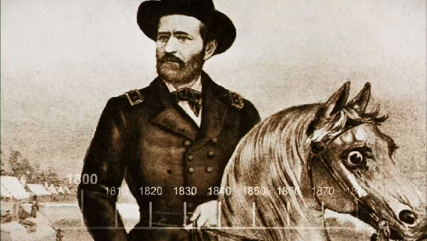

仍为格兰特

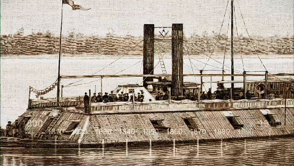

**USS Baron DeKalb战舰：** 1861年美国南北战争时期为联合海军构建的城市级铁甲战舰。工业革命带来了军事上的巨大进步，双方使用了金属弹壳和后装填步枪作战，使用铁路和蒸汽船实现快速的兵力机动和集结，使用蒸汽铁甲战舰进行海战。

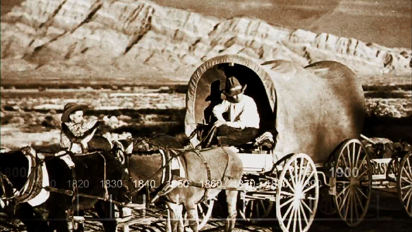

**西进运动：** 也称为血泪之路，是指在北美殖民地时期开始的向西移民的活动和对西部的开发，同时也是美国文化本土化的发展历程。广大的西部土地并入美国，使美国成为幅员辽阔、自然资源丰富的国家；西部的开拓，带动了大规模铁路的建筑和大批移民的流人，使美国形成了广大的国内市场。

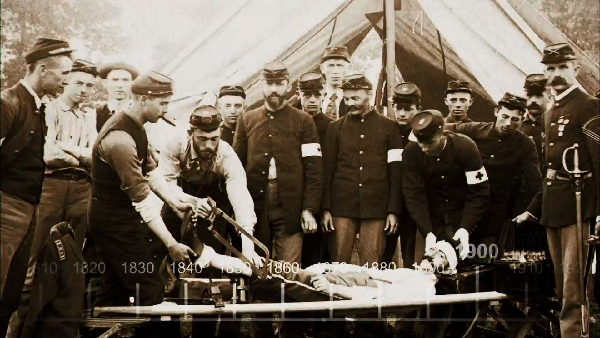

**南北战争时期的截肢手术：** 拍摄于盖茨堡，1863年7月。南北战争美国共死了60多万人。

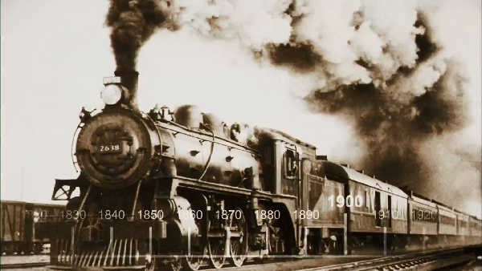

**温哥华高速列车：** 美国是世界上拥有铁路最多的国家，美国于1830年5月24日第一条铁路建成通车，全长21公里，从巴尔的摩至埃利州科特。19世纪50年代，筑路规模扩大，80年代形成高潮。从 1850～1910年的60年间，共修筑铁路37万余公里，平均年筑路6000余公里。

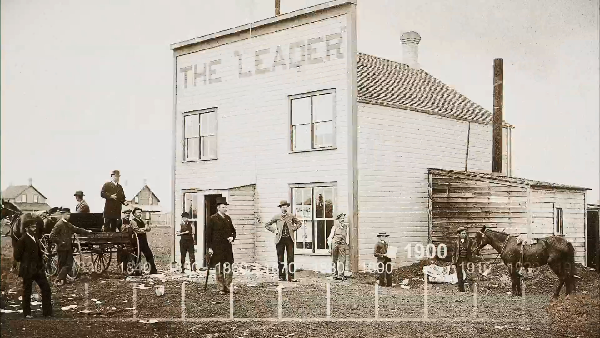

**The Leader报社：** 加拿大萨斯喀彻温省Regina地区的第一家报纸便在此发行。1885年Otto B. Buell.Corey拍摄此照片，站在前面戴礼帽的男士即为此报社的领导者。

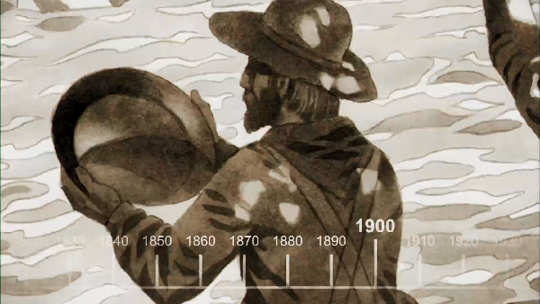

**淘金热：** 淘金热是美国西进运动的产物，也是其中极为重要的一个环节。对美国18-19世纪的经济开发，农业扩张交通革命，工商业发展具有重要的意义。一个地区戏剧性地发现了数量上拥有商业价值的黄金时，大量移民工人涌入这个地区的时期。淘金热的高潮时段，美国几乎所有的企业停止了营业，士兵离开了营房，农民典押田宅，工人扔下工具，公务员离开写字台，甚至连传教士也离开了布道所。

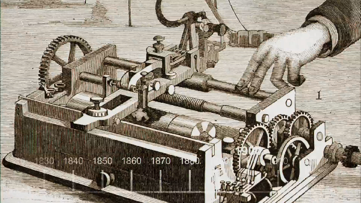

**电报机：** 在1832年俄国外交家希林制作出了用电流计指针偏转来接收信息的电报机，1837年6月英国青年库克获得了第一个电报发明专利权，1835年美国画家莫尔斯经过3年的钻研之后，第一台电报机问世，莫尔斯成功地用电流的“通”“断”和“长短”来代替了人类的文字进行传送，这就是鼎鼎大名的莫尔斯电码。

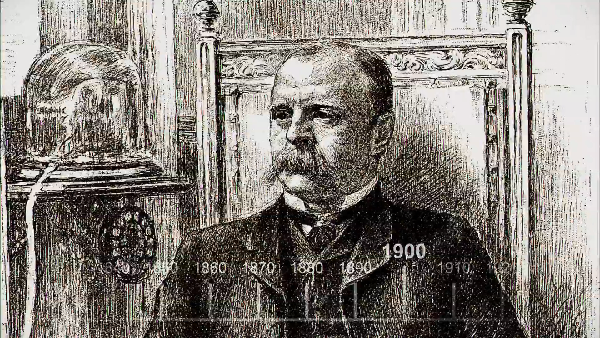

**J. Edward Simmons与Edison Stock Ticker：** J. Edward Simmons在1885年是纽约证券交易所的董事长，身边的机器是Edison Stock Ticker由爱迪生在1869年发明，是最早的电子通讯媒介，用纸带传输股票价格信息。

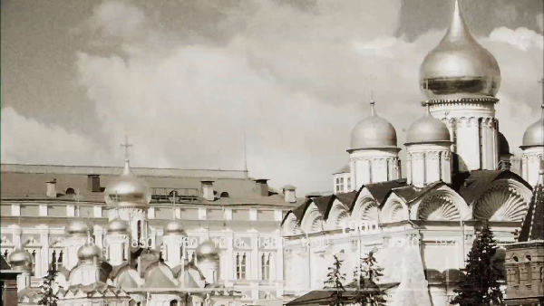

**天使报喜教堂和天使长教堂：** 报喜大教堂,又名圣母领报大教堂。近半个世纪以来，是莫斯科大公爵和国王一个家庭教堂，该教堂被定性为王室举行仪式的地方：婚礼,洗礼等。它也是大公的存储室和国库；天使长教堂，是由意大利建筑师诺维在1505～1508年间，在原来一座14世纪老教堂的位置上建造而成的教堂，既保持了俄罗斯五穹顶教堂建筑的传统风格，又在外观上表现了文艺复兴时期威尼斯建筑的特点。

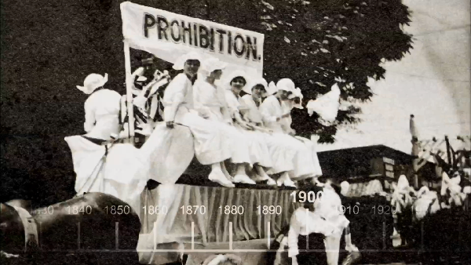

**禁酒令：** 从1920年1月17日凌晨0时，美国宪法第18号修正案——禁酒法案（又称“伏尔斯泰得法案”）正式生效。 根据这项法律规定，凡是制造、售卖乃至于运输酒精含量超过0.5%以上的饮料皆属违法。自己在家里喝酒不算犯法，但与朋友共饮或举行酒宴则属违法，最高可被罚款1000美元及监禁半年。 21岁以上的人才能买到酒，并需要出示年龄证明，而且只能到限定的地方购买。

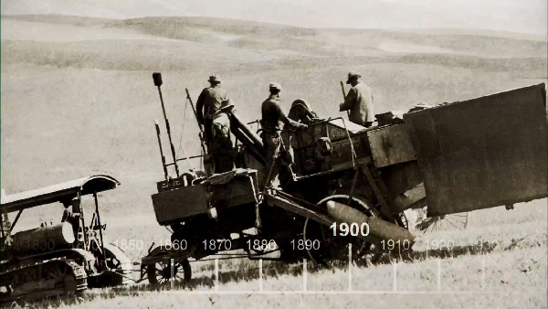

**第二次工业革命：** 指1870年至1914年的工业革命。工业得到飞速发展。第二次工业革命紧跟着19世纪末的第一次工业革命，并且从英国向西欧和北美蔓延。第二次工业革命以电力的大规模应用为代表，电灯的发明为标志。

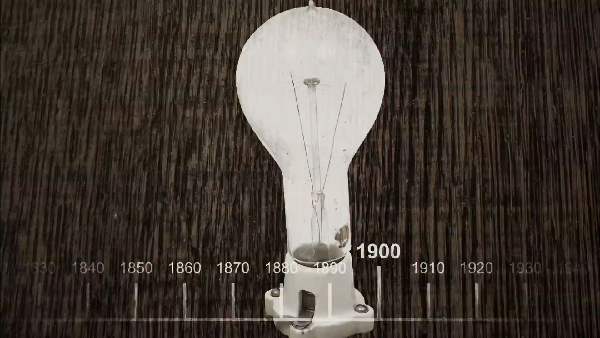

**电灯泡：** 世界上第一盏犁口般大小的电灯由美国科学家爱迪生于1879年10月21日试制成功。电灯泡的发明把黑夜变为白昼，扩大了人类活动的范围，赢得更多时间为社会创造财富。

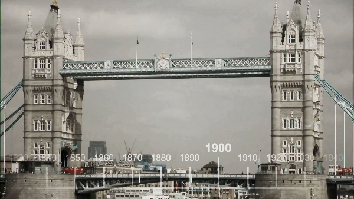

**伦敦塔桥：** 是一座上开悬索桥，位于英国伦敦，横跨泰晤士河，因在伦敦塔附近而得名，是从泰晤士河口算起的第一座桥（泰晤士河上共建桥15座），也是伦敦的象征。

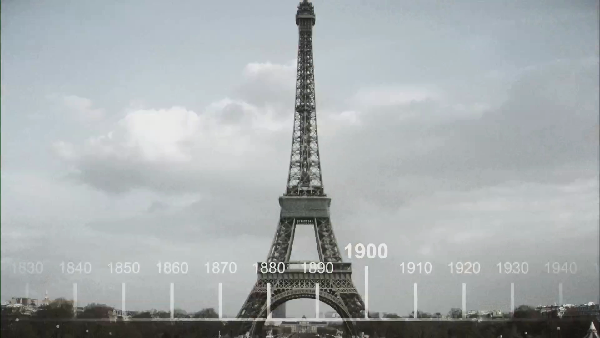

**埃菲尔铁塔：** 矗立在法国巴黎的战神广场，是世界著名建筑之一，也是法国文化象征之一，巴黎城市地标之一，也是巴黎最高建筑物，高300米，天线高24米，总高324米，于1889年建成。埃菲尔铁塔作为法兰西文化里的标志性传世佳作，广泛见于书籍、文艺、美术、装饰品等。

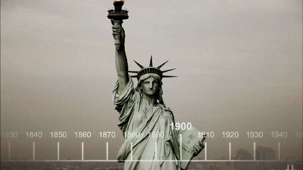

**自由女神像：** 是法国在1876年赠送给美国的独立100周年礼物。美国的自由女神像位于美国纽约州纽约市哈德逊河口附近。由法国著名雕塑家奥古斯特·巴托尔迪在巴黎设计并制作，历时10余年完成，在1886年10月28日由美国总统克利夫兰亲自在纽约主持揭幕。女神像高46米，加基座为93米，重225吨，是金属铸造，置于一座混凝土制的台基上，右手高举象征自由的火炬，左手捧着美国《独立宣言》，脚下是打碎的手铐、脚镣和锁链。象征着自由、挣脱暴政的约束。

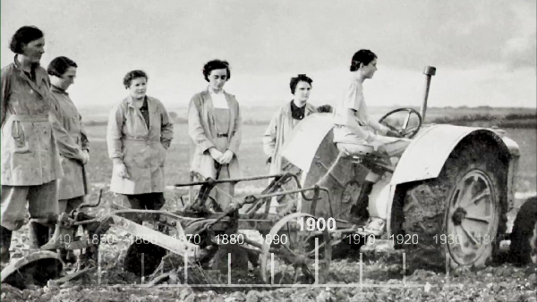

**妇女土地服务队：** 1917年建立,代替服役男子从事农业劳动,其全称为Women's Land Army。

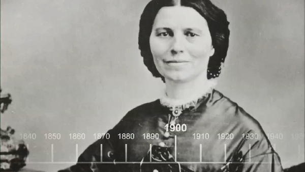

**克莱拉·巴顿：** 南北战争时期从事护士工作，策划并创立了美国红十字会。为美国医护工作奉献一生。

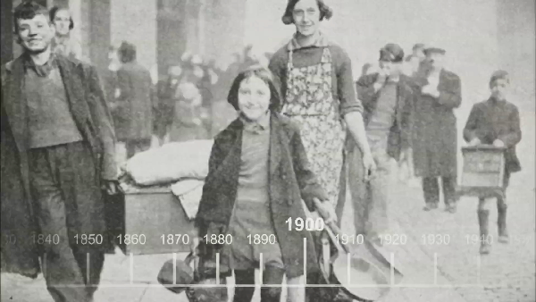

**美国移民潮：** 拿破仑战争结束后，欧洲重获和平。随着大批军人的复员，欧洲各国失业现象愈发严重，移民美国的人数逐年增加。此时，美国也因国内建设需要，改变了限制移民的政策。1848年欧洲革命后，移民美国的浪潮更是一浪高过一浪。从1820年到1920年的100年间，美国一共接纳了大约3350万移民，形成美国持续百年的移民潮。

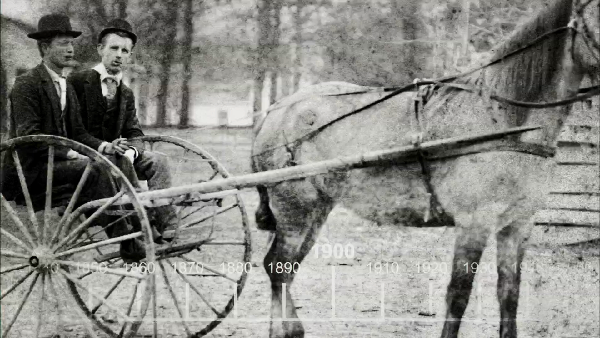

**阿米什人：** 是美国和加拿大安大略省的一群基督新教再洗礼派门诺会信徒（又称亚米胥派），以拒绝汽车及电力等现代设施，过着简朴的生活而闻名。

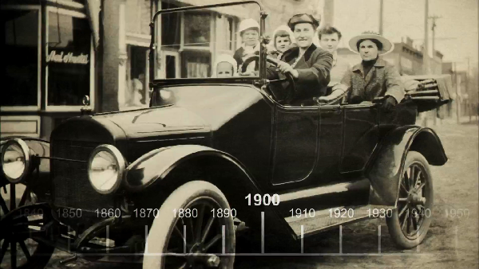

**福特T型车：** 它的面世使1908年成为工业史上具有重要意义的一年，T型车以其低廉的价格使汽车作为一种实用工具走入了寻常百姓之家，美国亦自此成为了“车轮上的国度”。受到屠宰厂动物肢解与传送带传送过程的启发，福特公司将流水装配线的概念引入汽车制造行业。

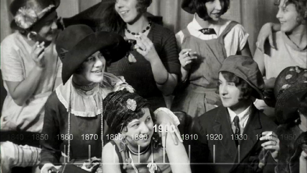

**妇女参政运动：** 19世纪末，美国妇女争取选举权的斗争进入了另一阶段。黑人解放运动和妇女运动的分裂导致许多资产阶级妇女纷纷建立妇女参政团体。1890年妇女选举权法案已在4、5个州获得通过，妇女争取选举权的斗争取得初步胜利。美国妇女在1920年获得了与男子平等的选举权。承认所有妇女都拥有选举权的第19宪法修正案终于获得国会批准并在该年8月26日正式生效。

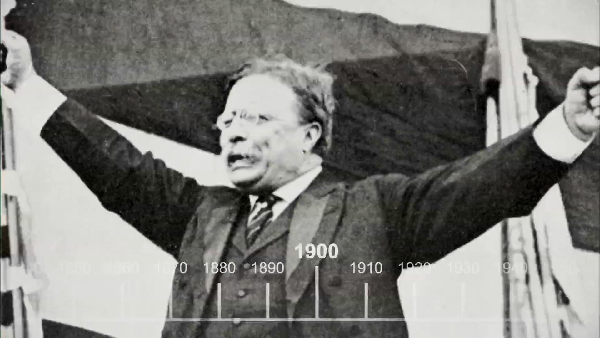

**老罗斯福：** 生在纽约市的罗斯福家族，美国军事家、政治家，第26任总统。他成为总统，时年42岁，是美国历史上最年轻的总统。他的独特个性和改革政策，使他成为美国历史上最伟大的总统之一。

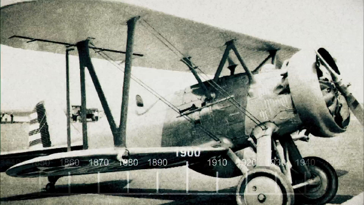

**波音P-12：** 1928年，波音公司自费研制一种双翼单座战斗机，交海军使用，即著名的F48，陆军型号改称P-12(意指第12种战斗机)。

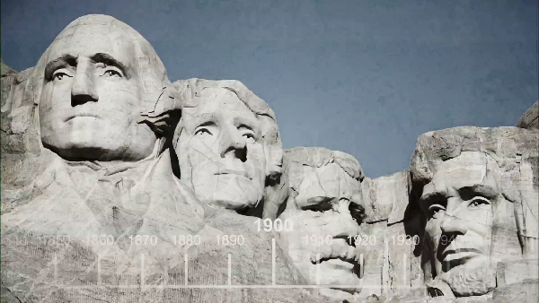

**拉什莫尔山：** 俗称美国总统山，是一座座落于美国南达科他州基斯通附近的美利坚合众国总统纪念馆。公园内有四座高达60英尺（约合18米）的美国历史上著名的前总统头像，他们分别是华盛顿、杰斐逊、老罗斯福和林肯，这四位总统被认为是美国最伟大的总统，代表了美国建国130年来的历史。

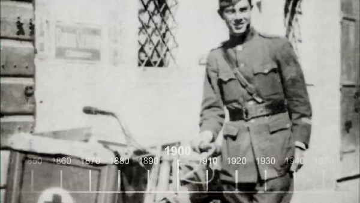

**红十字会志愿者：** 美国红十字会是全球最大的救援组织之一，但它只是全球灾民救援和应急防备体系的一个分支。美国红十字会创建于1881年，国会在1990年正式承认这一组织，并给它制定了正式章程。

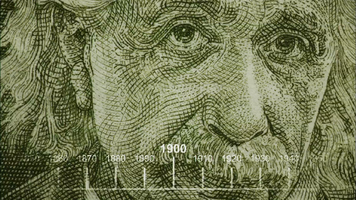

**爱因斯坦：** 20世纪犹太裔理论物理学家，科学哲学家，创立了相对论，现代物理学的两大支柱之一（另一支柱是量子力学）。爱因斯坦的质能方程E = mc2最著称于世，他也因为“对理论物理的贡献，特别是发现了光电效应”而获得1921年诺贝尔物理学奖，这个发现为量子理论的建立踏出了关键脚步。

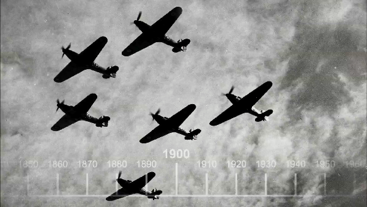

**飓风战斗机：** 是英国于30年代设计的战斗机，在不列颠空战期间皇家空军取得的战果大都由飓风战斗机击落，是英国胜出不列颠空战的最大功臣。到1944年末共生产14,000架飓风和海飓风战斗机，并在第二次世界大战各个主要战场服役。

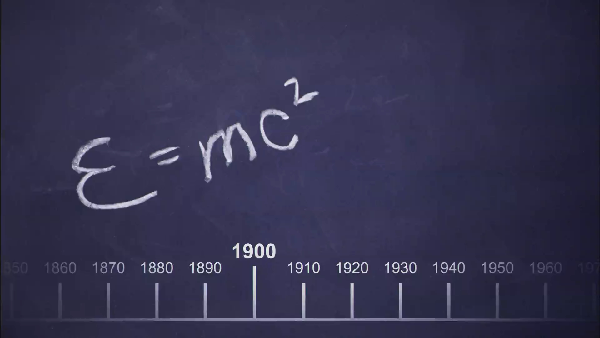

**质能方程：** 是一种阐述能量（E）与质量（m）间相互关系的理论物理学公式，公式中的c是物理学中代表光速的常数。

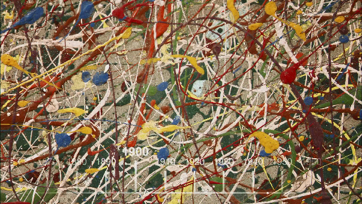

**杰克逊·波洛克：** 是一位有影响力的美国画家，抽象表现主义运动的主要力量。他以独特创立的滴画（图中）而著名。

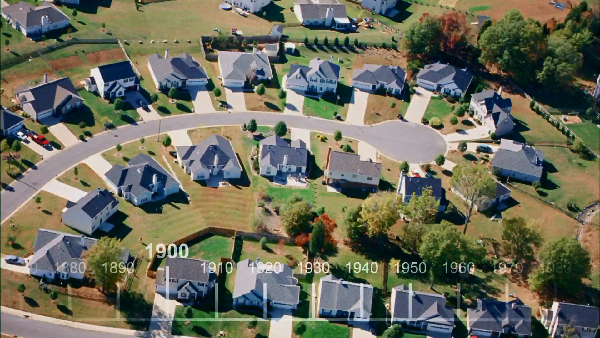

**郊区化：** 二战以来，美国城市人口以空前的速度向郊区转移，到70年代郊区人口已经分别超过了中心城和乡村人口，这是继1920年城市人口超过乡村人口的另一次历史性的变化。美国不仅在人口方面成为一个郊区化的国家，而且其经济活动的重心也在日益向郊区转移。

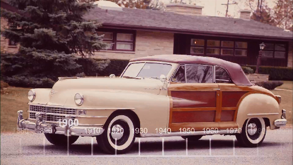

**克莱斯勒敞篷车：** 1946年，克莱斯勒恢复汽车生产，生产略有改进的战前车型。克莱斯勒“Town & Country”则推出新型轿车、双门轿车和敞篷轿车版本。

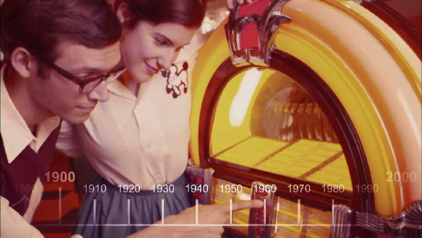

**Wurlitzer jukebox：** 1946年二战结束后，Wurlitzer1015型自动唱片点唱机一路狂销。仅在前18个月就售出超过56000台，成为最成功的一款点唱机。

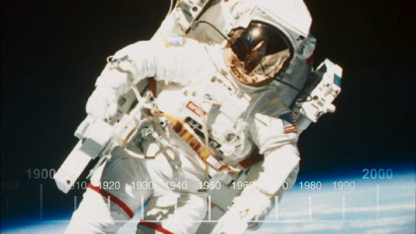

**舱外活动：** 1965年3月苏联航天员阿里克谢·列昂诺夫第一次由“上升”2号飞船飞出舱外时，其目的有两个：一是在载人航天活动中进行一次技术性的突破，二是使苏联在航天技术方面走到了美国前边，在全世界产生重大影响。美国也不甘示弱，同年6月，美国人怀特在乘双子星座4号飞船飞行时也飞出舱外。从此，出舱活动的技术就为两家所共有，在这时人们才谈到太空行走的实用意义。

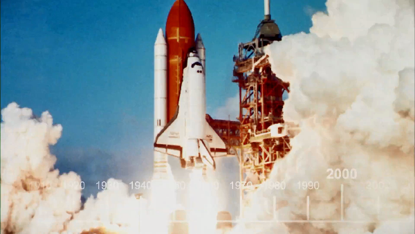

**挑战者号航天飞机：** 是美国国家航空航天局（NASA）肯尼迪太空中心旗下的一架航天飞机。1983年开始用做轨道载具，但不幸在1986年时于任务中爆炸坠毁。图为1984年执行STS-41-C任务，是挑战者号航天飞机的第五次太空飞行。

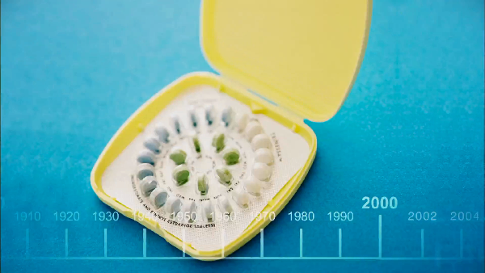

**避孕药：** 小圈7颗大圈21颗，一种周期型激素类避孕药。1960年，首次发明了避孕药，避孕药的出现使女性得以从生育的苦难中解脱出来，获得了更高的性自由。

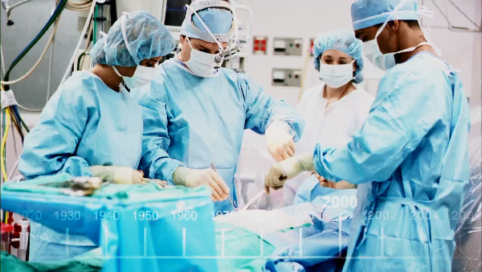

**外科手术：** 自 60 年代以来，现代医学见证了从人工心脏到器官和组织移植，从腹腔镜手术到机器人手术的发展。这些发展为人类带来了福音，各种类型的手术不断增加，更重要的是手术的成功率大大提高。

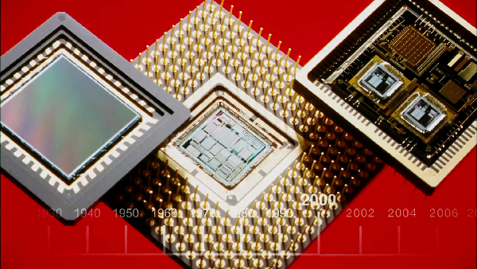

**超大规模集成电路：** 集成电路无处不在，电脑，手机和其他数字电器成为现代社会结构不可缺少的一部分。现代电子设备不断追求小型化、高速化促进了集成电路的发展，甚至很多学者认为有集成电路带来的数字革命是人类历史中最重要的事件。图中的英特尔奔腾处理器即为一种超大规模集成电路。

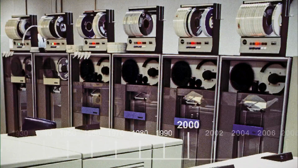

**磁带存储设备：** 以磁带为存储介质，由磁带机及其控制器组成的存储设备，是计算机的一种辅助存储器。图为IBM3420磁带存储器。

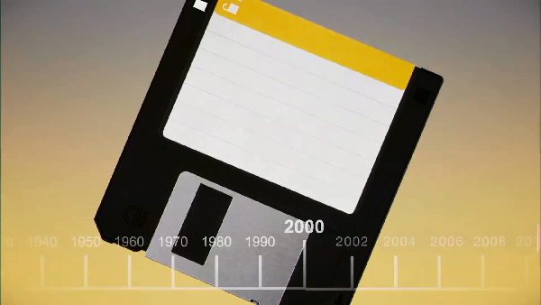

**软盘：** 是个人电脑设备中，最早使用可移动存储媒体。软盘存取速度慢，容量也小，但可装可卸、携带方便。作为一种可移贮存方法，它是用于那些需要被物理移动的小文件的理想选择。目前软盘已经逐渐被淘汰。图为3.5英寸1.44M软盘。

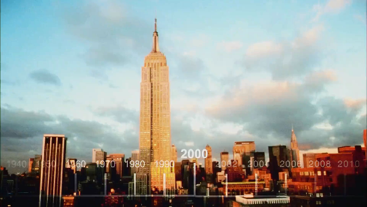

**帝国大厦：** 是位于美国纽约州纽约市曼哈顿第五大道的一栋著名摩天大楼，名称源于纽约州的昵称──帝国州。帝国大厦为纽约市以至美国最著名的地标和旅游景点之一，为美国及美洲第4高，世界上第25高的摩天大楼，也是保持世界最高建筑地位最久的摩天大楼（1931-1972年）。楼高381米、103层，于1951年增添的天线高62米，提高其总高度至443米，大楼于1930年动工，于1931年落成，建造过程仅410日，是世界上罕见的建造速度纪录。

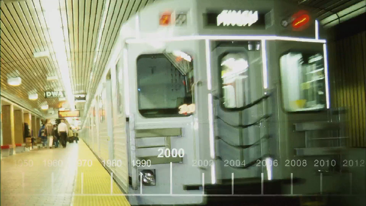

**地铁：** 给人们带来快捷、便利、有序的交通和良好的乘车环境，使人们更多地感受到生活质量的提高和享受。以无法比拟的优越性，成为解决时间集中、客流量特大城市交通问题的理想方式。随着1863年伦敦地铁率先建成而进入新的拐点，如今，全球100多个城市拥有地铁，总长超过5500公里。图为多伦多地铁在Union车站。

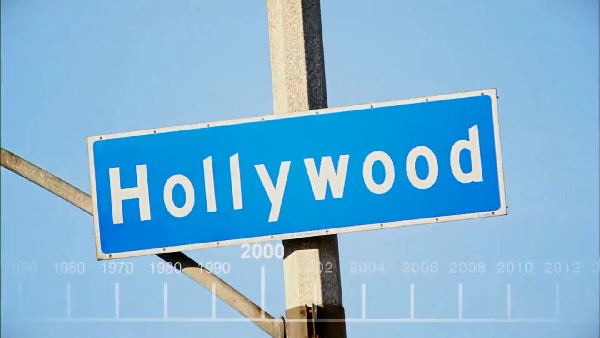

**好莱坞：** 不仅是全球时尚的发源地，也是全球音乐电影产业的中心地带，拥有着世界顶级的娱乐产业和奢侈品牌，引领并代表着全球时尚的最高水平，比如梦工厂、迪士尼、20世纪福克斯、哥伦比亚影业公司、索尼公司、环球影片公司等等这些电影巨头，这里的时尚与科技互相牵制发展，自然是不造作的，拥有着深厚的时尚底蕴和雄壮的科技做支持，一直被全球各地争相模仿。

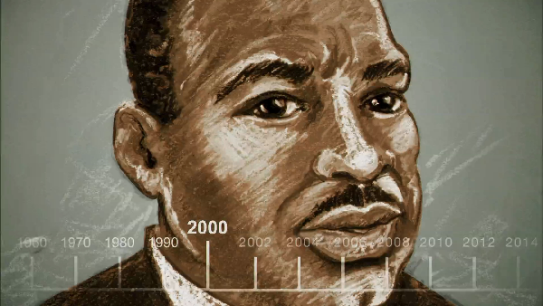

**马丁·路德·金：** 美国黑人民权运动领袖。1963年8月28日，在林肯纪念堂前，发表了《我有一个梦想》的演说。1964年度诺贝尔和平奖的获得者。从1986年起，美国政府将每年1月的第3个星期一，定为马丁路德金全国纪念日。

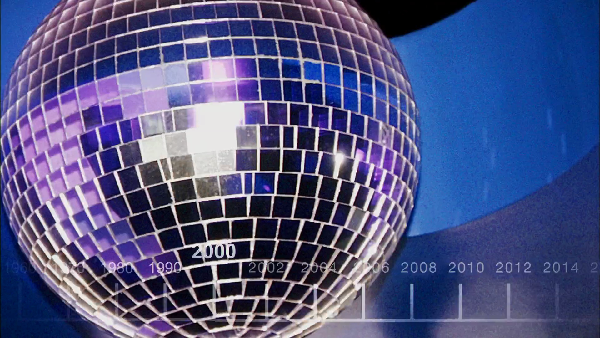

**DISCO：** 70年代初兴起的一种流行舞曲，音乐比较简单，具有强劲的节拍和强烈的动感。图为DISCO镭射球。

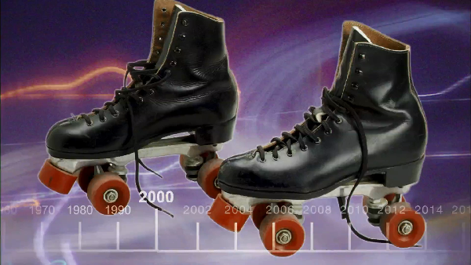

**双排溜冰鞋：** 是一种利用特别的轮滑鞋为比赛工具的竞赛项目，也是一种日常休闲的玩意儿。今日多数的溜冰者主要都是用直排轮。

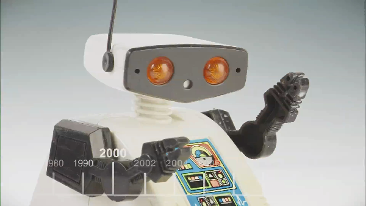

**Mysta Bot：** 由PlayTime生产，流行于80年代的机器人玩具。

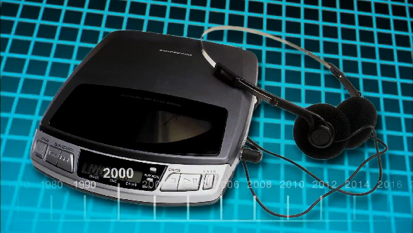

**随身听：** 携带型袖珍播放机，属于电子产品的一个种类。该辞汇最初出自日本索尼公司的一个品牌，中文名称由Walkman转变而来。图为AIWA XP-560型CD随身听。

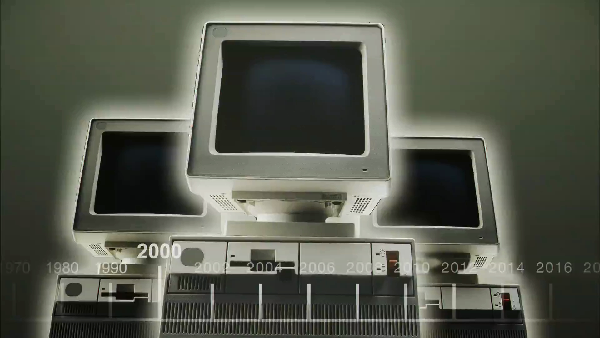

**计算机：** 是一种能够按照指令对各种数据和信息进行自动加工与处理的电子设备。电子计算机诞生于20世纪中叶，是人类最伟大的技术发明之一。它的出现和广泛应用把人类从繁重的脑力劳动中解放出来，在社会各个领域中提高了信息的收集、处理和传播的速度与准确性，直接加快了人类向信息化社会迈进的步伐，是科学技术发展史上的里程碑。图为IBM PS/2 Model 50Z型计算机。

**Hip Hop：** 源自于街头的一种黑人文化，也泛指rap（说唱）。hip-hop 文化的五种表现方式包括rap （有节奏、押韵地说话）、b-boying（街舞）、dj-ing（玩唱片及唱盘技巧）、graffiti writing（涂鸦艺术）、beat-box（人体音响）。另外，亦衍生出节奏口技、嘻哈时装、嘻哈俗语等次文化。

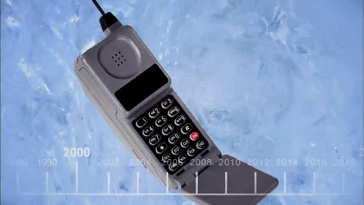

**手机：** 1990年代中期以前价格昂贵，只有极少部分经济实力较佳的人才买得起，而且体积庞大，因此又有大哥大的俗称。1990年代后期大幅降价，如今已成为现代人日常不可或缺的电子用品之一。图为1989年的Motorola Micro TAC。

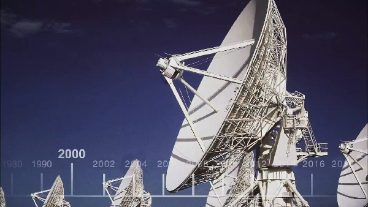

**甚大阵射电望远镜：** 由27台25米口径的天线组成的射电望远镜阵列，位于美国新墨西哥州的圣阿古斯丁平原上，是世界上最大的综合孔径射电望远镜。

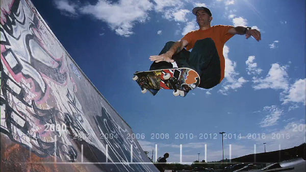

**滑板：** 许多的极限运动项目均由滑板项目延伸而来。50年代末60年代初由冲浪运动演变而成的滑板运动，而今已成为流行运动。

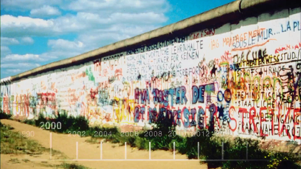

**柏林墙：** 是德国分裂期间东德政府环绕西柏林边境修筑的边防系统，以将其与东德领土分割开来。始建于1961年8月13日，全长155公里，最初以铁丝网和砖石为材料，后期加固为由瞭望塔、混凝土墙、开放地带以及反车辆壕沟组成的边防设施。1990年6月东德政府正式决定拆除柏林墙，一年后两德最终统一。

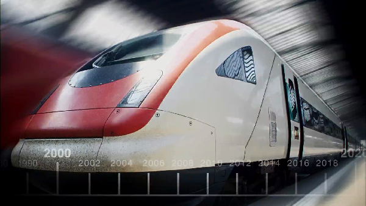

**高速铁路：** 高速铁路之所以受到广泛青睐，在于其本身具有显著优点：缩短了旅客旅行时间，产生了巨大的社会效益；对沿线地区经济发展起到了推进和均衡作用；促进了沿线城市经济发展和国土开发；沿线企业数量增加使国税和地税相应增加；节约能源和减少环境污染。图为瑞士高铁SBB-CFF-FFS RABDe 500。

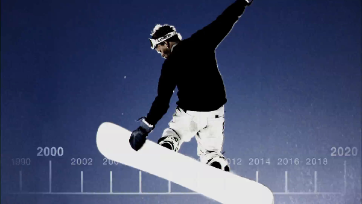

**单板滑雪：** 舍曼·波潘1965年把两个滑雪板绑在一起，偶然中就创造了两脚踩踏在一整块板上的新“滑雪板”，单板滑雪又称冬季的冲浪运动，利用身体和双脚来控制方向。

**PlayStation：** 日本Sony（索尼）旗下的新力电脑娱乐SCEI家用电视游戏机,现已成为最出名的家游产品之一。图为PS2游戏机。

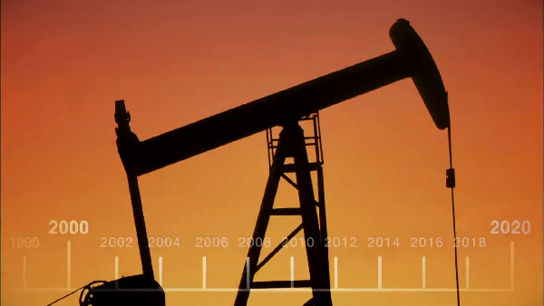

**石油开采：** 石油主要被用来作为燃料油和汽油，他们是目前世界上最重要的一次能源之一。石油也是许多化学工业产品如溶液、化肥、杀虫剂和塑料等的原料。由于石油是一种不可再生原料，许多人担心石油用尽会对人类带来严重的后果。石油因其价值高昂，又被称为黑金。

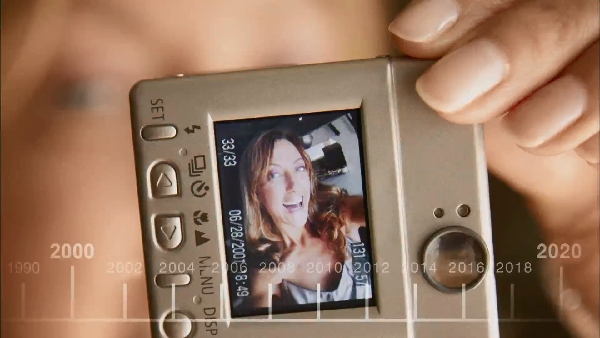

**数码相机：** 由于数码相机小巧轻便、即拍即有、使用成本低、相片方便保存、分享与后期编辑等诸多优点，使其在短时间得到迅速普及。大部分数码相机兼具有录音、摄录动态影像等功能。2009年，全球共售出数码相机（包括带数码相机功能的手机）超过9亿部，而传统相机已近乎在市场上绝迹。目前，越来越多的设备如手机、个人数字助理、个人电脑、终端机及平板电脑等也整合进了数码相机功能。

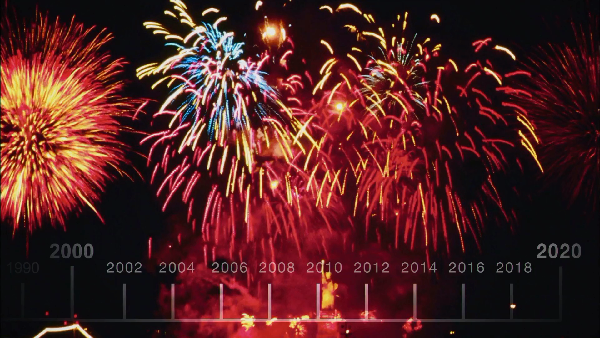

**千禧年：** 千禧年又名千福年，其概念源于基督教教义。最早的涵义可延伸至犹太人对来世的期待。至今日，第二个千禧年2000年已经过去，各种庆祝千禧年的活动让人难忘。千禧年已从宗教上的涵义扩展为全人类的庆典活动，原本隐含的末世意味也被跨世纪的喜悦和期待所取代。未来一定会更美好！

**本文参考自互联网 链接如下：**

1.生活大爆炸 http://zh.wikipedia.org/wiki/%E7%94%9F%E6%B4%BB%E5%A4%A7%E7%88%86%E7%82%B8
2.The Big Bang Theory http://en.wikipedia.org/wiki/The_Big_Bang_Theory
3.IMDB http://www.imdb.com/title/tt0898266/?ref_=fn_al_tt_1
4.生活大爆炸片头 http://blog.sina.com.cn/s/blog_53a8c8970101cz5n.html
5.The Big Bang Theory片头 http://blog.sina.com.cn/s/blog_64e6aeef0100ierk.html
6.Secuencia de imágenes del intro http://es.thebigbangtheory.wikia.com/wiki/Secuencia_de_im%C3%A1genes_del_intro
7.大爆炸宇宙论 http://baike.baidu.com/link?url=0afn-F1P_2taC_1zQsbaPu5wDykge39UkTCUHoa3JK8SKoExSWHnsxbMghhth3WXHxgs3Dll_GcTeXw_h94UC_
8.马蛔虫受精卵细胞有丝分裂切片制作技术 http://xueshu.baidu.com/s?ie=utf-8&tn=SE_baiduxueshu_c1gjeupa&wd=paperuri%3A%28133f367dfff88fdfc30a4b734fd975d9%29&filter=sc_long_sign&sc_ks_para=q%3D%E9%A9%AC%E8%9B%94%E8%99%AB%E5%8F%97%E7%B2%BE%E5%8D%B5%E7%BB%86%E8%83%9E%E6%9C%89%E4%B8%9D%E5%88%86%E8%A3%82%E5%88%87%E7%89%87%E5%88%B6%E4%BD%9C%E6%8A%80%E6%9C%AF
9.地球历史 http://zh.wikipedia.org/wiki/%E5%9C%B0%E7%90%83%E6%AD%B7%E5%8F%B2
10.生物进化与环境展厅：地质年代与生物进化史对照表 http://jxtd.ecit.cn/bwg/dzndyswybdyb.htm
11.八月风：秘鲁日记 http://www.smallstation.net/portal.php?mod=view&aid=10517
12.12天 秘鲁和玻利维亚心水之旅 http://www.junchilvxing.com/latin-south-america/bolivia/12-days-peru-bolivia.html?print=1&tmpl=component
13.圣奥古斯丁考古公园 http://yichan.cnair.com/688/
14.Tweets printed by home-built ticker-tape machine http://www.bbc.com/news/technology-23812365
15.莫斯科 报喜大教堂 http://ru.hujiang.com/new/p527838/
16.伟大的女性----克莱拉·巴顿 http://blog.sina.com.cn/s/blog_4c07a0400100awbd.html
17.三次移民潮带领美国走向强大 http://theory.people.com.cn/GB/49157/49163/3961568.html
18.福特T型车和生产流水线 http://blog.sina.com.cn/s/blog_4e4ac44901000bpz.html
19.美国妇女参政运动 http://www.hbwomen.org.cn/2007-12/13/cms529648article.shtml
20.最成功的早期战机 P-12战斗机 http://wowp.uuu9.com/201306/1139595.shtml
21.美国现代城市的郊区化及其原因 http://www.3edu.net/lw/gjzz/lw_97149.html
22.Wurlitzer Jukebox Company http://www.gibson.com/Products/Wurlitzer/Jukebox%20Museum/History/
23.外科手术简史 http://www.aboutkidshealth.ca/Zh/News/Columns/SurgeonsCorner/Pages/A-very-brief-history-of-surgery.aspx
24.地下空间的开发利用 肖明 武汉大学水利水电学院 城市地铁建设的意义
25.The Old Robots Web Site http://www.theoldrobots.com/light3.html

2015-06
