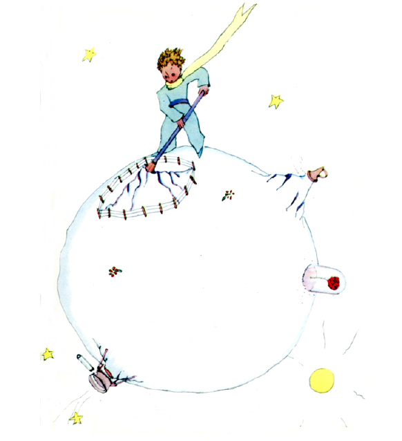

这两天整理以前的读书笔记，偶然发现了这篇很有意思的东西，顺便就整理出来了。是我上学期读《小王子》的时候写的，这篇小童话讲了一个对世界充满好奇的小孩儿遇到从外星球来的小王子之后发生的故事。小王子向他讲述了在不同的星球上看到的不同的人们。还是挺有意思的，有兴趣可以看看，很短。

> “我还了解到另一件重要的事，就是他（小王子）所在的那个星球比一座房子大不了多少。……我有重要的根据认为小王子所来自的那个星球是B612 星球。”
> 
> ——《小王子》第四章
> 
> “他（小王子）有两个活火山，早上热早点很方便。”
> 
> ——《小王子》第九章

正在热早点的小王子:

原文中提到小王子所在的星球B612比一间屋子大不了多少，我们知道月球相对于地球已经很小了，但直径仍然有3475公里，上面的重力只有地球的1/6，我不禁想到，小王子在一个如此精致的星球上，还能够正常的生活，要多大的重力来保证他不会飘到太空中呢？既然体积就只有这么小了，那一定是密度非常非常大，到底有多大呢？一向手贱的我忍不住算了一下：

为了计算星球的密度，现在体积大概可以估算出来，一间屋子的大小嘛，剩下的只要知道了星球的质量，自然就求出了。如何求得星球的质量呢？这就需要一个小技巧，小王子在星球上跳跃时，会产生克服天体重力的动能，如果这个动能达到某个临界，那他就会脱离星球的束缚。而星球产生的这个临界的能量，就和它的质量有关系，这样我们就建立了一个运动和质量之间的关系式，通过它我们就能求出星球的质量了，进而就能得出星球的密度。

**估算星球的体积**

比一间屋子大不了多少，那一间屋子有多大呢？既然比一般的屋子稍大一些，主流的房屋面积大概就是100~200㎡，既然稍大，那我们就假设相当于一间200㎡的房子。为了求出体积，我们还需要知道一般房子的高度是多少，粗略的估计一下，应该在2.5m至3m左右,我们取个中间值2.75m。而且外国的屋子，大多不是楼房，而是独门独户的小庭院，我们假设这间屋子是个两层的小别墅。好了，体积我们有了：

$$V = 200m^{2} * 2.75m * 2 = 1100m^{3}$$

星球是一个球体，所以它的半径为：

$$V = \frac{4}{3} \pi R^{3}$$

$$R = \sqrt[3]{\frac{3V}{4 \pi}} \approx 6.4m$$

体积和半径就这么愉快的估算出来了，下面计算星球的质量。

**星球的质量**

正如前面的分析，首先我们计算一下小王子奋起一跃，可以获得多少的动能。仅以现有的资料来看，似乎无法得到他在自己的星球上跳跃的动能，而我们熟悉的是地球的情况，所以小王子先要在地球上跳一下。当然他的身体状况假设和地球的同龄小朋友一样，一个13~14岁的男孩平均身高h约为160cm，体重m约为50kg，身体重心的高度大概是0.6h=96cm的样子。

一次起跳可以分为两个步骤，先是身体下蹲到脚刚离地，然后是脚刚离地到跃起至空中最高处（此时速度为0），前者重心的变化大概是△h1=30cm左右，后者重心大概变化了△h2=50cm，也就是说，小王子奋起一跃，跳到了半米的高度，只要稍加训练，达到这个水平还是比较容易的。

设F为小王子起跳的平均作用力，g=9.8m/s²为地球的重力加速度，v为跳起瞬间速度，则有：

$$(F-mg)∆h_{1} = \frac{1}{2} mv^{2} = mg∆h_{2}$$

等式的含义是，首先下蹬的作用力全部转化为刚好离地时的动能，然后在只有重力做功的情况下，动能全部转化为重力势能。

因此，我们得到：

$$F = mg(1 + \frac{∆h_{2}}{∆h_{1}})$$

再让我们设想一下B612星球上的情况，小王子在自己星球上起跳时，平均作用力F和△h1不会发生变化，星球的重力加速度为g’，起跳瞬间速度为v’于是有：

$$(F-mg')∆h_{1} = \frac{1}{2} mv'^{2}$$

带入F后为，计算获得的动能有：

$$E_{k} = \frac{1}{2} mv'^{2} = (mg + \frac{∆h_{2}}{∆h_{1}}mg - mg')∆h_{1} = (∆h_{1} + ∆h_{2})mg - ∆h_{1}mg'$$

为了能够不脱离星球引力的束缚，需要获得的动能，要比把小王子从星球表面移动到无穷远处的引力做功要少，这样才能防止飘走到太空中，而这个引力做功的大小为：

$$E_{p} = \frac{GMm}{R}$$

其中$G = 6.67 * 10^{-11} m^{3} kg^{-1} s^{-2}$为万有引力常数，M为星球质量（出现了！），R为星球半径。

由万有引力公式，我们有：

$$\frac{GMm}{R^{2}} = mg' $$

所以

$$E_{p} = \frac{GMm}{R} = mg'R$$

只需

$$E_{k} ≤ E_{p}$$

$$(∆h_{1} + ∆h_{2})mg - ∆h_{1}mg' ≤ mg'R$$

$$g' ≥ \frac{∆h_{1} + ∆h_{2}}{∆h_{1} + R}g ≈ 1.07m/s^{2}$$

故有

$$M = \frac{g'R^{2}}{G} ≥ \frac{1.07*6.4^{2}}{6.67*10^{-11}}kg ≈ 6.57*10^{11}kg$$

**注：** 最小不脱离引力束缚时动能对应的速度，即为第二宇宙速度。如果只是计算星球质量，则并不需要真正计算出这个速度的大小。

**最后是密度**

体积和质量我们全都得到了，密度自然是：

$$\rho = \frac{M}{V} ≥ \frac{6.57 * 10^{11}}{1100}kg/m^{3} ≈ 5.97×10^{8} kg/m^{3} = 5.97×10^{5} g/cm^{3}$$

正如我们开始预料的那样，需要足够大的密度才能保证小王子不会飞出星球。

**注：** 如果你仔细考虑这个问题，你会发现，星球的密度并不能无限变大，当下蹬作用力F不足以超过mg’时，想想会发生什么？是的，小王子将无法移动，像是粘在了星球表面。而此时对应的密度为：

$$\rho _{max} = \frac{M_{max}}{V} = \frac{g'_{max}R^{2}}{GV} = \frac{\frac{F}{m}R^{2}}{GV} ≈ 1.46×10^{7} g/cm^{3}$$

对比下面这个密度表（单位$g/cm^{3}$）：

| 物质             | 密度          |
| -------------- | ----------- |
| 土壤             | 1~2         |
| 岩石             | 约为3         |
| 钢铁             | 7.8         |
| 锇（自然界中密度最高的元素） | 22.5        |
| 白矮星            | 10^5~10^7   |
| 中子星            | 10^11~10^14 |
| 黑洞             | 至无穷大        |

可见B612的密度在白矮星范围内。不过白矮星可不是什么宜居星球，上面也不会有可爱的小花~

**小王子和他最爱的小花看日落**

**值得一提的是**

**他们的星球一天会有四十三次日落**

2015-04-17
