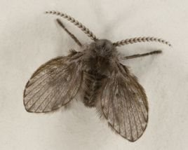
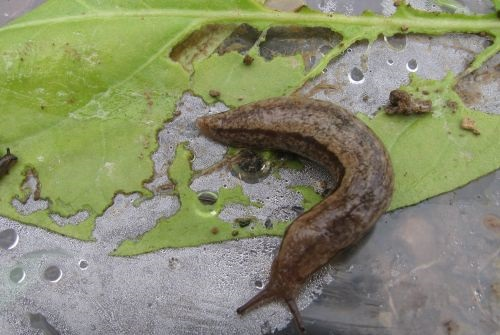

虫子无处不在，有了它们，我们的生活也热闹了些~益虫也好，害虫也罢，不去管它，再来看待这些小生命，是不是全都可爱了许多呢？

这几天，我把平常容易见到的那些虫子整理了一下，不为学术，不为研究，只是觉得好玩。

人人都能叫出名字的那些，我略去不写，比如：苍蝇，蚊子，蜗牛，蚂蚁，蜘蛛，蜈蚣，蝎子，青蛙，蟾蜍，蜻蜓，蝴蝶，蜜蜂，马蜂，蚯蚓，瓢虫…

我这里的「虫」不单单只昆虫，而是广义上的泛指。

有些图片可能会引起「不适」，所以请在监护人的陪同下观看，或者捂着眼睛观看，切记！

最后，在PC浏览器下全屏观看效果最佳，

如果准备好的话，那么就点击下面那只虫子，开启「虫国之旅」吧！(●'◡'●)ﾉ

**人人都能叫出名字的：**

苍蝇，蚊子，蜗牛，蚂蚁，蜘蛛，蜈蚣，蝎子，青蛙，蟾蜍，蜻蜓，蝴蝶，蜜蜂，马蜂，蚯蚓，瓢虫

**室内墙壁、地面处：**

**跳蚤**

别名：虼蚤、虼蚤子

养狗养猫的人可能会比较注意这个，现在人们讲卫生，很少在身上生跳蚤了，以前在农村兴许见过。

**虱子**

和跳蚤一样，也是一种寄生虫，吸血倒不是最可怕的，可怕的是传播疾病，所以大家要讲卫生。

**臭虫**

别名：木蚤、目虱

在墙壁或者床榻兴许会有臭虫的身影，勤换被褥，保持干燥才是正经。

**蟑螂**

别名：小强、黄婆娘、偷油婆、甴曱、鞋板虫

蟑螂一般分为两种，大的叫美洲大蠊，小的叫德国小蠊，生命力极强，号称「杀不死的小强」。是这个星球上最古老的昆虫之一，曾与恐龙生活在同一时代。可以忍受严寒、酷暑、强辐射，被摘头的蟑螂还特么能存活9天。繁殖能力也是极强，一年生几万个也是玩儿闹似的。

记得在铁院上学的时候，宿舍就闹过蟑螂，买的樟脑丸都被他们吃光了，妈蛋。

**蚰蜒**

别名：草鞋虫、千足虫、钱串子

地下室或者墙壁上会发现这种东西，脚长长的，触角更是长。反正我看到都是一鞋底子毙命，这东西看起来就让人炸毛，后来才知道它是一种以害虫为食的益虫，滥杀无辜，罪过罪过。据说这东西可以煲汤喝，有道汤叫「蚰蜒猪肉汤」，而且可以治疗口吐涎沫。

**蠼螋**

别名：夹板虫、耳夹子虫、剪刀虫

因尾部的钳子得名剪刀虫，也是家里常见的虫子，也是喜欢潮湿阴暗的环境。

**蛾蠓**

别名：蛾蚋、蛾蛉、毛蛉

蛾蠓简直就是卫生间的噩梦，你基本上可以在任何潮湿的环境中发现它的身影，貌似有水的地方就有他，水越臭越多…

所以请远离这东西，真的很脏。

**地鳖**

别名：土鳖、观音虫、土元、土咩咩、簸箕虫

看到别名有叫「土咩咩」真是笑到了。小时候在墙角经常翻到，现在也很少见了。干燥的雌虫是药材，可以治跌打损伤等症。

**地蜈蚣**

看起来就让人不舒服，你绝对见过才对，不过也不用怕它，一般来说不会攻击人，而且对付它也很容易，一脚丫子就…

喜欢潮湿、喜欢吃小昆虫，是衣鱼的天敌，下面介绍衣鱼。

**衣鱼**

别名：蠹鱼、白鱼、壁鱼、书虫

偶尔会在柜子脚见到，如果比吃货的话，那估计你是完败的，衣鱼爱好富含淀粉或多糖的食物，比如：胶、糨糊、书籍装订物、照片、糖、毛发、泥土等。而且衣鱼对棉花、亚麻布、丝和人造纤维等也毫不抗拒，甚至连其它昆虫尸体、自己脱的皮也是照吃不误。饥饿时甚至连皮革制品、人造纤维布匹等也吃。不过衣鱼能够捱饿数个月，身体机能也不会受到伤害，其生存能力不亚于蟑螂。

**白纹伊蚊**

别名：花蚊子、黑白蚊子、亚洲虎蚊

被这货咬上一口够你爽半年，除了比普通蚊子嘴劲大之外，传播各种疾病也是让人害怕。应该都见过，估摸也都被咬过。

**华丽巨蚊**

别名：金腹巨蚊

一种身子很小但腿又细又长，样子冒看像蚊子，但又比蚊子个儿头大些，这便是金腹巨蚊了，虽然看起来和蚊子像同伙，但事实上却是专门以蚊子为食的虫子，所以容易招蚊子的人，可以考虑在家养几只了。

**谷物中：**

**米蛾**

简直烦死这东西，可以在各种谷物中发现，比如前些日子，俺的半袋大米就招了这种蛾，我一打开袋子，更是飞了一屋子。

**米象**

别名：米虫、谷牛、象鼻虫、蛘子、麦甲

大米放的久了，如果密封没做好，那八成会生米虫，这是一种非常常见的贮粮害虫，而且繁殖极快。

这种小虫子是防不胜防的，只要吃过米饭、喝过稀粥那妥妥的都吃过它了，就算没吃过完整的，那断臂残肢肯定是吃到了。卖米的没有加价也是良心，毕竟算道荤菜吧。

**谷盗**

是对谷盗科的统称，这个我也是遇到过，很小的小黑虫，容易和米象搞混，仔细观察的话可以和大鼻子的米象区分开。

那么如果生了虫怎么办呢？首先应该把生了虫子的米铺开，让虫子爬走，如果有筛子可以用上，之后收到袋子里，放到冰箱冷冻里面，冻上两三天，差不多就能把虫卵冻死了，然后就可以接着吃了。（都说了不要在意那些虫卵尸体）

**花丛，砖瓦里：**

**马陆**

别名：千足虫、千脚虫

绝逼人人都见过的，长满了小脚，爬的还不慢，经常出没于草坪、墙角、砖块处。隐约记得用手指弄死的时候，会感觉它身体是脆的，而且有很难闻的味道。这种虫就是俗话说的「马路上有很多马陆」了。

还有句成语是「百足之虫，死而不僵」便指的是马陆。

**球鼠妇**

别名：西瓜虫、潮虫、团子虫、破鞋底

同样人人都见过，随便找块砖头翻过来应该就能见到几只，喜欢潮湿的角落。我小时候叫这玩意西瓜虫，因为只要一碰它就会缩成一个球，是不是有点像犰狳啊哈哈哈…

这个也可以吃，据说很利尿。

还有一种和它很相似的虫子，叫鼠妇（很多时候名字也会混用），他们都属于潮虫亚目，区别在于不会卷起来。

**叩头虫**

别名：磕头虫、铁丝虫、钢丝虫

这是一种可以当做玩具的虫子，小时候经常玩。它的前胸可以弯曲，当自己底朝天的时候，磕头虫会借助这个弯曲发力，一跃而起，并且发出「嗒」的一声。当遇到危险的时候，它会假死，然后弯曲自己的前胸，伺机跃起逃走。所以你如果抓着它肚子不放，一会就能看到它不停的叩头，这也是名字的由来。

**隐翅虫**

别名：影子虫、青腰虫、青蚂蚁

这个厉害了，很多人接触到这种虫子导致皮肤红肿溃烂，以为是被它叮咬，其实隐翅虫是不咬人的，是因为皮肤接触到了它分泌的体液，具有强酸性「PH值：1~2」，接触后不多一会就会感到剧烈灼痛，所以大家见到它，还是躲着走为妙。

**蚜虫**

别名：腻虫、蜜虫

最常见的一种害虫，个头不大，一般在叶子、嫩茎上，刺吸式口器吸食植物的汁液，排出水分和蜜露，所以聪明的蚂蚁会养一群蚜虫当宠物，保护他们，条件则是获取他们的蜜露，形成「共生关系」。

**蛞蝓**

别名：鼻涕虫

看起来像没壳的蜗牛，体表湿润有黏液，像一坨鼻涕，所以得名。这东西我见过，很恶心。

**蝼蛄**

别名：耕狗、拉拉蛄、扒扒狗、土狗、地蝲蛄

蝼蛄个头较大，摸起来肉肉的，以前在地里经常看到，但现在很少见到了。

**草蛉**

长着四个透明的大翅膀，夏天晚上在外面会经常碰到这种飞虫。

草蛉以各种小害虫为食，所以农业上有人工利用草蛉灭虫的。

如果你有幸抓到一只，那么恭喜你，你手上的味道将三日不绝，是的，这玩意臭的一米，而且很难洗掉……

**腐烂腐臭处：**

**果蝇**

果蝇属于小型蝇类，体长1.5-4毫米间。大部分的果蝇以腐烂的水果或植物体为食，相信在水果摊旁边找到果蝇并不难，比普通苍蝇发黄。

**蜣螂**

别名：屎壳郎、推丸、推车客、黑牛儿、铁甲将军、夜游将军。

宝宝还没有出世，妈妈就为它们准备了最丰盛的食物，一堆大象的粪便，能够养活 7000 只屎壳郎呢^^

团一个优秀的粪球可是个技术活，跟和面一样，讲究的是「路上干净、四肢干净、粪球干净」

**蛴螬**

别名：鸡婆虫，白土蚕，老母虫，白时虫

蛴螬是金龟甲的幼虫，这货专门喜欢在粪堆里生活，小时候看姥爷耙粪堆的时候，时不时的就能耙出来这东西，而且可以喂鸡吃，鸡很喜欢吃它。白白的是不是很可爱啊~

**树干旁、树枝上：**

**豆青虫**

别名：豆虫、豆丹

豆天蛾的幼虫，贝爷最爱的小甜点，「鸡肉味，嘎嘣脆，蛋白质，牛六倍」。不过一般人们都是煮熟来吃，是一种天赐的美味呢，像贝爷那样生咬，口中爆浆的吃法，也是看起来蛮有趣。

**尺蠖**

别名：吊死鬼

尺蛾类幼虫通称，身体细长，行动时一屈一伸像个拱桥，休息时，身体能斜向伸直如枝状。有些尺蠖一旦受惊就会采取自我保护的措施——吐丝把自己悬在空中，脱离树枝，俗称「吊死鬼」

**双叉犀金龟**

别名：独角仙、兜虫

独角仙也属金龟子科，所以幼虫是「蛴螬」，并不是很常见，因为样子看起来很雄壮，所以经常被人养来做宠物。

**天牛**

别名：天水牛、八角儿、牛角虫、花妞子、苦龙牛、锯树郎

天牛应该大家就见得多了吧。每次下完雨，几乎都能见到天牛。天牛因其力大如牛，善于在天空中飞翔，因而得天牛之名；又因它发出「咔嚓、咔嚓」之声，其声很象在锯树，故又被称作「锯树郎」。

**椿象**

别名：臭虫、放屁虫、臭大姐

这货高能了，方圆十米，谁敢靠近！椿象椿象，所以在椿树旁更为多见，当受到攻击时，可以从腹部的顶端释放出大量的毒雾喷向攻击者，那酸爽…

目测没有敢徒手捉此虫的网友，毕竟捉完，手要不要也不打紧了。

**叶蝉**

萌萌的小害虫，因为总是破坏植物叶子，所以得名。有没有被萌化呢

**斑衣蜡蝉**

别名：椿蹦、花蹦蹦、花姑娘、花媳妇、害眼虫

可以说「有臭椿的地方就有它」，估计人人都见过，翅膀打开之后很漂亮。

**蛹&蝉**

蛹别名：知了猴、知了龟、节老龟、罗锅、知拇吖、食孩儿、老少狗、爬杈、肉牛

蝉别名：知了、蚂知了、蛣蟟、哔蝉、海咦、红味纯

蛹是蝉的幼虫，生活在土中，通常会在土中待上几年甚至十几年，才爬出地面进行羽化（然后被活捉卖到烧烤摊），然后叫一个夏天，就死掉了，每次想到这里，都略有感慨。

想到一个好谜题：「蝉」的反义词是什么呢？

答案是「蛙」，因为一个飞到树上「知了知了」，一个跳到水里「不懂不懂」，有没有很冷…

最著名的周期蝉有十三年蝉和十七年蝉，又称质数蝉，由于生命周期是质数，所以不会遇到上一世代所遇到的天敌。

蝉分为很多种，下面介绍三种最常见的。

**蝉：黑蚱蝉**

黑蚱蝉应该是最常见的，长得黑壮黑壮的，大眼睛鼓鼓的，小时候会用纱窗围一个网兜，固定到竹竿上，用来摸蝉，摸蝉可比抓蚂蚱技巧性强多了~不过味道倒是和蚂蚱差不离。

**蝉：蟪蛄**

这个估计大家也见到过，灰不拉几的，小小的，反正抓到也不会吃它，看着就觉得不好吃，再说也没多少肉啊…

**蝉：蛁蟟**

这种蝉身上像发霉一样，估计摸过蝉的肯定也不陌生，同样不会吃它，觉得有毒…（不过应该是可以吃的）

**八角丁**

别名：毛虫、八角虫、火辣子、洋辣子、豁拉婆

刺蛾幼虫，已经不知道被这货虐过多少次了，小时候去枣树上打枣，总会不小心就一手抓到这货身上，那痛感，简直飞起~就跟被蛰了似的，反正我是又恨又怕。

话说前两天，就在自行车座子上发现一只，又他喵的让我抓到，还好个头比较小，不然我分分钟剁手给你变成郭靖。

**蚕**

别名：蚕宝宝、娘仔

中国养蚕也是自古有之，更是世界上著名的丝绸大国。蚕的一生要经过卵→幼虫→蛹→成虫四个阶段，属于完全变态。

各个过程蚕的形态：

**水洼，池塘中：**

**孑孓**

别名：跟头虫、方学虫

蚊子幼虫，游泳时身体一屈一伸，俗称跟头虫。要想找它，那就去臭水沟里找，准行。

**水黾**

别名：水马、水蜘蛛、水母鸡、水板凳、水蚊子、水蜢子、火叉子、打油的

每次在水里看到水黾都有一种很爽的感觉，真正的「水上漂」啊！之所以可以在水面站立，是因为腿上长有油质的细毛。

哎，对了，乃们女生不是喜欢长腿欧巴吗？我这里活捉一只，拿去不谢。

**水蚤**

别名：蚤、鱼虫、红虫

养鱼的都知道，无需多说，而且买的时候是一坨。看起来放嘴里像跳跳糖，哪位吃完告诉我像不像…

**水虿**

别名：水乞丐

蜻蜓的幼虫，农村河边比较常见，按理说你在哪见到蜻蜓，附近应该就有它。长这么丑，不想介绍更多了…

**龙虱**

别名：味龙、水龟子

和土鳖个头差不多，但是生活在水里，在水边经常见到，两条后腿爬的时候摆的很快，据说广西人拿这东西当家常小菜，我也是「呵呵」了。

**水蛭**

别名：蚂蟥

这货可不是好惹的，有的长，有的短，长的能到十几厘米，口部有吸盘，接触到皮肤便死死吸住，从中取血。同时也有很高的药用价值，具有治疗中风、高血压、清瘀、闭经、跌打损伤等功效。如同十全大补丹。前一阵有外国作死青年用自己血养水蛭的，道一声「珍重」吧。

**树木繁盛处、田地间：**

**蝗虫**

别名：蚂蚱、草蜢

这个不用多做介绍，小时候估计人人都抓过。每次去田里能抓一袋子，去掉翅膀腌起来，炒着吃，美味难忘啊！

**蚱蜢**

别名：尖头蚱蜢、扁担、老扁

尖尖的头，从后面一抄手就能抓住，行动没有蚂蚱灵敏，抓到手里吐你一手红水，也是够了。

**螳螂**

别名：刀螂，祷告虫，草猴子

也是在熟悉不过，抓来吃那是必须的。只是小心它的大刀，反正我又不只是被割过一次。而且记得小时候看过一个动画片，讲的是螳螂妻子吃掉螳螂丈夫的故事，满满的都是童年阴影吧。

**螽斯**

别名：蝈蝈、纺花娘

现在好像没怎么见过卖蝈蝈的了，编一个小笼子，里面放几根草叶，小时候买过好多次，还有放在编起来的镂空枕头里面的，有着特殊的叫声。

**蟋蟀**

别名：促织、蛐蛐、夜鸣虫、将军虫、秋虫、斗鸡、趋织、地喇叭、灶鸡子、孙旺，土蜇

没见过蛐蛐的，劝你赶紧关网页吧。好像从古至今，人们都喜欢斗蛐蛐，据研究，蛐蛐是一种古老的昆虫，至少已有1.4亿年的历史，有没有被吓尿。

**突灶螽**

别名：灶马、灶鸡、灶虾

这虫长得肥肥的，比蟋蟀个儿头大不少，经常有人跟蟋蟀弄混，其实很是很好区分的，大肚子和大鸡腿就是明显的标志。夏天田地里经常见到。

**竹节虫**

形似竹节，所以得名，田地里偶尔见过，但不是很常见，看着也没肉可吃，阿弥陀佛。

**飞蛾**

喜欢扑火。

**萤火虫**

别名：夜光、景天、如熠燿、夜照、流萤、宵烛、耀夜、火炎虫、夜火虫、火金姑

美到窒息的小绳命，夏天在池塘边，或者树林里，芦苇地什么的地方可以看到（貌似越来越少见了）。也是诗词中的常客，如杜牧《秋夕》：「银烛秋光冷画屏，轻罗小扇扑流萤。」

最后，不说了，看图：

**（本文整理自互联网）参考链接：**

1 【虫】那些虫子的常见性以及可食用性，不是所有的都 [http://tieba.baidu.com/p/1694768439?see_lz](http://tieba.baidu.com/p/1694768439?see_lz)=1

2 潮虫亚目[http://www.blueanimalbio.com/bugs/ruanjia/dengzu.htm?jdfwkey=74jrn](http://www.blueanimalbio.com/bugs/ruanjia/dengzu.htm?jdfwkey=74jrn)

3 常见仓储害虫[http://wenku.baidu.com/link?url=BTbDOJ33kpBGLWLIXwaW-YHP7OdWdpJO0a6TISVu34vlH9LQuxGgxq4ylhWdbtZX_j4sbChwWWY3CoMYQOU34FbN_oECHt1YW3F81LKDpRG](http://wenku.baidu.com/link?url=BTbDOJ33kpBGLWLIXwaW-YHP7OdWdpJO0a6TISVu34vlH9LQuxGgxq4ylhWdbtZX_j4sbChwWWY3CoMYQOU34FbN_oECHt1YW3F81LKDpRG)

4 蚕的一生 [http://blog.sina.com.cn/s/blog_03fd93850100cym9.html](http://blog.sina.com.cn/s/blog_03fd93850100cym9.html)

5 森林萤火虫的神奇探秘之旅[http://www.chinadaily.com.cn/dfpd/retu/2013-08/30/content_16933151_15.htm](http://www.chinadaily.com.cn/dfpd/retu/2013-08/30/content_16933151_15.htm)

6 群螢飛舞‧用螢火蟲照蓋大樓[http://t17.techbang.com/topics/4574--firefly-firefly-dancing-group-cover-building?mode=print&page=1](http://t17.techbang.com/topics/4574--firefly-firefly-dancing-group-cover-building?mode=print&page=1)

7 风光摄影：流萤挽歌[http://slide.tech.sina.com.cn/digi/slide_5_30939_45029.html#p=1](http://slide.tech.sina.com.cn/digi/slide_5_30939_45029.html#p=1)

8 The Most Romantic Place in the World!! [http://dawnkealing.com/2014/02/14/the-most-romantic-place-in-the-world/](http://dawnkealing.com/2014/02/14/the-most-romantic-place-in-the-world/)

2015-07-05
