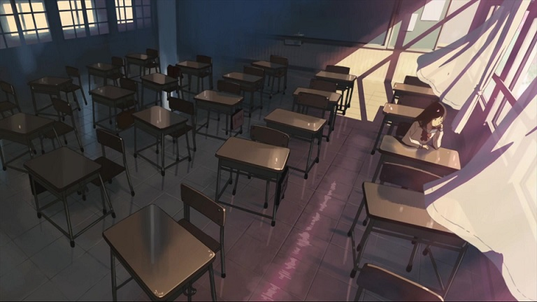
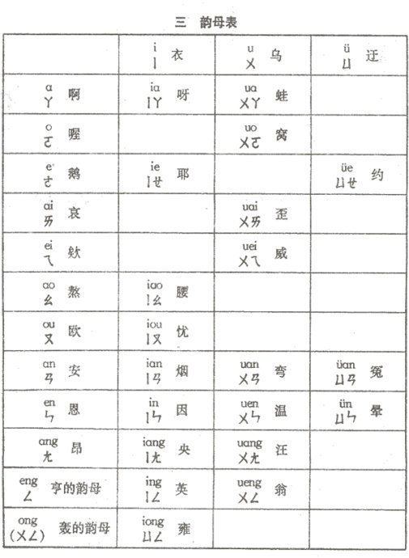

远在上初中的时候，在一个印象深刻的闷热的下午，和周围的小伙伴争执过这样一个问题，拼音中的「ong」到底应该怎么发音？其中支持读作「weng」的呈压倒性优势，当时我自作聪明的反驳说：“既然可以读成weng（嗡），那为什么还要多此一举造一个ong呢？所以啊，肯定不读weng！” 大家深以为然之际，马上有眼尖目明的找到了反例，拼音「un」读作「wen」，而wen和un又是大家都在用的呀。于是我的反驳顿时站不住脚了。

接着又是一番争论…

就这样，那天照着大家气鼓鼓脸的夕阳、吃力的搅拌着温吞吞空气的电扇以及那个并没有得到答案的问题，就一直被遗忘到了今天。

做过一番功课之后，试着回答一下：

容易和「ong」弄混的有发音有「eng」和「ueng（weng）」，其实这是三个不同的韵母，而且这三个韵母都属于鼻韵母中的后鼻音韵母。大家可能对于韵母eng比较熟悉，而韵母ueng似乎并不眼熟，这个我后面会进行说明。

所谓前后鼻音韵母，是根据韵尾不同来分类的，一类是元音加上鼻辅音n的，叫前鼻韵母；一类是元音加上鼻辅音ng的，叫后鼻韵母。

大家感受一下an/ang，en/eng，in/ing的不同，是不是区别挺明显的呢？

所以，说了半天，还是不知道「ong」怎么读啊，是的，哪怕我再说一万句话大家还是不清楚应该怎么读，不如直接把音频搬出来：

[ong的发音](assets/拼音ong到底怎么读/ong.mp3)

怎么样「ong」与「eng」、「ueng（weng）」差别还是挺大的吧。其实要检验ong与它俩的不同，我有个办法立竿见影，那就是把韵母加上声母拼读出来，比如加上声母「h」，拼h-eng必然发出来的声音是「哼」，拼h-ong发出来的则是「哄」而拼h-ueng似乎并不能成功。

其实不光是h与ueng不能成功，在普通话拼音中，如果你把所有的声母试一遍，也都不能成功。这就是韵母ueng不眼熟的原因了。

u开头的韵母被称作「合口呼韵母」其中包括ua,uo,uai,uei,uan…在拼音方案中规定，合口呼韵母前面没有声母的时候将u写作w，即写作wa,wo,wai,wei,wan…而事情巧就巧在ueng在普通话中没有前面冠以声母的情况，所以它只以一种面目示人，就是我们常见的 weng了。

中国汉语方言数目众多，比如官话、吴语、粤语、客家语、闽语等等。普通话中没有出现声母拼「ueng」的情况，并不能说明其他方言没有。比如潮汕语中就有「关键」发音为「gueng1 gieng6」、「专员」发音为「zueng1 ueng5」等；粤语中有，冲「cung1」、公「gung1」、风「fung1」、东「dung1」等情况，其中「ung」是「ueng」的简写，这跟「un」为「uen」的简写情况一样。至于其他方言中还有没有「ueng」的身影，我没有一一考证，估计还会有吧。

到现在，问题应该已经得到了圆满的解答。

但是我想更进一步，为什么这么多人会把「ong」和「ueng」搞混呢？甚至很多老师在发音的时候也会弄混，这难道只是不小心吗？

接着我发现，汉语发音的变化非常频繁，古代、近代、现代汉语的语音各有特点。就拿「ong」和「ueng」为例，其实一直到1958年颁布《汉语拼音方案》之前它们都是同音，并且写作「ueng」，即使是《汉语拼音方案》中「ong」和「ueng」对照的注音也都是ㄨㄥ，这就是说，《方案》把以前的一个音拆成了两个不同的音。

老韵书里面，《平水韵》分为一东二冬八庚九青十蒸，但在《十三辙》统归中东，反映出在古代「ong」和「ueng」可以是同韵的。在往古，《广韵》里面是「翁」是「乌红切」，以现在的视角看是拼做「wong」的。而这种**同韵不同音**的现象在很多方言中也是缤彩纷呈。

可见「ong」和「ueng」的纠缠是有悠久历史的，语言的变化就是这么反复无常，说不准哪天搞混的人多了，什么方案不方案，才不管你那套，“读错”的人多了，自然就是对的了，哈哈。

**参考链接：**

1.   普通话拼音发音[http://www.pthxx.com/b_audio/08_pinyinfayin/](http://www.pthxx.com/b_audio/08_pinyinfayin/)
2.   汉语拼音发音[http://www.pep.com.cn/xiaoyu/jiaoshi/tbjx/sheji_1/py/](http://www.pep.com.cn/xiaoyu/jiaoshi/tbjx/sheji_1/py/)
3.   维基百科：汉语拼音 [https://zh.wikipedia.org/wiki/%E6%B1%89%E8%AF%AD%E6%8B%BC%E9%9F%B3](https://zh.wikipedia.org/wiki/%E6%B1%89%E8%AF%AD%E6%8B%BC%E9%9F%B3)
4.   百度百科：粤语拼音[http://baike.baidu.com/view/197269.htm](http://baike.baidu.com/view/197269.htm)
5.   百度百科：汉语拼音方案[http://baike.baidu.com/link?url=uyYQFV1ex_oQAWQ480GaWMe-TE2E0kaqYy8j4aTX6Aanf8-3OA70Pzt0ogRX_UGZ44ZjXRPtzC1WocMzzNLBiq](http://baike.baidu.com/link?url=uyYQFV1ex_oQAWQ480GaWMe-TE2E0kaqYy8j4aTX6Aanf8-3OA70Pzt0ogRX_UGZ44ZjXRPtzC1WocMzzNLBiq)
6.   鼻韵母[http://www.360doc.com/content/08/1226/19/39024_2204590.shtml](http://www.360doc.com/content/08/1226/19/39024_2204590.shtml)
7.   潮阳话[http://baike.baidu.com/link?url=t1N50J37QoerflhtilWoHxQc7aIFcEaHp9jXVp1GuJXFelQLrW4_mpTSSFutZz0rLwlhZDD9W69Wjt8BCKRqpK](http://baike.baidu.com/link?url=t1N50J37QoerflhtilWoHxQc7aIFcEaHp9jXVp1GuJXFelQLrW4_mpTSSFutZz0rLwlhZDD9W69Wjt8BCKRqpK)
8.   合口呼韵母[http://baike.baidu.com/link?url=SuypeRg2R3GSa1AqNZB_O4sRWZbVxBSmqFz-Bp0gHm7md-QSDuj7EwFtirYNsom7JbIh12hZyGNXz3YnFfPuma](http://baike.baidu.com/link?url=SuypeRg2R3GSa1AqNZB_O4sRWZbVxBSmqFz-Bp0gHm7md-QSDuj7EwFtirYNsom7JbIh12hZyGNXz3YnFfPuma)
9.   [音频] 汉语拼音全部组合的四个声调发音MP3 [http://www.ebama.net/thread-111634-1-1.html](http://www.ebama.net/thread-111634-1-1.html)
10. 后鼻韵母 ang ung eng ing ong éng êng [http://www.yueyuge.cn/html/2013/fayin_1228/55.html](http://www.yueyuge.cn/html/2013/fayin_1228/55.html)
11. 普通话韵母「eng」和「ong」在部分汉字中有什么区别？[http://www.zhihu.com/question/19639019](http://www.zhihu.com/question/19639019)

2015-09-03

后记：

其实除了ong的发音之外，还疑惑过“二”和“耳”的发音为什么不同但是用的是一个拼写方式。
