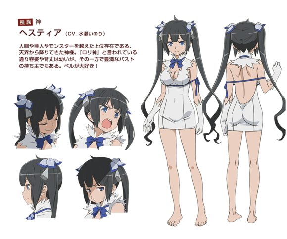
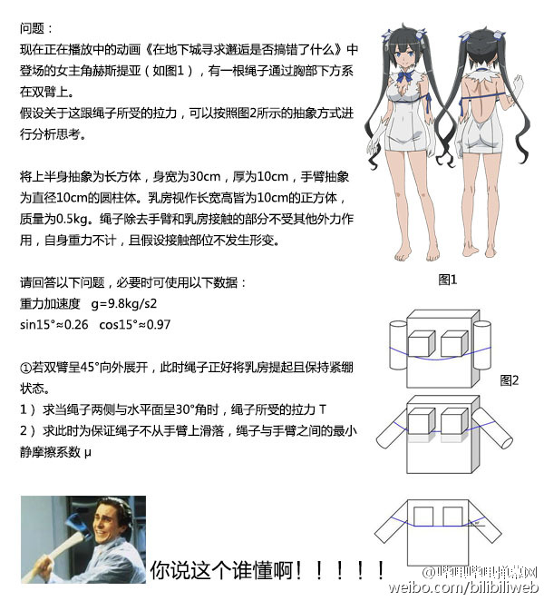
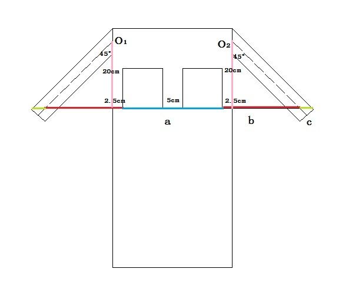
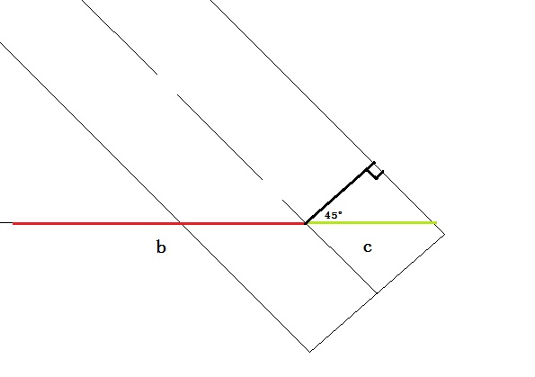
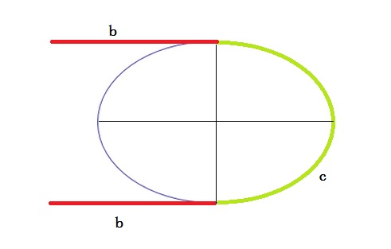
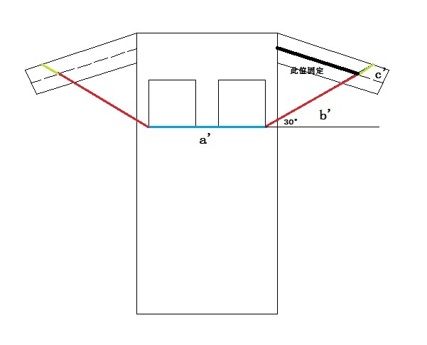
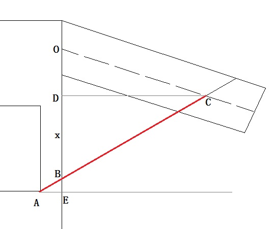
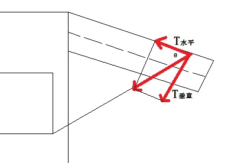
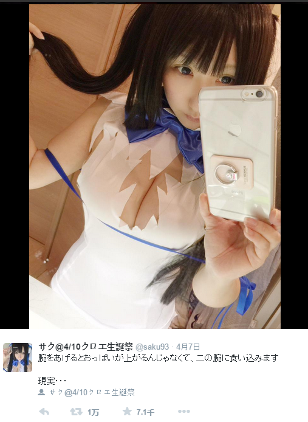

近日《在地下城寻求邂逅是否搞错了什么》中的萝莉神赫斯缇雅人气非常的高，她的提胸丝带设计更是在4月脱颖而出。先po个官方配图：

| 赫斯缇雅  | HESTIA                                                                                                                                                                              |
| ----- | ----------------------------------------------------------------------------------------------------------------------------------------------------------------------------------- |
| 年龄    | 上亿岁                                                                                                                                                                                 |
| 身高    | 140cm                                                                                                                                                                               |
| 隶属    | 【赫斯缇雅眷族】                                                                                                                                                                            |
| 种族    | 神                                                                                                                                                                                   |
| 打工    | 摊贩「炸薯球」店员、铁匠铺「赫菲斯托丝」店员                                                                                                                                                              |
| 喜欢的事物 | 贝尔、炸薯球、书、暖炉                                                                                                                                                                         |
| 简介    | 降临自天界的神仙，是超越人类、亚人的高级人物，也是贝尔隶屣的【赫斯缇雅眷族】之领导者。容貌、体格一如「萝莉神」之名娇小稚嫩，不过却同时拥有丰满的上围。视唯一的眷属贝尔为家人，甚至超过了家人，为了拜托神友赫菲斯托丝为贝尔打造武器而连续三天下跪请求，发挥了惊人毅力。除此之外，在感受到贝尔有生命危险时，也会以眷族之长的身分给予适切的建议等等，还算是有神仙的样子。 |

今天下午在哔哩哔哩弹幕网官微上看到一条关于赫斯缇雅的微博，具体内容我也不多说什么了，看图吧：

你们把赫斯缇雅玩坏了，造吗？？

刚开始我是拒绝的，示意图是什么鬼，看着就心疼好吗？

接着我仔细考虑了一下，好像这题也没有那么难……于是，我决定解答一下。

不过题目中很多条件没有给全，我在解答的过程中会引入一些合理的值（我定多少就是多少，不服来打我啊~）来得到最后答案。

题目中将人体简化为长方体和圆柱体，并假设人体被丝带接触的部位都不发生形变，这也使得题目极大的简化。题目大体是说，计算赫斯缇雅的双臂由自然撑开状态伸展到绳子（也就是丝带）紧绷状态时的受力情况。

我的思路大体是，先求出丝带伸长的长度，然后估计出丝带的弹性模量，从而得到丝带所受的拉力。

**伸展前的丝带长度**

好，我们先来计算丝带伸长长度。

再来看一下题设“双臂呈45°向外展开，此时丝带正好保持紧绷”，不过这里并没有说丝带处于什么样的位置状态，我们不妨假设双臂45°时，丝带整理呈水平。下图：

所以丝带的长度可以分为三个部分相加的结果，考虑到立体情形，有长度L为：

$$L=2a+4b+2c$$

其中：

$a$为两个“软软的”之间的距离

$b$为“软软的”端部到手臂中线的长度

$c$为弯折的长度，此时$c$表示的曲线段是一半的椭圆

并做如下假设：胳膊在躯体上的转动中心为$O1$和$O2$点；$O1$和$O2$点与“软软的”下端的水平线的垂直距离为20cm；两个“软软的”在胸前的摆放间隔为2.5cm、5cm、2.5cm。

这样就有：

$$a=25cm$$
$$b=2.5+20=22.5cm$$

长度$c$的计算稍微复杂些，我们以左手臂为例：

显然当丝带呈水平位置时，丝带与手臂中心线夹角为$45°$，这时丝带所在的平面截取手臂，截面为一个椭圆。又因为身体和手臂的直径相等，所以$b$线段正好与手臂相切于手臂中线位置，下图：

**一个半短轴为5cm半长轴为$5\sqrt{2}$cm的椭圆**

由夹角$45°$很容易计算出椭圆的半长轴为$5\sqrt{2}$cm。

可见$c$的长度就是一半的椭圆周长，那么椭圆的周长怎么计算呢？

椭圆周长并没有初等表达式，可以使用积分计算：

$$C=\int_{0}^{5\sqrt{2}} \sqrt{1+\frac{2x^{2}}{25-x^{2}}}dx$$

等价为：

$$C=5\int_{0}^{\sqrt{2}} \sqrt{\frac{1+t^{2}}{1-t^{2}}}dt$$

费了半天劲，发现这个积分是积不出来的，查资料发现椭圆周长的计算需要用到第二类完全椭圆积分函数$E$，公式为：

$$C=4pE(e^{2})$$

其中$p$为椭圆半长轴，$e$为椭圆离心率，$E(e)$按下面公式计算：

$$E(e^{2})=\int_{0}^{\frac{\pi}{2}}\sqrt{1-e^{2}\sin^{2}x}dx$$

使用数学软件进行求解，得到$2c$的长度为$38.2020cm$

这样就得到了丝带的长度为：

$$L=2a+4b+2c=2*25+4*22.5+38.2020≈178.2cm$$

这就是伸展手臂之前丝带的长度了。

**伸展后丝带的长度**

下面计算手臂伸展之后丝带的长度，依题意伸展之后丝带的两侧与水平面呈30°夹角，我们这里假设在伸展的过程中丝带与手臂之间由于摩擦力的关系，没有发生相对移动，也就是说丝带还是勒在手臂的同一个位置。

于是伸展后的丝带长度可以按下式计算：

$$L'=2a'+4b'+2c'$$

$a'$的值没有变与$a$相同，仍为$25cm$

重点是计算$b’$的值，还是以左臂为例

$b’$即为$AC$的长度，可求出$AB$与$BC$的长度，相加得到

因为$AE$的长度已知，为$2.5cm$，$∠BAE=30°$，所以$BE$容易得出：$BE=\frac{5\sqrt{3}}{6}$，$AB=2BE=\frac{5\sqrt{3}}{3}$

$OE$的长度为$20cm$，从而可以得到$OB$的长度：$OB=20-\frac{5\sqrt{3}}{6}$

现在做$CD$垂直$OB$于点$D$，并设$BD=x$，可以知道，$CD=\sqrt{3}x$，$OD=20-\frac{5\sqrt{3}}{6}-x$，$OC$仍为$20\sqrt{2}$，在$△OCD$中，勾股定理可以得到：

$$OC^{2}=CD^{2}+OD^{2}$$

带入数值，计算得，$x≈16.2768$，又有，$BC=2x≈32.5536$，而且，$\angle OCD=\arccos \frac{CD}{OC}≈4.625°$

可见，这时赫斯缇雅的手臂几乎是水平的。

还得到，$∠OCB=∠OCD+30°≈34.625°$，于是有，$b'=AB+BC≈35.44$

有了之前的经验$c’$的长度也很好计算，把$45°$换成$34.625°$即可。计算得到，$c'≈22.09$

最后有：

$$L'=2a'+4b'+2c'$$
$$=2*25+4*35.44+2*22.09$$
$$=235.94cm$$

到这里伸展前后的丝带长度我们就都计算出来了。同时得到增长量

$$△L=L'-L=57.74cm$$

**拉力T的计算公式**

为了计算丝带所受的拉力$T$，我们还需要一些关于丝带的物理力学性质。

由弹性模量公式得知：

$$E=\frac{应力}{应变}=\frac{\frac{T}{S}}{\frac{△L}{L}}$$

即得：

$$T=E*S*\frac{△L}{L}$$

其中：

$T$：丝带所受拉力

$E$：丝带的弹性模量

$S$：丝带的有效横截面积

$△L$：长度变化量

$L$：初始长度

因为$△L$和$L$我们已经计算出来了，所以只要再知道$E$和$S$的数值，丝带受力$T$就可以解出来了。

**弹性模量E的计算**

下面我们先来求弹性模量$E$：

我翻阅了很多资料，都没找到有关于丝绸材料的弹性模量信息。最后发现在蔡再生编写的《纤维化学与物理》一书中，列举了常见纤维材料（包括丝绸在内）的另外一种描述弹性强度的参考值，即所谓的拉伸强度，单位是$cN/tex$，丝的拉伸强度值为$39.69cN/tex$

这个单位的含义有必要解释一下：

$cN$表示的是厘牛，即牛的百分之一，$1cN=10^{-2}N$

$tex$特\[克斯\]，俗称号数，是指纤维在公定回潮率下，$1000m$长度所具有的质量（克）。

因此：

$$1 tex = 10^{-6} kg⁄m = 10^{-3} g⁄m$$

可见$cN/tex$的含义是单位线密度下材料可承受的拉伸受力值，也即每千米每克的纤维材料所能承受的拉伸受力值。

假如又知道纤维材料的密度值，即可算出每克材料的体积值，再比上千米，即为材料的横截面积。最后用拉伸强度值比上横截面积就可以得到材料的弹性模量了。

翻阅资料，可以得到丝的密度值为$1.36g/cm^{3}$，因此有：

$$E = 39.69 cN⁄tex * 1.36 g⁄cm^{3} = 539.8MPa$$

这个值和木质纤维的强度相当，在一定程度上说明了数值具有参考性。

得到弹性模量E之后，问题就剩下丝带的有效横截面积了。

**有效截面面积$S$的计算**

横截面积的计算需要知道丝带的厚度和宽度，两者相乘即得。宽度我们这里假设为1cm，而丝带的厚度我们不好做出直观估计。

首先要注意一点，丝带为纺织品，密实性不高，如果采用直接测量的方式，只能得到毛截面高度，毛截面高度包括丝线之间空气间隙的高度，会给结果带来很大误差，这是不可取的。（网上有人测量丝绸毛截面高度为$0.12mm$，此值可以作为下面计算的一个验证参考。）

继续查阅资料发现，一般在丝绢行业，描述丝娟厚度的时候使用的是姆米作为衡量标准。

姆米的定义是，织物宽$1$英寸，长$25$码，重$2/3$日钱为$1$姆米（$1英寸=0.0254米$，$1码=0.9144米$，$1日钱=3.75克$）所以换算成公制：$1姆米=2.5/0.58064=4.3056克/平方米$。

而丝绸一般常见的厚度（单位姆米）在$8-20$姆米范围内，这里我们取一个中间值$16$姆米来计算。

用姆米数与丝的密度作比，即为一般意义上的丝的厚度：

$$H = 16 * 4.3056 g/m^{2}/1.36g/cm^{2} = 5.065*10-5m = 0.051mm$$

这个数值即为丝带的净截面高度 ，大约为毛截面高度（$0.12mm$）的一半，可见丝线间隙大约占据了一半的空间。和常识没有冲突，此数值可以信赖。

于是有横截面积：

$$S = 0.051mm*1cm = 5.1*10^{-7} m^{2}$$

**最后结果**

将$E$、$S$带入到下式：

$$T = E*S*\frac{△L}{L}$$
$$= 539.8MPa*5.1*10^{-7} m^{2}*57.74/178.2$$
$$= 89.2N$$

所以最后结果是丝带所受拉力为$89.2N$，这个数值其实不算小，相当于抱起两只猫所用的力。

不过神族的赫斯缇雅，这点重量还是不在话下的吧。

至于最小静摩擦系数，那就简单了只需要：

$$\mu ≥ \frac{T_{水平}}{T_{垂直}} = \cot \theta = \cot 34.625° ≈ 1.4$$

即最小静摩擦系数为$1.4$，虽然日常生活中静摩擦系数大于$1$的情况比较少见，但也不是没有，比如橡皮与固体静摩擦系数范围就在$1.0～4.0$之间。造成摩擦系数较大的原因，是因为题目假设了手臂不发生形变，对于肉体来说，肯定会因为被丝带勒紧而产生直接阻力，这种情况下，阻止丝带滑动的力就无需完全由摩擦力提供，这样也就不需要这么大的最小静摩擦系数了。

至此本题就解答完毕了。

最后，来几张福利

**参考**
1.官网人设说明 http://danmachi.com/character.html
2.函数的积分和椭圆的周长 http://wenku.baidu.com/link?url=SRRCWS4b6Gyqwyp6SMiFZ2FrWGJwwRyO7mpSieCPlIhZg04z3M3DwyyU3wRCvgEqyJaKhmVbRP_OydWcZuliHFmNw8Dwzbh-g-3YYQwQ4QG
3.在地下城寻求邂逅是否搞错了什么3 特装版附录小册子 http://www.lightnovel.cn/thread-754255-1-1.html
4.纤维的结构及主要化学性质纺织 http://wenku.baidu.com/view/809459886529647d272852a7.html
5.《纤维化学与物理》蔡再生编，中国纺织出版社，2004.8
6.关于丝绸的点点滴滴 http://blog.sina.com.cn/s/blog_596e38390100urfd.html
7.真丝面料的厚度测量 http://www.goodsilk.cn/blog/881.html

2015-04-10
