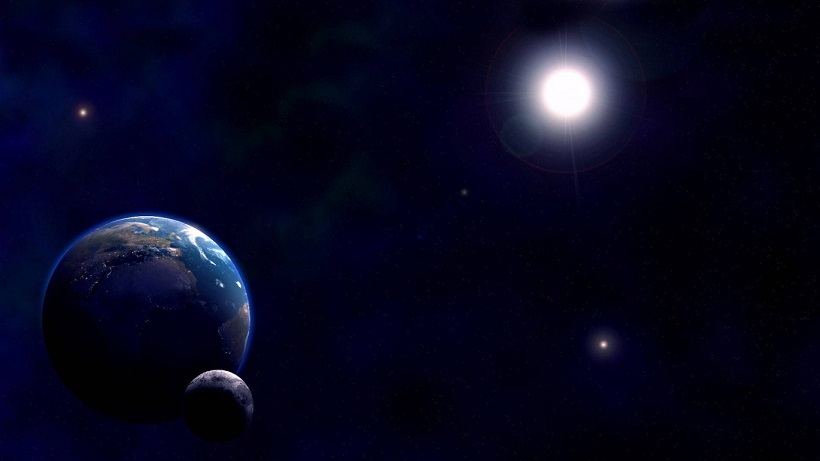

不省心的地球

闰年，大家都不陌生，就是那些比365天多一天的年份，为什么要在纪年规则中加入闰年呢？很容易就能猜到，因为地球公转一圈并不是乖乖的365天整，而是365天5时48分46秒，即一个「回归年」（注1），所以我们需要在某些年份增加一天，来平衡这多出来的5个多小时。

在判断闰年时，有这样的规定：

> 四年一闰，百年少一闰，四百年加一闰。

那么它是怎么起作用的呢？想知道吧！想知道吧！（好吧好吧，又要强行科普了。）

**四年一闰**

咳咳，首先，为了方便计算，我们先做这样的处理

$$1回归年 = 365天5时48分46秒 = 365天+0.242199074天$$

如果每年只有365天，那么每1年就少0.242199074天，因此每1/0.242199074≈4.128年就会少出来一整天，但是4.18年不是整年数啊，那干脆就选个最接近的4年增加一天好了，这就是4年一闰。

**百年少一闰**

此时平均一年的长度为365.25（365+1/4）天。这时和真正的回归年误差为：

$$365.25-365.242199074≈0.007800926天$$

就是说，4年一闰，每一年又多出来0.007800926天，同理可以计算出每128.1899年，就会多出来一整天。这样来看，按照4年一闰，128年一共增加了32天，减掉多出来的这一天，所以应该再规定每128年少一闰，也就是128年31闰最为合理（注2）。但是人们觉得128用起来不方便（可见制订历法的不是程序员），于是用100年少一闰去近似处理这多出来的一天。因此按照4年一闰，每100年少一闰，也就有100年增加了24闰。

**四百年加一闰**

此时平均一年的长度为365.24（365+24/100）天。这时误差缩短为：

$$365.24-365.242199074≈-0.002199074天$$

仍然应用上面的方法，平均每一年少了0.002199074天，每454.737年会少一整天，还是觉得455用着不方便，于是又规定一个整百数400来增加一闰。这样，4年一闰，100年少一闰，400年再加一闰，得到每400年增加了97闰（100-4+1=97）。

**还要继续闰？**

现在平均一年的长度为365.2425（365+97/400）天。这时误差继续缩短为：

$$365.2425-365.242199074≈0.000300926天$$

大约每3323.076年会又多出来一天。据此，有人建议每3200年再少一闰（注3），也有人建议每4000年少一闰（注4），但无论是3200年还是4000年都离我们还很遥远，一两千年之后采用谁的建议我们不得而知，说不准那时的纪年标准已经发生了根本的改变。

|         | 平均年长度（天） | 与回归年误差（天）    | 最优闰年值（年）      | 实际闰年值（年） |
| ------- | -------- | ------------ | ------------- | -------- |
| 不闰      | 365      | -0.242199074 | 4（4.13）       | 4        |
| 四年一闰    | 365.25   | +0.007800926 | 128（128.19）   | 100      |
| 百年少一闰   | 365.24   | -0.002199074 | 455（454.74）   | 400      |
| 四百年加一闰  | 365.2425 | +0.000300926 | 3323（3323.08） | ？        |
| （？年少一闰） |          |              |               |          |

弄个表格会更清楚

当然，无论是3200年少一闰，还是4000年少一闰，还是会存在误差，更甚的是，这个误差值还在变化，因为地球公转并不是老老实实每个回归年都花掉严格相同的时间，大约每年都会比上一年多出来5ms，更更甚的是这个5ms也不是一成不变的- -

人参啊~

注：

1. 以历元J2000.0（2000年1月1日）地球时为基准，由Moisson经由完整的分析，最后测定的回归年长度是：365.242 190 419天。由于岁差的变动和地球轨道的变化，回归年的长度会作平稳的改变。这项线性的变化可以用多项式即时的表示：差值（天）=−0.000 000 061 62×天数（自2000年起以儒略年显示的天数，或是每年约5ms，这意味着2000年来回归年的长度已经增长了10秒。）

2. 128年31闰置闰法：这一规则曾在19世纪提出，但不知何故没被两教派采纳。比起400年3不闰和900年7不闰的规则，128年31闰更精确更简便。

3. （未找到出处）

1) 非整百年能被4整除的为闰年。（如2004年就是闰年,2010年不是闰年）

2) 整百年能被400整除的是闰年。(如2000年是闰年，1900年不是闰年)

3) 对于数值很大的年份,这年如果能被3200整除,并且能被172800整除则是闰年。如172800年是闰年，86400年不是闰年(因为虽然能被3200整除，但不能被172800整除)（此按一回归年365天5时48分45.5秒计算）。

4. 英国著名天文学家、数学家**约翰·赫歇尔**提议每逢4000的倍数不闰，如公元4000年。但距此一年份来临尚有约二千年之遥，因此还未曾真正纳入规则或实施过。又由于地球公转速率的不稳定与众多影响因素，届时是否需要纳入此规则仍有疑问。

**参考：**

1 《连分数与历法》徐诚浩 高等教育出版社

2 百度百科：闰年[http://baike.baidu.com/link?url=r6dqYT3fofbiy_PCZO5Xr-3dho1ioMweMsAcEkSQvgbiIF676tSeYqPoLjFYq7nMY7cEtAaxCPL9VOa_dh9VOpuYpeJquvKTJ747xVrTPU7](http://baike.baidu.com/link?url=r6dqYT3fofbiy_PCZO5Xr-3dho1ioMweMsAcEkSQvgbiIF676tSeYqPoLjFYq7nMY7cEtAaxCPL9VOa_dh9VOpuYpeJquvKTJ747xVrTPU7)

3 维基百科：回归年[https://zh.wikipedia.org/wiki/%E5%9B%9E%E5%BD%92%E5%B9%B4#.E7.8F.BE.E4.BB.A3.E7.9A.84.E5.B9.B3.E5.9D.87.E5.80.BC](https://zh.wikipedia.org/wiki/%E5%9B%9E%E5%BD%92%E5%B9%B4#.E7.8F.BE.E4.BB.A3.E7.9A.84.E5.B9.B3.E5.9D.87.E5.80.BC)

2015-09-21
