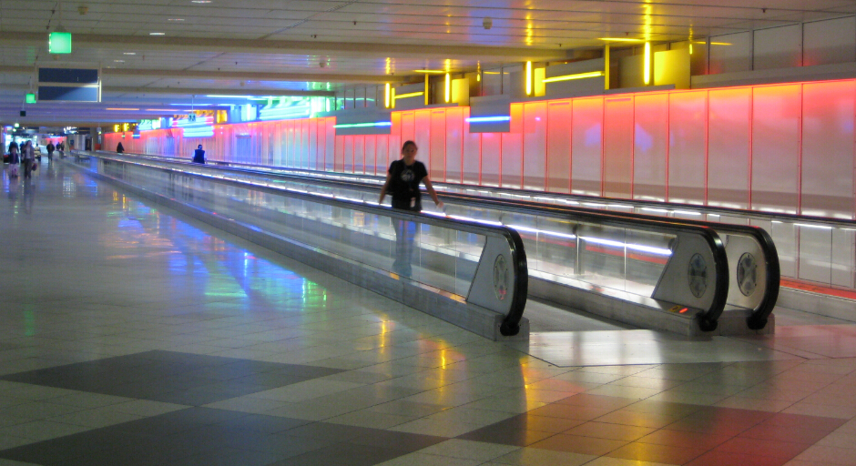
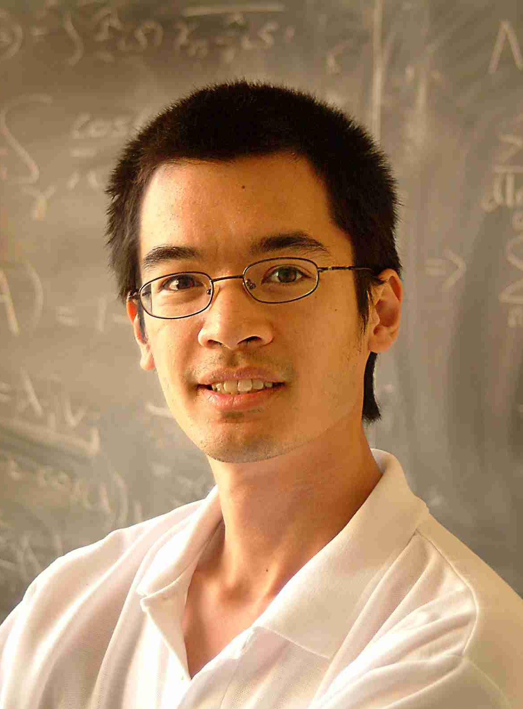
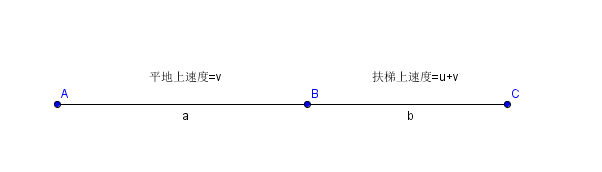

如果看到这个题目，以为我要跟你科普一些飞机马上就要起飞，而你还在去往登机口路上飞奔时候的注意事项，那我只好满怀“歉意”的说一句：Bazinga！

哈哈，虽然没有温馨小贴士，但我下面要给大家分享的这个有趣的题目，说不定在你哪天赶飞机的时候，真的争取到几分钟时间呢！

我们知道，机场通道里面通常会设置几段水平扶梯，供需要休息或者赶时间的人使用，那么问题来了，如果正在赶路的你发现需要停下来系一下鞋带，是在平地上系还是在扶梯上系比较节省时间呢？又或者是你刚好有跑一小段路的力气，是在平地上跑还是在扶梯上跑能让你更快到达登机口呢？

**问题描述**

这个有趣的问题的提出者，正是大名鼎鼎的陶哲轩（Terence Tao），是他在一次乘坐国际航班前突然想到的。随后他便将这个问题放在了他的博客上（[链接](https://terrytao.wordpress.com/2008/12/09/an-airport-inspired-puzzle/)），引发了大量的回复讨论，我们先看下这个问题的具体描述：

你要从机场通道的一端到另一端（为了简化问题，假设通道是一条直线），通道由一段平地和一段自动扶梯组成，假设你走路为匀速运动，且速度为v，而自动扶梯以匀速u运行，这就是说当你站在自动扶梯上的时候，你前进的速度为v+u。为了能够以最短的时间通过通道，请回答下面三个问题：

1，如果你需要停下来一小段时间，比如系鞋带，那么应该在平地上还是在扶梯上停留呢？假设花费的时间相同。

2，如果你刚好有一股能量支持你跑起来，把速度提高到v’，那么你应该在平地上还是扶梯上奔跑呢？假设拥有的能量相同。

\*3，如果考虑到狭义相对论，那上面两个问题的答案又是什么？

