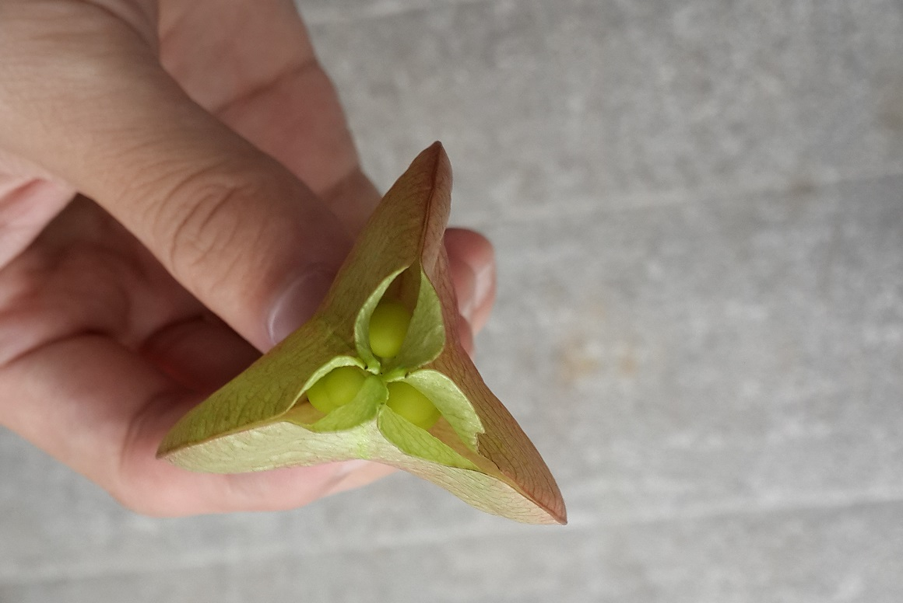

为什么叫雾中之塔呢？我不知道。

“但这塔一定得是个灯塔吧，有点年头的，要隔三差五拎着扳手沿着螺旋梯走到塔顶，拧一拧探照灯上的螺母，检查一下悬窗有无漏风，顺便清理一下窗台海鸥逗留积攒的粪便。塔室刚好容下两个人和一个火炉，用来驱赶寒风和潮湿。三五层楼样子的高度，外壁挂满了腥腻的海藻，和画着鳞片图的白色盐渍。踩在布满暗礁的海边，低矮的岩石连成一片，被海水拍打成狗牙状。距离最近的小镇也要半个小时的脚程，所以附近除了倒霉搁浅于此的渔夫就只有瞒着家人偷溜出来的小情侣。还有，重要的，凌晨和傍晚都会起雾。”大概就是这样，看到雾中之塔这四个字，我就会这样想。

和她相识是在去年夏天，那时我还是一个不认识花草的人。只觉得楼下大树的种子别致好看，但也只能把它放进脑海中贴着‘好看的种子’标签的抽屉里。“这是栾树的种子”，她告诉我，我才知道原来结出这好看的三棱形的种子的树，叫栾树。

她极爱猫，每次从自己家回来，肯定全身沾满猫毛。她谈起大花和大白（两只可爱的大肥猫）总是充满无限疼爱，并把‘愿意猫给你抱’作为对别人的最高认可，她说抱着猫摸摸拍拍能成神仙。

我带她爬紫金山，山腰休息的时候，聊起了槐花、榆钱和桑葚，都是可以吃的。但不知是由于小时候哪段记忆，一提起桑葚就想到下雪，我说，“小时候每次下大雪，我都闹着吃雪，爸爸就会拿一个小碗，跑去墙头给我取，有时候还要撒白糖吃”。结果被她笑了一路，说，吃雪用碗就够造作的了，还撒白糖，真是矫揉造作到极致了。

她带我去博物馆，给我讲竹林七贤、傅抱石、黄宾虹，反正我也记不住仨瓜俩枣，就盯着她笑。有一次突然扭头，不怀好意的指着一只张着大嘴的陶器问我，“哎，你知道虎子是干什么的吗？”

“我们开一个公众号吧”她跟我说，在一个平常到除了这句话什么都回忆不起来的下午，“把我们遇到的开心的事儿或者哪天有了一个有意思的想法记录下来，以后翻回来看，会有很多意外吧”我说，好啊好啊。

为什么叫雾中之塔呢？她起的，听着顺耳，就叫起来了。

——20161231（深圳）

**小记：**

记得很早做过一个梦，梦见自己身处一条长廊，长廊没有尽头，两侧是残破的、但排列整齐的房间，我逐一推开每个房间的木门检查有没有人在，但所有的房间都是空的（不仅没人，最起码的陈设也没有），我拼命地开门、空的、又空的……最后，陷入了极度的恐惧和悲伤，那是种摧毁式的无力感。

不知道世界上如果只剩下我一个人自己会怎么面对，大概会丧失对一切事物的兴趣吧。作为智能体的人类总归无法像其他动物那样——吃饱喝足就是一切。

从什么开始觉察自己和别人交流的变少了的，已经记不得了。有时想起一个好朋友，还有同他做过好玩的事儿，掰指头一算，呀，那真是很久之前了。

这个公众号是我和她一起维持的。其实蓄谋已久，迟迟才得以发布，实在是因为我太懒，拖延的理由从工作太忙、身体不舒服到椅子高度不合适、窗帘颜色影响创作，最后自己都说服不住，只好定下deadline。说好今年发出来，就绝不拖到明年。该怎么说：死线万岁！哈？？？（201612）

**再记：**

这是我写的第一篇文章，也是最后一篇文章。公众号一共有两篇文章，另一篇是她写的。后来我们都没再更新过文章，现在公众号已经注销了。（202411）

**再记：**

刘老师的文章全文如下

夏日将尽时我领受了完全新鲜的人生经验，那中间恰好看了许多次落日，在将来这段记忆可能会被我凝练地概括为黄昏时分大片的暗色，棕、深紫、橘黄，以及层叠的褶皱和阴影。伴随着新经验的累积，那些在往昔岁月中我可以用“并不了解，并无体会”去推拒的现实，这时就像撕开地面的深壑一样确切，没办法再回避。不全是“好”的体验，但那些不愉快的方式也以填补空白的姿态出现，令我震动、而后是无从排解的困惑，它所引起我内心情绪的力度之强劲，竟使这件不算愉快的事也奇怪地充满魅力，令人心动不已。
 
很多时候入神地看着夜里黑暗模糊的街道和伸向远方的荧荧街灯，想到人们孜孜不倦地规划和铺展命运之路也许并不是为了抵达什么远方，陌生的地域常常并不比当前的景况更能使人感到轻松安乐，丢弃既有之物想要拥进新的所爱最后说不定落得两手空空，然而恢弘壮阔的生命图景从时空的经纬中被凭空编织出来，即使颜色图案又会再慢慢剥落，归为虚空，但任生命之流随自己的意志跌宕奔逸，仍是值得骄傲的。人各自持有度量生命的方式，有人一生只对一件事认真，有人试图从千万件事及其触发的层叠涟漪中感受生命，而我属于后者。走在路上永远耳目大张，贪心地希望能把周遭的一切洞察个涓滴不遗。
 
秋天之后，我和男朋友的距离将从175公里变成1300公里。之前我在蜀山的面包店买到了爱吃的奶油提子面包，一高兴就乘上动车去仙林找他一起吃——不过是穿过环滁的青色丘陵、跨过长江、翻过钟山而已，觉得轻而易举。但是1300公里，仅仅读出这个数字就让我想起“远”而不由得心头一酸。这么远啊，想象中是因外力压迫而不能顺畅奔流的血液，久了大概就会引起人轻微的麻痹，就是类似的感觉。好在男朋友矫揉造作的程度与我旗鼓相当，他说当年离开北方到南京去读书其实只为了成全自己背井离乡的姑妄之情，既然这样，那么不能随时相见的小小苦痛又为何不能被理解为顺遂我们在恋爱中造作情怀的善意馈赠呢？ 很早就相互觉得有被对方的智慧之网吸纳的资质，之后也在一次又一次昏天黑地的交流和辩论中反复确认了这一点。一起写点什么，以纪实、想象、思索和呓语来将生活重新包裹起来，是我们不约而同的想法。
 
即使是最为丰饶的生命也总是由一些类型之物构成的吧！常能见到人在不同处境里固执地反复陈述相似的意象，就能知道这些东西凝练地指出了他们生活的本质。有人奇怪地爱提起被外力带离原生地，而在陌生的经纬里扇动翅膀，徒劳寻找它熟悉的那片灌木的粉蝶；有人最深刻的记忆则始终伴随着深绿色故乡的连绵雨声。如果闭上眼睛沉思我的，首先浮现出的形象是一座雾霭中的高塔。塔真优美，尤其是已经不承担实际用途的那些，瞭望塔、佛塔、水塔、通讯塔像是从虚荒诞幻的土壤中直接抽出的花箭，形态明确、意志坚定、毫不犹豫迟疑，所以连时间都不得不以放任其近乎永久存留的方式献上自己的敬意。塔的周围为什么要有雾，说不清楚，雾霭可能代表着穷尽人菲薄力气之后仍然无法触及的东西。而那些混沌和神秘，让世界不至于堕入完全的因果之中，也让生命有趣。
