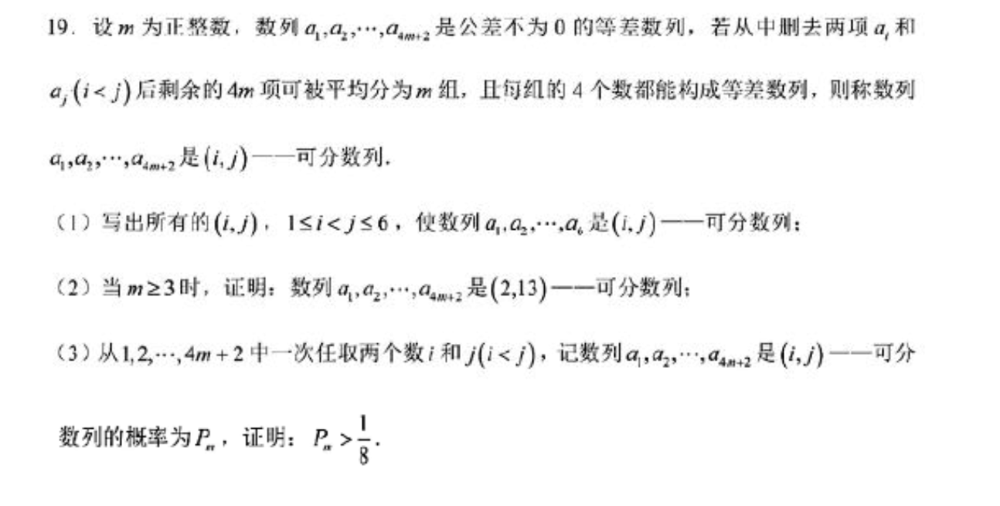

**试题：（概率）**

**解答：**

（1）共有三组：$(1,2)$对应等差数列$a_{3},a_{4},a_{5},a_{6}$；$(1,6)$对应等差数列$a_{2},a_{3},a_{4},a_{5}$；$(5,6)$对应等差数列$a_{1},a_{2},a_{3},a_{4}$。

（2）由于从15位（$m$取4,5,…）之后，数列是$a_{15},a_{16},a_{17},a_{18},\dots ,a_{4m-1},a_{4m},a_{4m+1},a_{4m+2}$必然可以从前至后每四个分为一组（共$m-3$组），因此只需要考察前14位即可，其去掉第2位和第13位后，可以分为3组等差数列$a_{1},a_{4},a_{7},a_{10}$、$a_{3},a_{6},a_{9},a_{12}$、$a_{5},a_{8},a_{11},a_{14}$，因此共拆分为$m$组等差数列，得证。

（3）引理：（扩展第2问结论）对于$m\ge 2$时，数列$a_{1},a_{2},\dots ,a_{4m+2}$是$(2,4m+1)$可分数列。

观察可知$a_{1},a_{3},a_{4},\dots ,a_{4m-1},a_{4m},a_{4m+2}$可做如下拆分：
$$a_{1},a_{m+1},a_{2m+1},a_{3m+1}$$
$$a_{3},a_{m+3},a_{2m+3},a_{3m+3}$$
$$a_{4},a_{m+4},a_{2m+4},a_{3m+4}$$
$$\dots ,\dots ,\dots ,\dots $$
$$a_{m-1},a_{2m-1},a_{3m-1},a_{4m-1}$$
$$a_{m},a_{2m},a_{3m},a_{4m}$$
$$a_{m+2},a_{2m+2},a_{3m+2},a_{4m+2}$$
因此引理成立。

对于$a_{1},a_{2},\dots ,a_{4m+2}$考虑数对$\{1,2\}$、$\{5,6\}$、$\{9,10\}$、…、$\{4m+1,4m+2\}$即$\{1,2\}$、$\{4+1,4+2\}$、$\{4*2+1,4*2+2\}$、…、$\{4m+1,4m+2\}$，对于使数列为可分数列的$i$与$j$皆从上述数对中取出。

如果$(i,j)$取数不跨越数对，即$(i,j)$就取为$(1,2)$、$(5,6)$、$(9,10)$、…、$(4m+1,4m+2)$，显然数列剩余元素必然可分，此时个数共计$m+1$；

如果$(i,j)$取数相邻（间隔为$1$）的数对各一个数，即$(i,j)$就取为$(1,6)$、$(5,10)$、$(9,14)$、…、$(4m-3,4m+2)$，显然数列剩余元素必然可分，此时个数共计$m$；

如果$(i,j)$取数间隔为$2$的数对各一个数，此时$(i,j)$有两种取法，方式一取两端，取为$(1,10)$、$(5,14)$、…、$(4m-7,4m+2)$，显然数列剩余元素必然可分，此时个数共计$m-1$，方式二取数对所在数组范围的第二个与倒数第二个数字，取为$(2,9)$、$(6,13)$、…、$(4m-6,4m+1)$，显然根据引理数列剩余元素必然可分，此时个数共计$m-1$，两种方式个数共计$2(m-1)$；

依此类推，如果$(i,j)$取数间隔为$k$的数对各一个数，则个数共计$2(m+1-k)$；

一直到，$(i,j)$取数间隔为$m$的数对各一个数，则个数共计$2$；

因此$(i,j)$取数总个数为

$$(m+1)+m+2(m-1)+2(m-2)+\dots +2(m+1-k)+\dots +2*2+2*1$$

计算得$m^{2}+m+1$，即所有可能$(i,j)$的个数$N\ge m^{2}+m+1$。

又有$a_{1},a_{2},\dots ,a_{4m+2}$，当$m\ge 2$时，任取两数的组合数为$C_{4m+2}^{2}$，若有$\frac{m^{2}+m+1}{C_{4m+2}^{2}} > \frac{1}{8}$，则可得证。

显然有：

$$\frac{C_{4m+2}^{2}}{8} = \frac{8m^{2}+6m+1}{8} = m^{2} + \frac{3m}{4} + \frac{1}{8} < m^{2}+m+1$$

因此$m\ge 2$时，结论成立。

另有$m=1$时，由第1问结论，可得$P = \frac{1}{5} > \frac{1}{8}$

综上$m\ge 1$时，皆有$P_{m} > \frac{1}{8}$，证毕。
