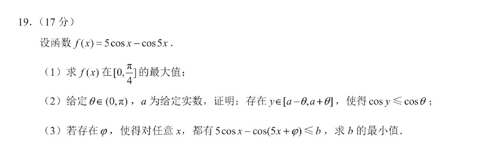

**试题：（三角函数）**

**解答：**

（1）对函数$f(x)$求导得到：$f'(x) = -5\sin x + 5\sin (5x) = 5(\sin (5x) - \sin x)$，当$f'(x) = 0$时，$x$取$0$或$\pi / 6$(由$5x+x=\pi$得出)。

因此有，当$x \in [0,\pi / 6]$时，$f'(x) \ge 0$，$f(x)$为增函数；当$x \in (\pi / 6, \pi /4]$时，$f'(x) < 0$，$f(x)$为减函数，故当$x=\pi /6$时，$f(x)$取得最大值，为$3\sqrt 3$。

（2）因为$\cos x$在$(0,\pi)$区间内为减函数，在$(-\pi,0)$区间内为增函数。考虑$\cos (-\theta )$与$\cos (\theta)$两函数值，为$[-\theta,\theta]$区间内$\cos x$的两个最小值点，此时对应$a=0$时的区间$[a - \theta, a + \theta]$，仅当$y=-\theta,\theta$时有$\cos y = \cos \theta$（其他$y$的取值都会大于$\cos \theta$），当$a$不取$0$时，$y$的qu'zhi