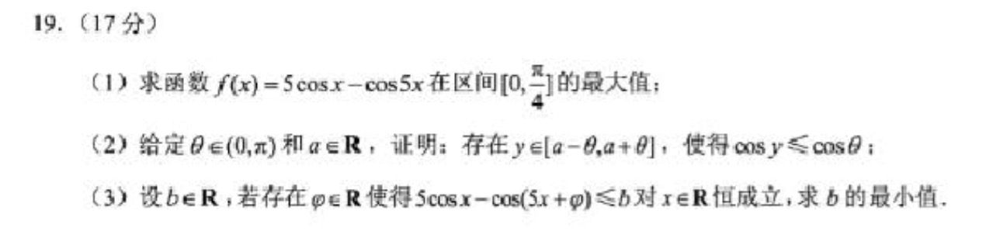

**试题：（三角函数）**

**解答：**

（1）对函数$f(x)$求导得到：$f'(x) = -5\sin x + 5\sin (5x) = 5(\sin (5x) - \sin x)$，当$f'(x) = 0$时，$x$取$0$或$\pi / 6$(由$5x+x=\pi$得出)。

因此有，当$x \in [0,\pi / 6]$时，$f'(x) \ge 0$，$f(x)$为增函数；当$x \in (\pi / 6, \pi /4]$时，$f'(x) < 0$，$f(x)$为减函数，故当$x=\pi /6$时，$f(x)$取得最大值，为$3\sqrt 3$。

（2）因为$\cos x$，在$(-\pi,0)$区间内为增函数，在$(0,\pi)$区间内为减函数。考虑$\cos (-\theta )$与$\cos (\theta)$两函数值，为$[-\theta,\theta]$区间内$\cos x$的两个最小值点，即对应的值域为$[\cos \theta, 1]$，此区间对应$a=0$时的区间$[a - \theta, a + \theta]$，仅当$y=-\theta,\theta$时，有$\cos y = \cos \theta$（其他$y$的取值都会大于$\cos \theta$），当$a$不取$0$时，在$y$的取值区间内，因其取值长度为$2\theta$，因此必然能取到小于$-\theta$或者大于$\theta$的值，由$\cos x$函数的单调性可知，必然有$\cos y \le \cos \theta$，证毕。

（3） 设$g(x) = 5\cos x -\cos (5x + \varphi)$，即求$g(x)$在不同的$\varphi$取值时，所组成的函数簇中，所有函数最大值的最小值是多少。

求导有$g'(x) = 5(\sin (5x + \varphi) - \sin x)$，当$g'(x) = 0$时，为函数的极值点。

首先，证明对于$g(x)$必然有一最大值点落在区间$(-\pi/3, \pi/3)$内，设$g_1(x) = 5\cos x$，$g_2(x) = \cos (5x + \varphi)$，则$g(x) = g_1(x) - g_2(x)$。在区间$(-\pi/3, \pi/3)$内，$g_2(x)$可能取到的最大值为$1$，因此$g(x)$在区间$(-\pi/3, \pi/3)$取到的最大值一定大于$5 - 1 = 4$；在其他区间内，$g_1(x)$可取到最大值为$5\cos \pi/3 = 5/2$，$g_2(x)$可能取到的最小值为$-1$，所以此时$g(x)$可取到的最大值一定小于等于$7/2$，因此$g(x)$必然有一最大值点落在区间$(-\pi/3, \pi/3)$内。

由于余弦函数周期性，只需考虑$\varphi \in [-\pi, \pi]$即可。

当$g'(x) = 0$时，有$\sin (5x + \varphi) = \sin x$，根据对称性有$(5x + \varphi) + x = \pi + 2k\pi$，根据周期性有$5x + \varphi = x + 2k\pi$，即：

$$x = 
\begin{cases}
\frac{2k+1}{6} \pi - \frac{\varphi}{6} 
 \\
\frac{k}{2} \pi - \frac{\varphi}{4} 
\end{cases}$$

其中$k = 0, \pm 1, \pm 2, ...$，在$\varphi \in [-\pi, \pi]$区间内，可以得到：

$$
\left
\{\begin{matrix}
\varphi \in [-\pi,-\frac{2}{3}\pi)时，有极大值点\frac{\pi - \varphi}{6}和\frac{-\pi - \varphi}{6}，有极小值点-\frac{\varphi}{4}和\frac{-2\pi - \varphi}{4}
 \\
\varphi \in [-\frac{2}{3}\pi,\frac{2}{3}\pi]时，有极大值点\frac{\pi - \varphi}{6}和\frac{-\pi - \varphi}{6}，有极小值点-\frac{\varphi}{4}
 \\
\varphi \in (\frac{2}{3}\pi,\pi]时，有极大值点\frac{\pi - \varphi}{6}和\frac{-\pi - \varphi}{6}，有极小值点-\frac{\varphi}{4}和\frac{2\pi - \varphi}{4}
\end{matrix}
\right.
$$

综上，$\varphi \in [-\pi, \pi]$时，最大值点在$(\pi - \varphi)/6$或$(-\pi - \varphi)/6$取得，带入$g(x)$得到：

$$g((\pi - \varphi)/6) = 5\cos(\pi /6 - \varphi/6) - \cos(5\pi/6 + \varphi/6) = 6\cos(\pi /6 - \varphi/6)$$

$$g((-\pi - \varphi)/6) = 5\cos(-\pi /6 - \varphi/6) - \cos(5\pi/6 - \varphi/6) = 6\cos(\pi /6 + \varphi/6)$$

显然有：

$$
\left\{\begin{matrix}
\varphi \in [-\pi,0)时，最大值为6\cos(\pi /6 + \varphi/6)（大于3\sqrt{3} ）
 \\
\varphi = 0时，最大值为3\sqrt{3} 
 \\
\varphi \in (0,\pi]时，最大值为6\cos(\pi /6 - \varphi/6)（大于3\sqrt{3} ）
\end{matrix}\right.
$$

因此在不同$\varphi$取值下的$g(x)$的最大值的最小值为$3\sqrt{3}$，即￥
