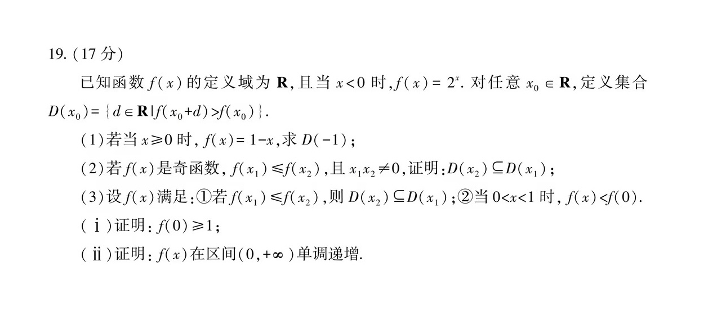
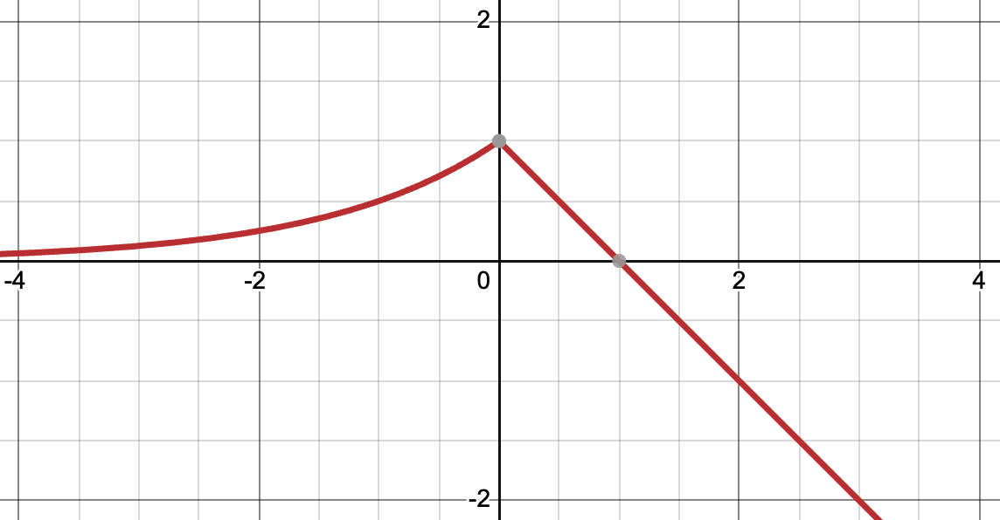
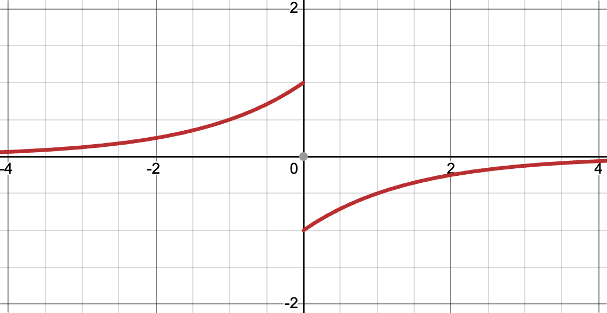
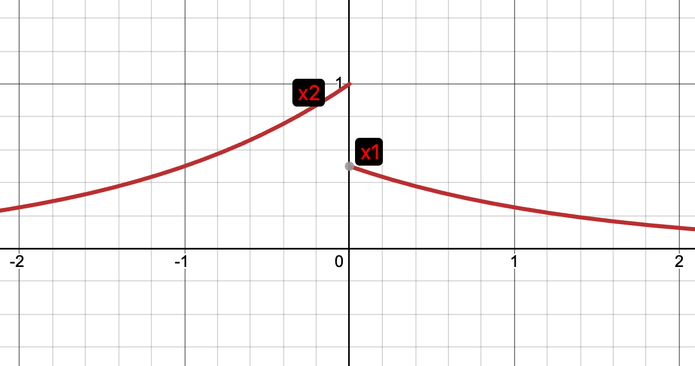
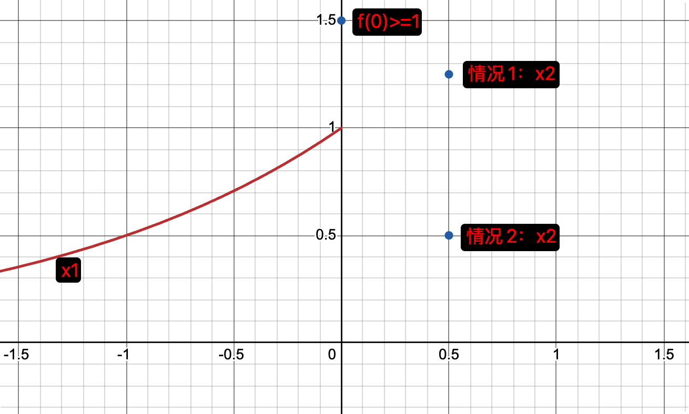
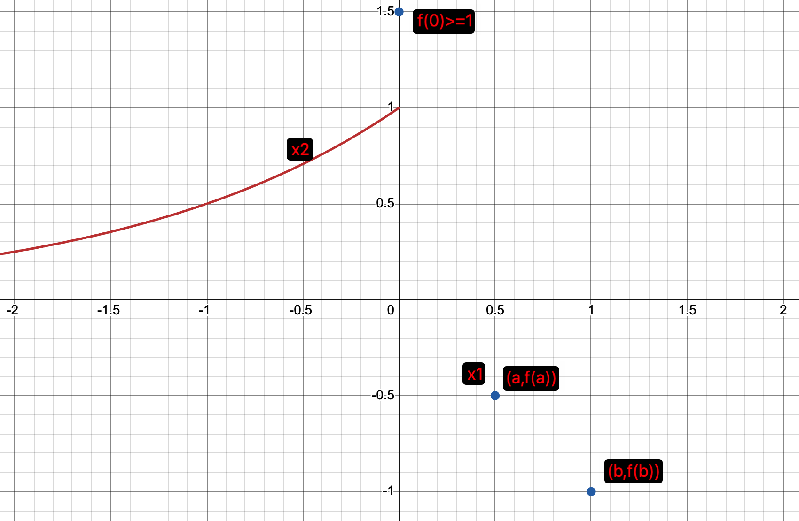

**试题：（函数）**

**解答：**

（1）对应的函数图像为：

$$D(-1)=\{d\in\mathbb{R}\mid f(d-1)>f(-1)\}$$
即$f(d-1)>f(-1)=1/2$，左边$d-1=-1$，右边$d-1=1/2$，所以集合$D(-1)$为$0<d<3/2$。

（2）对应的函数图像为：

由$f(x_1)\leqslant f(x_2)$，且 $x_1 x_2\neq 0$，可以分为三种情况：

情况1：$x_1\leqslant x_2<0$

设$t<0$，有$D(t)=\{d\in\mathbb{R}\mid f(t+d)>f(t)\}$，因为小于0时$f(t)$单调递增，大于等于0后整体小于负数区间取值，所以有$D(t)=\{d\in\mathbb{R}\mid 0<d<-t\}$，因为有$x_1\leqslant x_2<0$，所以必然有$D(x_2)\subseteq D(x_1)$。

情况2：$x_2\geqslant x_1>0$

设$t>0$，有$D(t)=\{d\in\mathbb{R}\mid f(t+d)>f(t)\}$，因为大于0时$f(t)$单调递增，小于等于0的函数整体取值大于正数区间取值，所以有$D(t)=\{d\in\mathbb{R}\mid d\leqslant-t或d>0\}$，因为有$x_2\geqslant x_1>0$，所以必然有$D(x_2)\subseteq D(x_1)$。

情况3：$x_2<0$且$x_1>0$

由上面的结论可以知道$D(x_2)=\{d\in\mathbb{R}\mid 0<d<-x_2\}$，$D(x_1)=\{d\in\mathbb{R}\mid d\leqslant-x_1或d>0\}$，所以必然有$D(x_2)\subseteq D(x_1)$。

综上可得$D(x_2)\subseteq D(x_1)$。

（3-i）

假设$f(0)< 1$，且满足当 $0<x<1$ 时，$f(x)<f(0)$。

取点$-1<x_2<0$且$f(x_2)>f(0)$，必可取到，再取点$x_1=0$，则显然满足$f(x_1)\leqslant f(x_2)$。

由定义知，$D(x_2)$必然包含$0<d<-x_2$的区间，但$D(x_1)$必然不含$0<d<-x_2$的区间，因此得出矛盾，无法满足$D(x_2)\subseteq D(x_1)$，故假设不成立，因此$f(0)\geqslant 1$。

（3-ⅱ）

假设在$0<x<1$时，有$f(x)>0$。

有$0<x_2<1$可分两种情况，分别为$0<f(x_2)<1$与$1\leqslant f(x_2)<f(0)$ ，为了满足$f(x_1)\leqslant f(x_2)$，则总能找到符合$x_1<0$的$x_1$。此时$D(x_2)$必然包含值$-x_2$，但因为函数负值侧为单调增函数，所以$D(x_1)$必然不含值$-x_2$，因此假设不成立，故在$0<x<1$时，总有$f(x) \leqslant 0$。

再假设当$x \geqslant 1$时，有$f(x)>0$。

可设存在$t \geqslant 1$，$f(t) > 0$，一定存在$x_2<0$，使得$f(x_2)<f(t)$，取$d=t-x_2$，所以$d$属于$D(x_2)$，再取$x_1$满足$-d<x_1<-d+1$，此时$x_1<x_2<0$，满足$f(x_1) \leqslant f(x_2)$，即$0<x_1+d<1$，所以有$f(x_1+d) \leqslant 0 < f(x_1)$，故$d$不属于$D(x_1)$，因此假设不成立。

综上，有$x>0$时，有$f(x)\leqslant0$。

再假设当$x>0$时，存在点$(a,f(a))$和点$(b,f(b))$，满足$b>a$但$f(b)<f(a)$，如图：

此时可以设$x_1=a$，$x_2=a-b$，显然$f(x_1)\leqslant f(x_2)$，且$D(x_2)$必然包含值$-x_2=b-a$，但$D(x_1)$必然不包含$b-a$，所以假设不成立，故当$x>0$时，对于所有的$b>a$都有$f(b) \geqslant f(a)$，因此$f(x)$ 在区间 $(0,+\infty)$ 单调递增。

批注：

此题出的甚妙，不必（或者不可）着眼于整体证明或者过分关注区间的情况，只需构造出**特殊点**即可。

其实就是构造两次矛盾，制造出来高度差。区间$(0,1)$，是$x$大于$0$时，让$d=-x$这样恰好落到$0$上，制造矛盾；区间$(1,+\infty)$ 就是构造第二个点增加$d$之后，恰好落入$(0,1)$的区间内，制造矛盾。这两次之间是层层推进的，巧妙巧妙。

AI虽然有点啰嗦，但99%都是正确的，而且看它的答案，还找到了自己答案的一处漏洞，厉害厉害。
