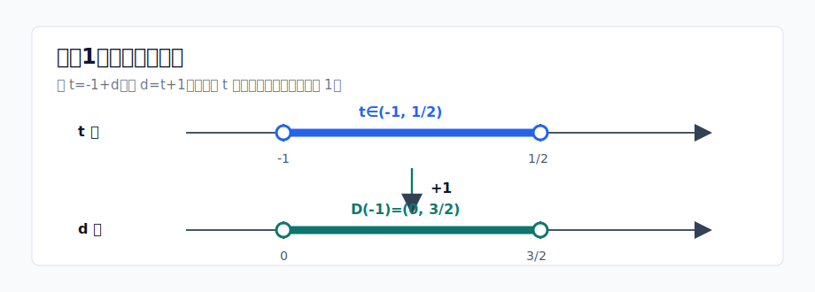
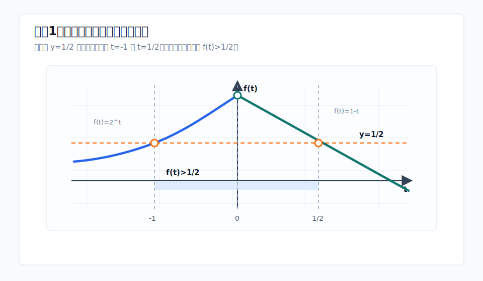
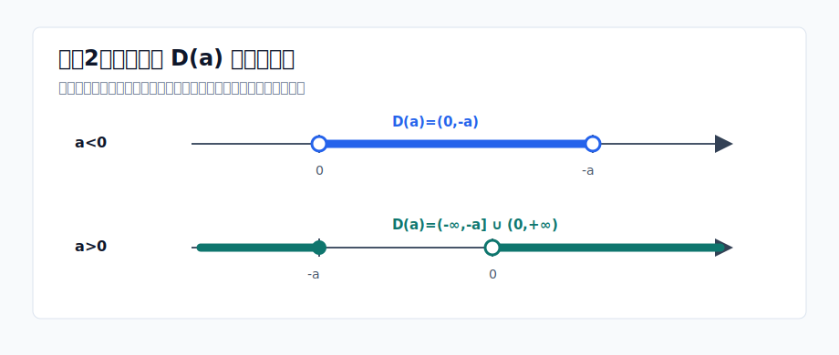
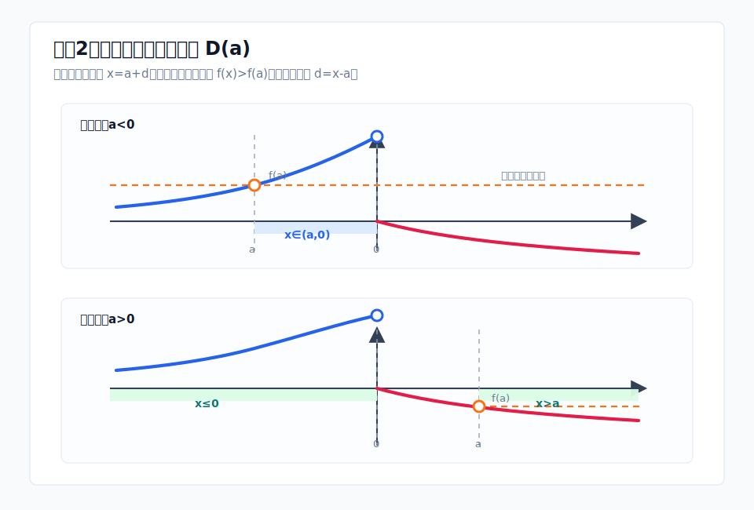
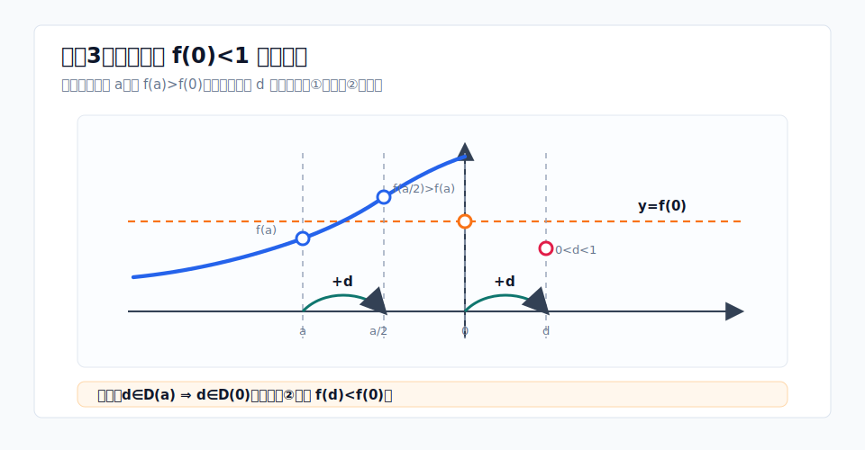
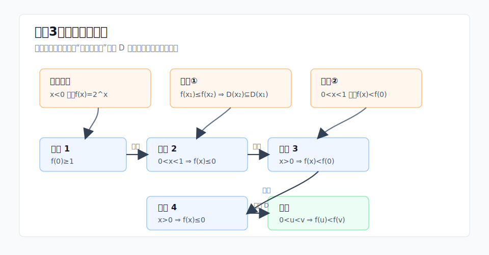
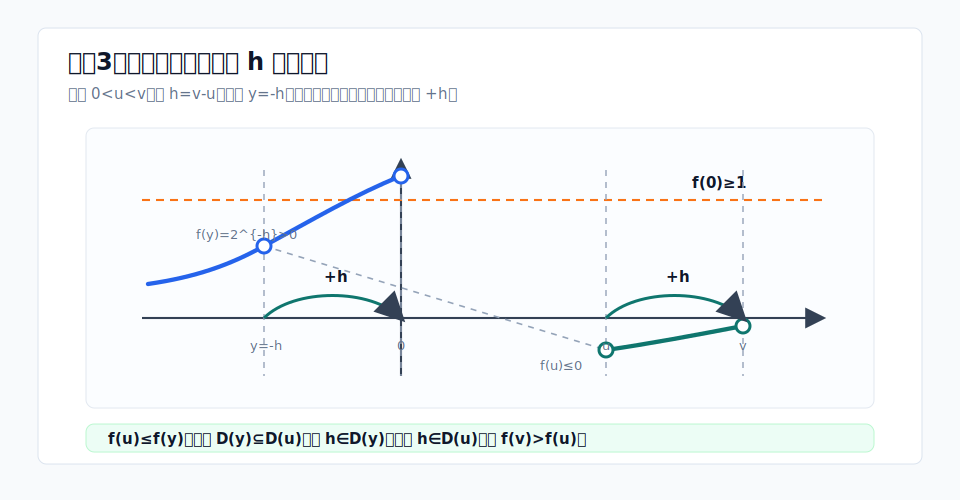

**codex gpt-5.5 xhigh**

**试题：（函数）**

已知函数 $f(x)$ 的定义域为 $\mathbb{R}$，且当 $x<0$ 时，$f(x)=2^{x}$。对任意 $x_0\in\mathbb{R}$，定义集合

$$D(x_0)=\{d\in\mathbb{R}\mid f(x_0+d)>f(x_0)\}$$

（1）若当 $x\geqslant 0$ 时，$f(x)=1-x$，求 $D(-1)$；

（2）若 $f(x)$ 是奇函数，$f(x_1)\leqslant f(x_2)$，且 $x_1 x_2\neq 0$，证明：$D(x_2)\subseteq D(x_1)$；

（3）设 $f(x)$ 满足：①若 $f(x_1)\leqslant f(x_2)$，则 $D(x_2)\subseteq D(x_1)$；②当 $0<x<1$ 时，$f(x)<f(0)$。

（ⅰ）证明：$f(0)\geqslant 1$；

（ⅱ）证明：$f(x)$ 在区间 $(0,+\infty)$ 单调递增。

**解答：**

已知函数 $f(x)$ 的定义域为 $\mathbb R$，且当 $x<0$ 时，$f(x)=2^x$。对任意 $x_0\in\mathbb R$，定义

$$
D(x_0)=\{d\in\mathbb R\mid f(x_0+d)>f(x_0)\}.
$$

第（3）问中，为便于引用，记：

- **条件①**：对任意 $x_1,x_2\in\mathbb R$，若 $f(x_1)\le f(x_2)$，则 $D(x_2)\subseteq D(x_1)$。
- **条件②**：当 $0<x<1$ 时，$f(x)<f(0)$。

其中条件①的方向要特别注意：函数值较大的点，对应的 $D$ 集合反而包含在函数值较小的点对应的 $D$ 集合中。

## （1）求 $D(-1)$

当 $x_0=-1$ 时，$f(-1)=2^{-1}=\frac12$。令 $t=-1+d$，则

$$
d\in D(-1)\iff f(t)>\frac12.
$$

若 $t<0$，则 $f(t)=2^t$，所以 $2^t>\frac12=2^{-1}\iff t>-1$，得到 $-1<t<0$。若 $t\ge0$，则 $f(t)=1-t$，所以 $1-t>\frac12\iff t<\frac12$，得到 $0\le t<\frac12$。

因此 $t\in\left(-1,\frac12\right)$。由 $t=-1+d$，得

$$
-1<-1+d<\frac12\iff 0<d<\frac32.
$$

所以

$$
\boxed{D(-1)=\left(0,\frac32\right)}.
$$

图示如下，核心是从 $t\in\left(-1,\frac12\right)$ 平移到 $d\in\left(0,\frac32\right)$。

也可以直接看函数图像：水平辅助线 $y=\frac12$ 与两段函数分别交于 $t=-1$ 和 $t=\frac12$，中间横坐标正好对应 $f(t)>\frac12$。

## （2）证明 $D(x_2)\subseteq D(x_1)$

因为 $f(x)$ 是奇函数，且当 $x<0$ 时 $f(x)=2^x$，所以 $f(0)=0$，且当 $x>0$ 时，

$$
f(x)=-f(-x)=-2^{-x}.
$$

因此

$$
f(x)=
\begin{cases}
2^x,&x<0,\\
0,&x=0,\\
-2^{-x},&x>0.
\end{cases}
$$

先求 $D(a)$。

若 $a<0$，则 $f(a)=2^a>0$。要使 $f(a+d)>2^a$，必须有 $a+d<0$，且

$$
2^{a+d}>2^a\iff d>0.
$$

再由 $a+d<0\iff d<-a$，得

$$
D(a)=(0,-a),\qquad a<0.
$$

若 $a>0$，则 $f(a)=-2^{-a}<0$。当 $a+d\le0$ 时，$f(a+d)\ge0>-2^{-a}$，所以 $d\le-a$ 均满足条件；当 $a+d>0$ 时，

$$
-2^{-(a+d)}>-2^{-a}
\iff 2^{-(a+d)}<2^{-a}
\iff d>0.
$$

所以

$$
D(a)=(-\infty,-a]\cup(0,+\infty),\qquad a>0.
$$

这两种 $D(a)$ 的形状可以用数轴表示如下。

从函数图像看，关键是把横轴上的变量看成 $x=a+d$。图中彩色横轴区域表示所有满足 $f(x)>f(a)$ 的 $x$，再由 $d=x-a$ 换回 $D(a)$。

下面由 $f(x_1)\le f(x_2)$ 且 $x_1x_2\ne0$ 分情况讨论。

1. 若 $x_1<0,x_2<0$，则 $2^{x_1}\le2^{x_2}\iff x_1\le x_2$，于是 $-x_2\le -x_1$，所以

$$
D(x_2)=(0,-x_2)\subseteq(0,-x_1)=D(x_1).
$$

2. 若 $x_1>0,x_2>0$，则 $-2^{-x_1}\le-2^{-x_2}\iff x_1\le x_2$，于是 $-x_2\le -x_1$，所以

$$
D(x_2)=(-\infty,-x_2]\cup(0,+\infty)
\subseteq
(-\infty,-x_1]\cup(0,+\infty)=D(x_1).
$$

3. 若 $x_1>0,x_2<0$，则 $f(x_1)<0<f(x_2)$，条件成立，且

$$
D(x_2)=(0,-x_2)\subseteq(0,+\infty)\subseteq D(x_1).
$$

4. 若 $x_1<0,x_2>0$，则 $f(x_1)>0>f(x_2)$，不可能满足 $f(x_1)\le f(x_2)$。

综上，

$$
\boxed{D(x_2)\subseteq D(x_1)}.
$$

## （3）（ⅰ）证明 $f(0)\ge1$

反设 $f(0)<1$。由于 $\lim_{x\to0^-}2^x=1$，可取 $a\in(-2,0)$，使得

$$
f(a)=2^a>f(0).
$$

由条件①，令 $x_1=0,x_2=a$，得到 $D(a)\subseteq D(0)$。取 $d=-\frac a2$，则 $0<d<1$，且 $a+d=\frac a2<0$，于是

$$
f(a+d)=f\left(\frac a2\right)=2^{a/2}>2^a=f(a).
$$

所以 $d\in D(a)$，进而 $d\in D(0)$，即 $f(d)>f(0)$。但 $0<d<1$，由条件②知 $f(d)<f(0)$，矛盾。

因此

$$
\boxed{f(0)\ge1}.
$$

这一反证过程中的辅助点关系如下：从 $a$ 平移同一个 $d=-\frac a2$ 到 $\frac a2$，再从 $0$ 平移到 $d$。条件①会把 $d\in D(a)$ 传到 $d\in D(0)$，但条件②在 $0<d<1$ 上给出相反结论。

## （3）（ⅱ）证明 $f(x)$ 在 $(0,+\infty)$ 单调递增

下面分四步证明。

证明链条如下，后文每一步都是对图中一个结论的严格证明。

### 第一步：证明 $0<x<1$ 时，$f(x)\le0$

任取 $s\in(0,1)$。由条件②，$f(s)<f(0)$。反设 $f(s)>0$，则可取 $y<0$，使得 $2^y<f(s)$，即 $f(y)<f(s)$。由条件①，

$$
D(s)\subseteq D(y).
$$

又因为 $f(0)>f(s)$，所以 $-s\in D(s)$，于是 $-s\in D(y)$，即 $f(y-s)>f(y)$。但 $y-s<y<0$，因此

$$
f(y-s)=2^{y-s}<2^y=f(y),
$$

矛盾。所以

$$
\boxed{0<x<1\Rightarrow f(x)\le0}.
$$

### 第二步：证明 $x>0$ 时，$f(x)<f(0)$

先证不存在 $a>0$ 使 $f(a)>f(0)$。若存在，则 $a\in D(0)$。对任意 $t<0$，由（ⅰ）知 $f(t)=2^t<1\le f(0)$，所以由条件①得 $D(0)\subseteq D(t)$，进而 $a\in D(t)$，即

$$
f(t+a)>f(t)=2^t.
$$

特别地，取 $s\in(0,\min\{a,1\})$，令 $t=s-a<0$，则 $t+a=s\in(0,1)$，于是 $f(s)>2^{s-a}>0$，这与第一步矛盾。因此 $f(a)\le f(0)$ 对一切 $a>0$ 成立。

再证不存在 $a>0$ 使 $f(a)=f(0)$。若存在，取 $r\in(\max\{0,a-1\},a)$，则 $s=a-r\in(0,1)$。任取 $y<0$，令 $z=y-r$，则 $z<y<0$，所以 $f(z)<f(y)$。又因为 $f(a)=f(0)\ge1>2^y=f(y)$，故 $d=a-y\in D(y)$。由条件①，$D(y)\subseteq D(z)$，所以 $d\in D(z)$，即

$$
f(z+d)>f(z).
$$

而 $z+d=(y-r)+(a-y)=a-r=s$，于是 $f(s)>f(z)=2^z>0$，仍与第一步矛盾。

所以

$$
\boxed{x>0\Rightarrow f(x)<f(0)}.
$$

### 第三步：证明 $x>0$ 时，$f(x)\le0$

反设存在 $a>0$，使得 $f(a)>0$。由第二步，$f(a)<f(0)$。取 $y<0$，使 $2^y<f(a)$，即 $f(y)<f(a)$。由条件①，

$$
D(a)\subseteq D(y).
$$

又因为 $f(0)>f(a)$，所以 $-a\in D(a)$，于是 $-a\in D(y)$，即 $f(y-a)>f(y)$。但 $y-a<y<0$，所以

$$
f(y-a)=2^{y-a}<2^y=f(y),
$$

矛盾。因此

$$
\boxed{x>0\Rightarrow f(x)\le0}.
$$

### 第四步：证明严格递增

最后一步的辅助点和平移关系如下。这里的核心是同一个增量 $h$：先知道 $h\in D(y)$，再由 $D(y)\subseteq D(u)$ 转移到 $h\in D(u)$。

任取 $0<u<v$，令 $h=v-u>0$，$y=-h<0$。由第三步，$f(u)\le0$；而 $f(y)=2^{-h}>0$，所以 $f(u)\le f(y)$。由条件①，

$$
D(y)\subseteq D(u).
$$

又因为 $y+h=0$，且由（ⅰ）有 $f(0)\ge1>2^{-h}=f(y)$，所以 $h\in D(y)$。于是 $h\in D(u)$，即

$$
f(u+h)>f(u).
$$

因为 $u+h=v$，所以 $f(v)>f(u)$。因此 $f(x)$ 在 $(0,+\infty)$ 上严格递增，当然也单调递增：

$$
\boxed{f(x)\text{ 在 }(0,+\infty)\text{ 单调递增}.}
$$

批注：

第一步的反证，$x_2$取的是$\in(0,1)$，$x_1$取的$x_1<0$且满足$f(x_1)<f(x_2)$，$d$取的是$-x_2$。

第二步的反证，假设有 $a>0$ 使 $f(a)>f(0)$，$x_2$取的是$0$，$d$取的是$\min\{a,1\}$，$x_1$取的$x_1<0$且满足$f(x_1)<f(x_2)$，$s$取的是$-x_2$。

