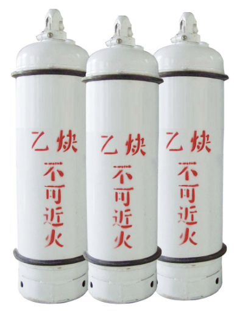

乙炔钢瓶不能横躺卧放，是由贮存乙炔钢瓶的化学、物理性质所决定的。

乙炔是可燃性气体，与空气混合燃烧时产生的火焰温度为2350℃，而与氧气混合燃烧时产生的火焰温度可达3000—3300℃。因此，乙炔是具有爆炸性的危险气体。

乙炔有个特点，如果将其装在一般容器里，压力不能超过0.2MPa，否则，就要发生爆炸；如果将乙炔赶入多孔性填充料中，压力增加到2.7MPa时，仍能安全有效。但后者贮存量很小，不利于工业生产。于是人们利用乙炔可以大量溶解在丙酮中的特点，在瓶中填满浸透丙酮的多孔性材料（如细粒活性炭或固体硅酸钙复合填料）。这样，就可以在1.5—2.5MPa时（15—25个表压）下安全制取，贮存瓶内供使用。

使用乙炔时，把乙炔钢瓶阀门打开后，由于外界压力比钢瓶内压力小，丙酮就会把溶解进去的乙炔放出来，放完后，再去充装乙炔，周而复始，使用十分方便。

但是，如果将乙炔瓶横躺卧放使用，则溶解有乙炔的丙酮就会从钢瓶中流出，不仅乙炔与空气混合而发生爆炸，同时丙酮蒸气与空气混合到1.6—13.0%时遇明火就会爆炸。因此，乙炔钢瓶只能直立使用。

此外，环境温度的高低，直接影响着乙炔的丙酮中的熔解度。所以，乙炔钢瓶不能在阳光下暴晒，也不能在热环境中放置。