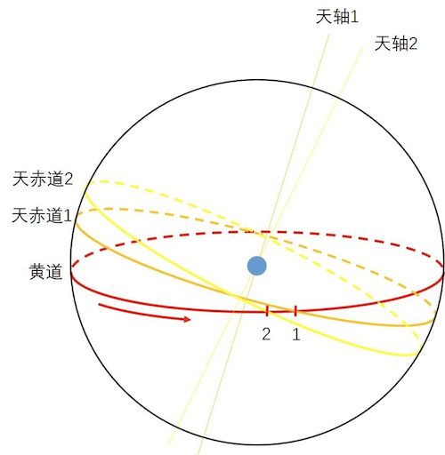

**回归年**

回归年(tropical year)，也称为太阳年(solar year)，属于太阳时间计量系统，是太阳的平黄经变化360°所经历的时间。由于太阳视运动不是均匀的，选取不同的起点会得到不同的长度。若选取春分点作为基准，太阳从春分点出发运行一周再次回到春分点的时间为春分点年。在2000年，回归年的平均长度（即平回归年）为365.24219天(SI day)。

**恒星年**

恒星年(sidereal year)，属于恒星时间计量系统，是太阳在黄道上的视位置相对遥远恒星变化360°所经历的时间。也相当于地球相对于遥远恒星在绕太阳公转轨道上运行360°所经历的时间。在2000年，恒星年的平均长度（即平恒星年）为365.25636天(SI day)。

恒星年比回归年要长20分24.5秒，这是由于地球自转轴的进动导致的，而这个差异被称为岁差。

**岁差**

地球的自转轴在惯性空间并不是固定不变的，在引力的作用下，地球自转轴会发生进动，被称为地轴进动。地球自转轴以大约26,000年的周期在空间扫出一个圆锥。

如上图所示，在起始时刻，太阳视位置在春分点1，平黄经为0°。一段时间后，地球自转轴与天轴2重合，春分点的位置移动到了点2，太阳视位置到达点2，平黄经再次为0°，相对春分点运动了360°，这段时间为一个回归年。太阳继续运动到点1，相对惯性空间中的遥远恒星在黄道上转动了360°。这段时间为一个恒星年。因此，恒星年比回归年略长。
