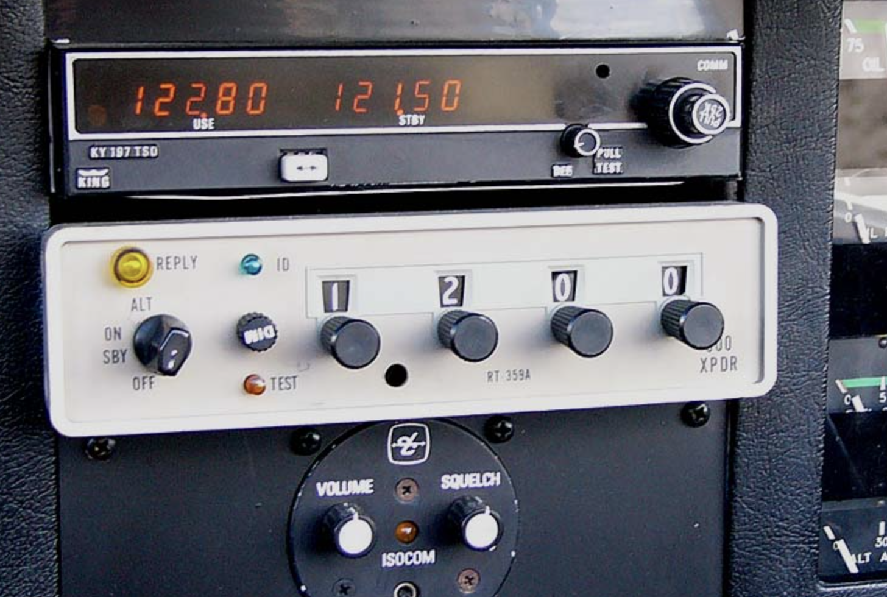

在飞行中，航空管制员会通过无线电通知飞行员分配给他的应答机代号，比如：“东航5101，应答机0363”，之后飞行员在飞机上手动输入应答机代号0363，之后航空管制员的雷达屏幕上就会正确显示该飞机的身份信息。

应答机代号是一组4位8进制数字，通过分配应答机代号，航空管制员可以对飞行器进行区分。应答机代号取值从0000到7777，共4096个，其中一些组合带有特定的意思，比如：
- 7500表示非法行为（比如劫机）
- 7600表示通信故障
- 7700则代表紧急状况

飞行员在飞行过程中，遇到特殊情况，会将应答代号设置为以上特殊代码。如遇到劫机事件时，飞行员则将应答机设为7500。这样，即使飞行员不通过无线电或者其他手段呼叫地面，地面管制员也能通过应答机信号判明该架飞机遭到劫持。