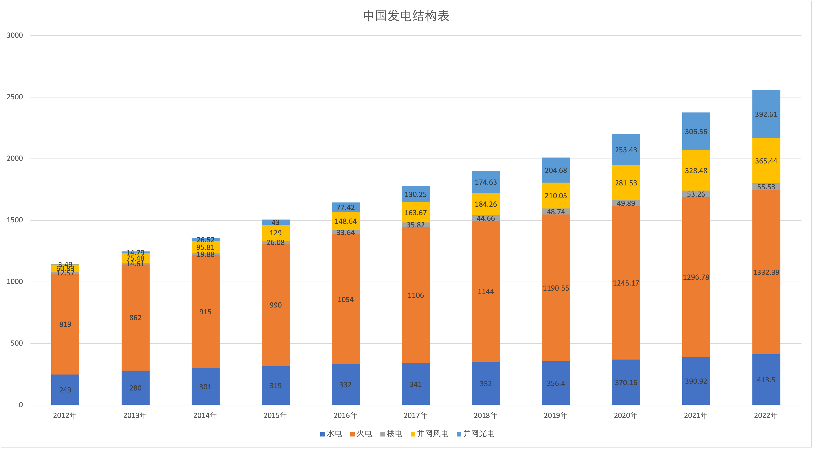
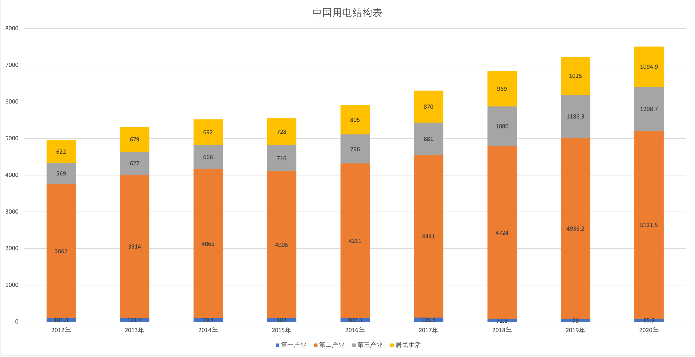

中华人民共和国的能源结构长期以煤炭为主，水力发电也有一定比重。改革开放后，能源需求随着经济发展增长，并正朝向高效率低污染的石油气发电型式过渡，与此同时，以风电、核电、太阳能为代表的新能源正在快速增长。中华人民共和国可再生能源部分已位居世界第一。

**中国发电结构表（单位：GW）**

| 发电方式     | 2012年 | 2013年 | 2014年 | 2015年 | 2016年  | 2017年  | 2018年  | 2019年   | 2020年   |
|----------|-------|-------|-------|-------|--------|--------|--------|---------|---------|
| 水电       | 249   | 280   | 301   | 319   | 332    | 341    | 352    | 356.4   | 370.16  |
| 火电       | 819   | 862   | 915   | 990   | 1054   | 1106   | 1144   | 1190.55 | 1245.17 |
| 核电       | 12.57 | 14.61 | 19.88 | 26.08 | 33.64  | 35.82  | 44.66  | 48.74   | 49.89   |
| 并网风电     | 60.83 | 75.48 | 95.81 | 129   | 148.64 | 163.67 | 184.26 | 210.05  | 281.53  |
| 并网光电     | 3.49  | 14.79 | 26.52 | 43    | 77.42  | 130.25 | 174.63 | 204.68  | 253.43  |
| 全部发电设备容量 | 1144  | 1247  | 1360  | 1507  | 1646   | 1777   | 1900   | 2010.66 | 2200.58 |

**中国用电结构表（单位：GW）**

| 指标名称    | 2012年 | 2013年 | 2014年 | 2015年 | 2016年 | 2017年 | 2018年 | 2019年  | 2020年   |
|---------|-------|-------|-------|-------|-------|-------|-------|--------|---------|
| 第一产业    | 101.3 | 101.4 | 99.4  | 102   | 107.5 | 115.5 | 72.8  | 78     | 85.9    |
| 第二产业    | 3667  | 3914  | 4065  | 4005  | 4211  | 4441  | 4724  | 4936.2 | 5121.5  |
| 第三产业    | 569   | 627   | 666   | 716   | 796   | 881   | 1080  | 1186.3 | 1208.7  |
| 居民生活    | 622   | 679   | 692   | 728   | 805   | 870   | 969   | 1025   | 1094.9  |
| 全国全年用电量 | 4959  | 5322  | 5523  | 5550  | 5920  | 6308  | 6845  | 7225.5 | 7511    |

