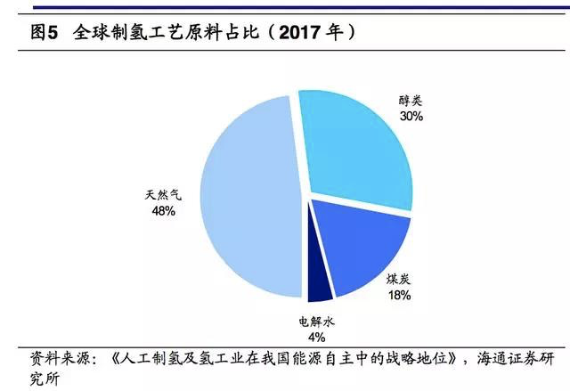
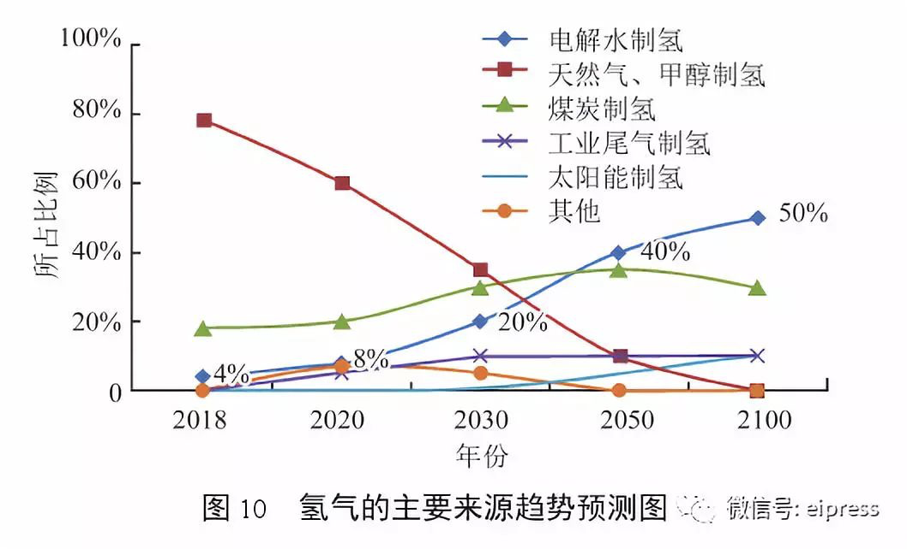

首先对于直接污染来说，都是清洁能源。

如果从能量来源分析：

**电力的来源**

有60%以上仍然是燃料发电。但比起来传统的汽油能源，则100%是燃料发电。所以从这个角度看，也算是清洁的。另外，传统的汽车排放的尾气，无法很好地处理。而发电厂的废气处理，应该比较容易（？至少比较集中）

**氢能源的来源**

可见，氢气的来源大多来自化石燃料，都属于不可再生能源。

各种制氢方式对比：

-   水煤气法制氢成本最低，适用规模大，但是二氧化碳排放量最高，且所产生氢气含硫量高，如果用于燃料电池，会导致燃料电池催化剂中毒，如果应用脱硫装置对其产生氢气进行处理，不但增加了额外的成本，对技术标准的要求也很高；
-   石油和天然气蒸汽重整制氢的成本次之，约为0.7~1.6元/Nm3，能量转化率高达72%以上，但环保性不强，未来可以考虑通过碳捕捉技术减少碳排放；
-   氯碱制氢工艺成本适中，在1.3~1.5元/Nm3之间，且环保性能较好，生产的氢气纯度高，目前而言适用于大规模制取燃料电池所使用的氢气原料，也是可实现度最高的氢气来源。
-   甲醇裂解和液氨裂解成本较氯碱制氢高50%左右，较化石资源制氢技术前期投资低、能耗低，较水电解法制氢单位氢成本低。
-   水电解法制氢成本最高，在2.5~3.5元/Nm3之间，且成本在不断降低，碳排放量低，且在应用水力、潮汐、风能的情况下能量转化率高达70%以上。在未来与可再生能源发电紧密结合的条件下，水电解法制氢将发展成为氢气来源的主流路线。

可见，目前氢气的制备环保性并不高。

制氢工业发展预测：

在所有的人工制氢途径中，**电解水制氢**可以有效地消纳风电、光伏发电等不稳定电力，以及其他富余波谷电力，因而将贯穿于氢能发展的全过程，是建设“氢能社会”工业氢气的主要来源之一。