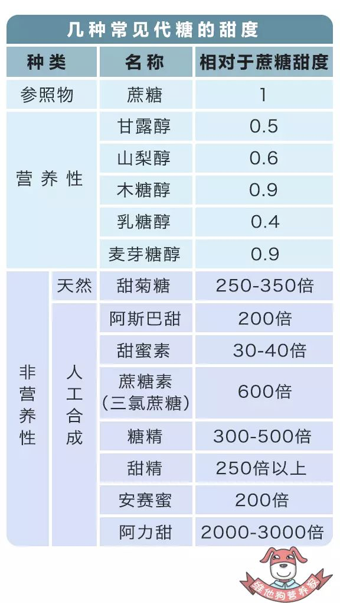

我们通常说的糖就是指白砂糖、蔗糖、葡萄糖、砂糖等。

无糖就是没有添加以上这些糖，而是添加的**代糖**。

而且无糖按标准，也不是绝对不添加糖。（同理无能量饮料）。

**代糖的分类**

代糖分为营养性（可产生热量）和非营养性（无热量）。

生活中常见糖类的卡路里数据：

麦芽糖：100(克) 热量331千卡

蔗糖：100(克) 热量389千卡

绵白糖：100(克) 热量396千卡

白砂糖：100(克) 热量400千卡

葡萄糖：100(克) 热量400千卡

木糖醇：100(克) 热量240千卡

**1.营养性**

**木糖醇**

这个我们在口香糖中见得最多，感觉它就是那么的健康，天然、清新。

而它的提取也的确很天然。是从剩下的**玉米棒子和甘蔗渣**等农作物中提取的。

**甘露醇、山梨醇**

这两个名字在很多食品包装上都出现过，只是我们没有注意过而已。

我们吃的药片，外面有一层甜甜的糖衣，也是加了这两个东东，让良药不再苦口。

**2.非营养性**

**天然：甜菊糖**

这是从一种叫甜叶菊的植物中提取的，它的特点就是**天然、不升高血糖（糖尿病患者的福音）。**

**人工合成：阿斯巴甜、甜蜜素、甜精、蔗糖素、糖精**
